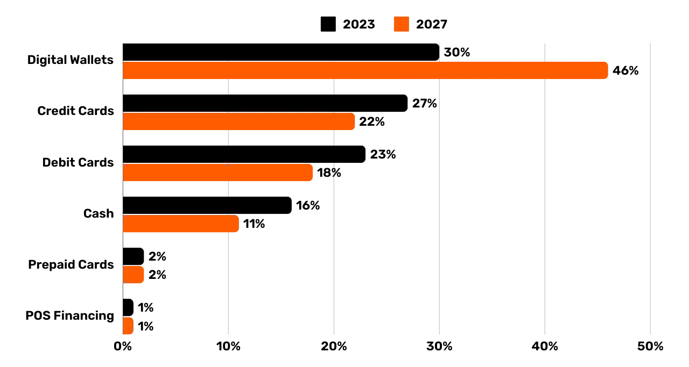
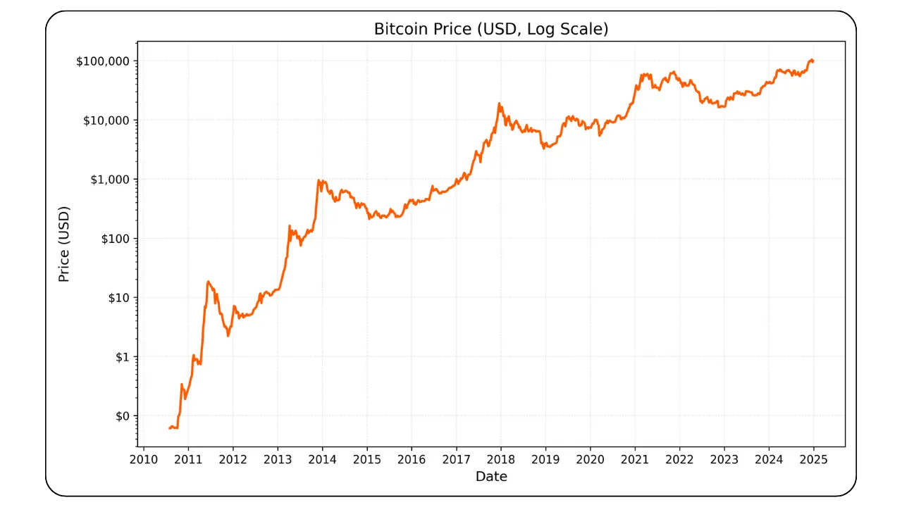
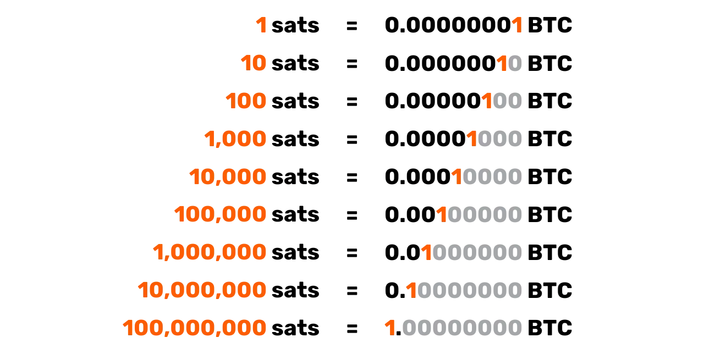
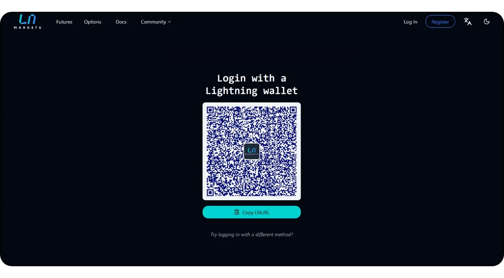

# Розпочніть подорож вашої компанії до мережі Bitcoin

Відкрийте для себе практичні можливості Bitcoin і Lightning Network та дізнайтеся, як, подібно до Інтернету, вони можуть **трансформувати ваші бізнес-операції**. Від цифрового капіталу до швидких, економічних і масштабованих платежів, Bitcoin пропонує широкий спектр **використання для бізнесу**.

У цьому посібнику ви дізнаєтеся, як розуміти Bitcoin як глобальну, універсальну та інтернет-орієнтовану валютну мережу. Завдяки своїм унікальним фундаментальним характеристикам **Bitcoin забезпечує значні переваги над традиційними валютними мережами**. Ви дізнаєтеся, чому і як використовувати Bitcoin для класичних фінансових кейсів, таких як зберігання капіталу і платіжні системи. Крім того, цей посібник охоплює питання еквайрингу та зберігання Bitcoin, включаючи пов'язані з цим бухгалтерські та фіскальні вимоги, а також реалізацію простих і масштабних платіжних рішень у Bitcoin.

Незалежно від того, чи ви **малий бізнес, чи велика корпорація**, інтеграція Bitcoin у вашу повсякденну діяльність може зробити вашу компанію більш **стійкою, продуктивною та конкурентоспроможною**. Кожна інтернет-компанія має стати компанією, орієнтованою на Bitcoin, і цей курс допоможе вам підготуватися до цього. Початкові розділи повторюють основи роботи Bitcoin, тому навіть якщо ви новачок, ви отримаєте фундаментальні знання, необхідні для подальшої роботи. Вивчення основ винаходу Satoshi завжди є гарною ідеєю, незалежно від того, до чи після занурення в BIZ101.

+++
# Вступ

<partId>326cf945-5d3f-4d86-8c3e-4d1c35959799</partId>

## На борту вашої компанії на Bitcoin

<chapterId>1be42be9-4080-49f5-b5b2-6b531dd55f5f</chapterId>

Розпочніть подорож вашої компанії до мережі Bitcoin з цього комплексного навчального курсу, який допоможе зрозуміти, як Bitcoin і Lightning Network можуть революціонізувати традиційні бізнес-операції. Цей курс призначений для роздрібних торговців, підприємців, менеджерів і корпоративних керівників, які бажають вивчити практичні можливості Bitcoin як глобальної грошової мережі, що базується на Інтернеті, і надійного засобу створення вартості Exchange.

Протягом курсу ви ознайомитеся з основоположними принципами, які роблять Bitcoin та Lightning Network справді трансформаційними. Ви дізнаєтесь, як ці технології пропонують широкий спектр варіантів використання, від зберігання цифрового капіталу до швидких, економічних і масштабованих платежів, і як вони забезпечують критичні поліпшення в порівнянні з традиційними валютними і платіжними системами. Курс BIZ101 пов'язує економічну теорію з реальними застосуваннями, пояснюючи, як децентралізація може зменшити залежність від посередників і подолати обмеження, притаманні застарілим системам.

Курс починається з детального вивчення традиційних валют і платіжних механізмів, закладаючи основу для вивчення того, як валюта функціонує як мережа, що забезпечує торгівлю, заощадження та економічну спеціалізацію. Згодом ми заглибимося в технологію, що лежить в основі Bitcoin, та інновації, запроваджені Lightning Network, розкриваючи їхню роль у забезпеченні безперебійних, безпечних та майже миттєвих транзакцій, які можуть обслуговувати бізнес будь-якого розміру. Потім ми зануримося в практичні розділи цього курсу, починаючи з частини про зберігання біткоїнів в якості казначейства, за якою послідує заключна частина про прийняття Bitcoin в якості платіжного засобу.

Незалежно від того, чи ви представляєте мале підприємство, чи велику корпорацію, цей курс має на меті озброїти вас знаннями для інтеграції Bitcoin у вашу повсякденну діяльність, тим самим підвищуючи стійкість, ефективність та конкурентну перевагу вашої компанії. Оскільки Bitcoin продовжує змінювати економічний ландшафт, розуміння цих революційних технологій є не просто можливістю, а стратегічною необхідністю. Приготуйтеся до взаємодії з глибоким змістом, практичними прикладами та стратегічними рекомендаціями, які допоможуть вам орієнтуватися в мінливому світі Bitcoin та використовувати його переваги!

# Валюта, платіжні системи та Bitcoin

<partId>d9bd0e21-8488-44e0-af55-6d0b934f83c2</partId>

## Традиційні валюти

<chapterId>785e095c-6811-4ca2-ba46-fe38291432d4</chapterId>

### Валюти - це мережі

Валюти - це, по суті, мережі, які уможливлюють ефективний Exchange вартості.

Без валюти люди повинні покладатися на **бартер** - систему, в якій товари або послуги обмінюються безпосередньо. Бартер непрактичний, оскільки вимагає "подвійного збігу бажань" - обидві сторони повинні одночасно бажати те, що пропонує інша. Наприклад, якщо фермер, який має надлишок пшениці, хоче взуття, він повинен знайти шевця, якому потрібна саме пшениця. Це трапляється рідко і неефективно. Крім того, **при n продуктах в бартерній економіці потрібно ~n(n-1)/2 ставки Exchange**, що створює дуже складну і громіздку систему. Наприклад, це вимагало б понад 124 000 ставок Exchange лише для 500 товарів.

Валюта спрощує цей процес, діючи як посередник, створюючи **мережу, яка зменшує кількість курсів Exchange до n** - по одному для кожного товару по відношенню до валюти. Це робить транзакції набагато простішими і **дозволяє людям торгувати товарами і послугами, не вимагаючи при цьому взаємних бажань**. Замість того, щоб безпосередньо обмінювати пшеницю на взуття, фермер може продати свою пшеницю за валюту, а потім використати цю валюту для купівлі взуття або чогось іншого, що йому потрібно.

Запровадження валюти як мережі не лише полегшує торгівлю, але й уможливлює **поділ праці та спеціалізацію**. Завдяки надійному носію Exchange окремим особам і громадам більше не потрібно виробляти все, що вони споживають. Замість цього вони можуть зосередитися на тому, що у них виходить найкраще, підвищуючи ефективність і якість. Фермер може спеціалізуватися на вирощуванні сільськогосподарських культур, взуттьовик - на виготовленні взуття, а будівельник - на зведенні будинків. Потім ці фахівці можуть обмінювати свої товари та послуги на валюту, отримуючи вигоду від досвіду один одного. Така спеціалізація стимулює **продуктивність та інновації**, оскільки люди вдосконалюють свої навички та розробляють нові методи у відповідних галузях.

Мережева природа валюти приносить додаткові значні переваги. По-перше, бути частиною валютної мережі **вигідніше, ніж бути поза нею**. Спільний стандарт мережі полегшує торгівлю, дозволяючи людям координувати свою економічну діяльність навіть **на великих відстанях**. Наприклад, продавець в одному місті може торгувати товарами з покупцем в іншому, використовуючи ту саму валюту, що сприяє економічному зростанню та співпраці у великих регіонах.

Ще однією важливою перевагою валюти є її здатність **дозволяти відкладений обмін**. При бартері транзакції відбуваються миттєво; один товар обмінюється на інший в режимі реального часу. Валюта ж дозволяє **заощаджувати - люди можуть зберігати вартість для використання в майбутньому**. Це величезний стрибок вперед для економічного планування, інвестицій та накопичення багатства, що покращує життя учасників мережі.

Отже, валюти - це мережі, призначені для ефективного переміщення вартості. Вони долають обмеження бартеру, спрощують торгівлю і створюють можливості для координації та економії. Як і будь-яка мережа, цінність валюти залежить від її широкого впровадження та корисності - зрештою, перемагає найкраща валюта.

### Що таке хороша валюта?

Хороша валюта має кілька важливих властивостей, які роблять її ефективною для сприяння створенню вартості Exchange. Ось стисле пояснення кожної з них:

- Захищеність**: Валюта має бути захищена від крадіжки або несанкціонованого доступу, щоб користувачі могли зберігати та переказувати її з упевненістю. Безпека має вирішальне значення для побудови довіри до системи.
- Захищеність від підробки**: Валюту має бути надзвичайно важко або неможливо підробити. Це гарантує, що кожна одиниця є автентичною, зберігає свою вартість і запобігає інфляції, спричиненій потраплянням в обіг фальшивих одиниць. Наприклад, історично склалося так, що золото цінується не лише за свою красу та рідкість, але й за те, що його надзвичайно складно видобувати. На відміну від паперових банкнот або цифрових записів, золото не можна просто "зробити" - його потрібно видобути з землі. Цей природний дефіцит і складність виробництва допомогли золоту зберегти свій статус надійного засобу збереження вартості та еталону автентичності.
- Дефіцитна**: Хороша валюта повинна мати обмежену або контрольовану емісію. Дефіцит гарантує, що її вартість зберігається протягом тривалого часу, запобігаючи надвиробництву, яке могло б підірвати купівельну спроможність. Наприклад, деякі індіанські племена Америки використовували намистини як форму валюти. Спочатку ці намистини виробляли Hard, зберігаючи їхню дефіцитність та цінність. Однак, як тільки європейські торговці почали масово виробляти бісер і заполонили ним ринок, його рідкість зникла. Зі зростанням ціни на Supply, намистини втратили свою купівельну спроможність, що підірвало їхню роль як надійного засобу збереження вартості.
- Без дозволу**: У минулому такі валюти, як золоті та срібні монети, часто карбувалися приватними особами, місцевою владою або купцями, які мали доступ до сировини. Ця система іноді діяла на основі угод або ліцензій, наданих королями чи правителями. З часом королі та уряди централізували цей процес, щоб отримати більший контроль над економічною стабільністю, оподаткуванням та грошовою системою. Одним з відомих прикладів є **талер**, срібна монета, вперше викарбувана у 1518 році в **Долині Йоахімсталь** (сучасний Яхимов у Чеській Республіці) місцевими шахтарями та владою. Назва "талер" походить від німецького слова **"Thal "**, що означає "долина" Ці монети, відомі своїм високоякісним сріблом, набули широкого поширення по всій Європі. З часом цей термін еволюціонував у лінгвістичному та географічному сенсі, зрештою давши початок назві "долар", яка була прийнята у Сполучених Штатах для своєї валюти.

У сучасну епоху валюти стали повністю дозволеними в рамках сеньйоражної системи, що означає, що тільки уповноважені суб'єкти - такі як центральні банки або казначейства - можуть карбувати монети або друкувати банкноти. Приватні особи більше не мають юридичного права виробляти валюту, що забезпечує централізований контроль над її випуском і Supply.

Сьогодні принцип сеньйоражу кидає виклик криптовалюті Bitcoin, яка працює без централізованого контролю. Bitcoin - це "бездозвільна" система, де будь-хто може брати участь у використанні валюти, не питаючи дозволу, а через Mining - і в її створенні. Така децентралізація позбавляє уряди монополії на емісію, що піднімає питання про потенційне повернення до конкурентних валютних систем вільного ринку.

- Рахункова одиниця**: Валюта повинна забезпечувати стандартний вимірник для порівняння вартості товарів і послуг. Це спрощує торгівлю та робить ціноутворення прозорим і послідовним у різних операціях.
- Міцна**: Валюта повинна витримувати зношування з часом. Фізичні валюти, такі як монети або банкноти, повинні протистояти пошкодженням, тоді як цифрові валюти повинні зберігатися надійно без ризику втрати даних.
- Портативною**: Валюта має бути зручною для транспортування та використання, щоб уможливити торгівлю на відстані. Цього можна досягти за допомогою фізичної портативності (легкі монети або банкноти) або цифрових систем переказу.
- Подільна**: Валюта має бути подільною на менші одиниці, щоб полегшити транзакції різного розміру. Така гнучкість забезпечує практичність як для дрібних покупок, так і для великомасштабної торгівлі.
- Взаємозамінні**: Всі одиниці валюти повинні бути взаємозамінними і мати однакову вартість. Наприклад, одна доларова банкнота має бути еквівалентною будь-якій іншій доларовій банкноті. Така однорідність забезпечує справедливість і простоту транзакцій.
- Впізнаваною**: Валюта повинна бути легко ідентифікована і викликати довіру. Фізичні валюти досягають цього завдяки унікальному дизайну та функціям безпеки, тоді як цифрові валюти можуть покладатися на протоколи верифікації. Це забезпечує широке визнання і знижує ризик шахрайства.

Ці характеристики роблять валюту практичною, надійною та ефективною для сприяння торгівлі та зберігання вартості в економіці.

### Еволюція валютних систем

**Від монет до паперових грошей: Підвищення ефективності та портативності**

Перехід від монет до паперових грошей ознаменував значне покращення їхньої **портативності** та ефективності. Монети, виготовлені з дорогоцінних металів, таких як золото чи срібло, були цінними завдяки своїй власній вартості. Однак вони були важкими, їх було важко транспортувати у великих кількостях, вони були схильні до зношування та крадіжок. Паперові гроші революціонізували валютні мережі, запровадивши легкий, стандартизований і портативний носій, який представляв цінність, а не містив її. Це нововведення дозволило економікам масштабуватися, полегшивши торгівлю на великі відстані та зменшивши логістичні проблеми використання фізичних товарів як грошей.

Паперові гроші також покращили масштабованість. Замість того, щоб покладатися на обмежений Supply дорогоцінних металів, економіки могли розширювати свою грошову базу за рахунок репрезентативних валют, спочатку підкріплених резервами, а згодом - довірою до емісійних установ. Цей зсув проклав шлях до більш складних і взаємопов'язаних фінансових систем.

**Від паперових до електронних грошей: Підвищення доступності та швидкості**

Перехід від паперових грошей до електронних ще більше вдосконалив валютну мережу, підвищивши її доступність і швидкість. З розвитком банківських систем, кредитних карток і цифрових транзакцій гроші стали не просто **портативними**, а майже **миттєвими**. Електронні перекази усунули потребу у фізичному Exchange, дозволивши здійснювати транзакції на величезні відстані за лічені секунди.

Цей зсув також демократизував доступ до валюти. Електронні банківські та платіжні системи знизили бар'єри для входу на ринок для фізичних та юридичних осіб, уможлививши участь у глобальній економіці. Швидкість і зручність електронних грошей розширили торговельні мережі та сприяли появі нових бізнес-моделей, які були б неможливими в паперовій системі.

Ці сучасні валютні мережі мали суттєвий недолік: **відсутність аудиту та прозорості в управлінні грошима Supply**, що часто призводило до неконтрольованої інфляції та втрати довіри до централізованих систем. Наприклад, лише за останні чотири роки було надруковано понад 20% усіх доларів США, що перебувають в обігу. Цю постійну спокусу випустити більше валюти - і тим самим знецінити вартість, яку мають нинішні власники, - можна значною мірою пояснити системною вадою: політики часто зацікавлені в тому, щоб уникати жорстких бюджетних рішень, натомість відкладаючи проблеми на майбутні адміністрації, "відкладаючи їх у довгий ящик"

**Від централізованої до децентралізованої валюти: Зміцнення довіри та суверенітету**

Сьогодні поява децентралізованої валюти Bitcoin являє собою наступний стрибок у розвитку валютних мереж. Традиційні електронні гроші покладаються на централізовані органи влади, такі як банки або уряди, для управління та перевірки транзакцій. Незважаючи на свою ефективність, ці системи вразливі до неефективності, цензури та єдиних точок відмови. Децентралізовані валюти покращують ці властивості мережі шляхом **розподілу довіри і усунення посередників**. Це також означає, що гроші можуть рухатися набагато **швидше** і **дешевше**, тому що немає етапів авторизації. Нарешті, жодна людина не може піддатися спокусі змінити графік Bitcoin валюти Supply, це робить програмне забезпечення.

У децентралізованих системах транзакції перевіряються глобальною мережею учасників з використанням технології Blockchain, що забезпечує безпеку, прозорість і стійкість. Така структура мінімізує ризик шахрайства, зменшує залежність від центральних органів влади та надає громадянам більше можливостей контролювати свої фінанси. Усуваючи географічні та інституційні бар'єри, децентралізовані валюти пропонують дійсно глобальну та інклюзивну грошову систему.

**Еволюція валютних мереж**

Кожен етап еволюції валютних мереж покращував ключові властивості: портативність, масштабованість, доступність, швидкість, безпеку та довіру. Монети поступилися місцем паперовим грошам для кращої мобільності та ефективності. Папір перетворився на електронні гроші, уможлививши глобальний доступ і миттєві транзакції. Зараз Bitcoin переосмислює поняття довіри та безпеки, створюючи відкриту та стійку грошову систему. Цей історичний прогрес підкреслює постійне прагнення людства створювати кращі мережі для створення вартості Exchange, кожна ітерація якої спирається на обмеження попередньої і перевершує їх.

Найкраща мережа, швидше за все, переможе.

## Традиційні платіжні системи

<chapterId>1306196c-1e8a-454b-8e11-6887ecb3d8b4</chapterId>

Платіжні системи - це методи та інфраструктура, які забезпечують переказ коштів між двома сторонами - зазвичай між платником (наприклад, споживачем) та отримувачем (наприклад, підприємством). Ці транзакції можуть відбуватися в різних ситуаціях: споживач платить місцевому торговцю, бізнес оплачує рахунки постачальнику або навіть фізичні особи переказують гроші один одному. Розуміння платіжних систем передбачає розгляд різних типів платіжних методів, їхніх характеристик та способів використання в контекстах "бізнес-споживач" (B2C) та "бізнес-бізнес" (B2B).

### Найпоширеніші типи способів оплати

1. **Готівка:** Фізична валюта, що обмінюється безпосередньо між двома сторонами.

2. **Чеки:** Паперові документи, що містять доручення банку сплатити певну суму з рахунку платника на рахунок одержувача.

3. **Банківські перекази:** Електронний переказ коштів між банками, часто використовується для великих сум і транскордонних платежів.

4. **Платіжні картки (кредитні/дебетові):** Пластикові або цифрові картки, підключені до карткової мережі, що дозволяють переказувати кошти з банківського рахунку (або кредитної лінії) власника картки на рахунок торговця.

5. **Цифрові гаманці та мобільні платежі:** Додатки або пристрої, що зберігають платіжну інформацію (наприклад, Apple Pay, WeChatPay, AliPay, PayPal), що дозволяють здійснювати швидкі та часто безконтактні перекази.

*використання в B2C та B2B:** *Використання в B2C та B2B

- B2C (Business-to-Consumer):** (Бізнес-споживач)
    - Споживачі часто використовують готівку, картки та цифрові гаманці для повсякденних покупок, таких як продукти, онлайн-покупки або послуги, такі як виклик таксі.
    - Швидкість, зручність і низькі комісії (для споживача) часто є ключовими пріоритетами.
    - Безконтактні та мобільні платежі стають все більш популярними в цьому просторі завдяки простоті використання.
- B2B (Business-to-Business):** (Бізнес для бізнесу)
    - Компанії зазвичай покладаються на банківські перекази, чеки та системи виставлення рахунків для оплати постачальникам, погашення великих рахунків або здійснення періодичних платежів.
    - Основна увага часто приділяється відстежуваності, документуванню та здатності обробляти великі суми транзакцій.
    - Використання карток існує, але, як правило, менш поширене через вищі комісії та ліміти на транзакції. З'являються цифрові рішення, такі як інтегровані платіжні платформи, що дозволяють впорядкувати та автоматизувати процеси управління дебіторською/кредиторською заборгованістю.

*Графік: Глобальні тенденції в методах оплати в точках продажу (2023-2027), The Global Payments Report 2024, Worldpay.*

### Складність простої оплати карткою

Коли клієнт використовує кредитну картку в магазині, її зчитує POS-термінал, який безпечно передає дані про транзакцію банку-еквайру продавця. Еквайр пересилає цю інформацію до відповідної карткової мережі (наприклад, Visa або Mastercard), яка потім надсилає запит емітенту - банку, який надав картку клієнта. Емітент перевіряє рахунок або кредитну лінію клієнта і надсилає назад авторизацію через мережу та еквайра, що дозволяє торговцю прийняти платіж.

Ця, на перший погляд, проста транзакція насправді включає понад 15 кроків, 7 посередників і займає в середньому від 48 годин до 5 днів, перш ніж торговець отримає кошти. Протягом наступних днів відбувається процес клірингу та розрахунків. Карткова мережа агрегує транзакції за день і координує обмін коштами між еквайром та емітентом. Центральний банк забезпечує точність і стабільність цих міжбанківських розрахунків. Зрештою, на банківський рахунок торговця надходить чиста сума (за вирахуванням комісій), зарахована від еквайра, таким чином завершуючи життєвий цикл транзакції.

Загалом, цей процес є складним, трудомістким і дорогим для того, що має бути простим актом переміщення вартості від однієї сторони до іншої.

### Порівняння способів оплати

| Спосіб оплати | Необхідна авторизація?           | Час схвалення транзакції (Merchant View) | Швидкість розрахунків (повне зарахування коштів) | Остаточність (легкість відкликання) | Кількість посередників | Типові комісії (для одержувача платежу)

| ------------------------------ | ------------------------------- | ----------------------------------------- | ---------------------------------------------- | ---------------------------------------- | ------------------------------ | ---------------------------------- |

| Готівка** | Немає | Негайна (фізична Exchange) | Негайна (без затримки розрахунку) | Висока (безповоротна після оплати) | Немає | Немає | Немає

| Чеки** | Так (банківський кліринг) | Прийняття на депозит (не гарантується) | Кілька днів (процес клірингу чеків) | Середній (може відскакувати/зупинятися до клірингу) | Банк | **Від низького до середнього** (банківська комісія)

банківські перекази** | Так (банк/мережа) | Підтвердження протягом декількох годин | Того ж дня або наступного дня (внутрішні) | Висока (зазвичай незворотна після відправлення) | Банки, платіжні мережі | **Середня** (фіксована/відсоткова) | *Середня** (фіксована/відсоткова) | *Середня** (фіксована/відсоткова)

| **Платіжні картки** | Так (авторизація емітента картки) | Секунди до хвилин (код авторизації) | Кілька днів (міжбанківський розрахунок) | Середній (можливі повернення платежів) | Емітент, еквайр, карткова мережа | **Змінний (1-3% від суми транзакції)| | ¦ ¦ ¦ ¦ ¦ ¦ ¦ ¦ ¦ ¦ ¦ ¦ ¦ ¦ ¦ ¦

цифрові гаманці/мобільні платежі** | Так (провайдер/банк Wallet) | Секунди (миттєве підтвердження) | Зазвичай 1-2 дні (залежить від джерела фінансування) | Середній (можливе повернення коштів/суперечки) | Банки, оператори Wallet | **Від низького до середнього (варіюється)| | ¦ ¦ ¦ ¦ ¦ ¦ ¦ ¦ ¦ ¦ ¦ ¦ ¦ ¦ ¦

### Обмеження існуючих рішень

Індустрія традиційних платежів представляє річний економічний оборот у розмірі приблизно 2 200 мільярдів доларів, що становить приблизно десяту частину ВВП США або дорівнює ВВП Франції. Оскільки валюти функціонують як дозволені мережі, конкуренція обмежена, що робить цю "послугу" більш схожою на податок, який накладається на виробничу економіку. На додачу до створюваного нею фінансового тягаря, існує ще кілька інших обмежень, які описані нижче.

| Обмеження, пояснення, вплив

| -------------------------------- | ---------------------------------------------------------------------------------------------------------------------------------------------------------------------------------------------------------------------------------- | ---------------------------------------------------------------------------------------------------- |

| Високі комісії за використання карток | Комісії за обмін (~0,3%), мережеві комісії (фіксовані або 0,3%-1%), підписка на термінали/PSP та банківська маржа (0,5%-1,7%) складають значні витрати, подібні до глобального "податку" на виробничі сектори, що сягають трильйонів доларів США.     | Підвищує витрати продавців, зменшуючи маржу та потенційно призводячи до зростання споживчих цін.                  |

| Дуже повільний остаточний розрахунок | Розрахунок коштів може тривати до 5 днів, що уповільнює рух грошей і загальну економічну активність.                                                                                                                                | Затримує ліквідність для торговців і знижує швидкість економічного обігу.                        |

| Шахрайство | Канали електронної комерції часто стають об'єктами шахрайства, що призводить до значних збитків (наприклад, $28 млрд). До 2024 року суми повернень платежів можуть сягнути близько $174 млрд у всьому світі. Управління цими спорами забирає багато часу та викликає психологічне напруження. | Збільшення операційних витрат, складні заходи із запобігання шахрайству та зниження довіри клієнтів.       |

| Відмова від кошика | Додаткові заходи безпеки (одноразові коди, двофакторна автентифікація за PSD2) створюють труднощі на касі.                                                                                                                   | Вища складність оформлення замовлення призводить до збільшення кількості покинутих візків та втрачених продажів.                       |

| Високі мінімальні суми транзакцій | Мінімальні пороги витрат за картками можуть змушувати продавців і споживачів до незручних цінових або купівельних умов, що заважає здійсненню операцій на невеликі суми.                                                                       | Зниження рівня задоволеності та гнучкості клієнтів, що потенційно обмежує імпульсивні покупки або покупки на невеликі суми.  |

| Повільна попередня авторизація | Сучасні системи не можуть обробляти транзакції на мілісекундній швидкості або підтримувати безперервні потоки платежів у реальному часі.                                                                                                                   | Обмежує варіанти використання, які вимагають миттєвих або потокових платежів, обмежуючи інновації та масштабованість. |

| Потреба в банківському/картковому рахунку | Доступ до цих методів оплати вимагає наявності банківського або карткового рахунку, що автоматично виключає тих, хто не має таких рахунків.                                                                                                       | Обмежує фінансову інклюзію, зменшуючи доступ для небанківських або недостатньо банківських груп населення.                 |

| Багаторазове створення облікових записів в Інтернеті | Користувачам часто доводиться створювати кілька облікових записів в Інтернеті, що призводить до втоми, зниження зручності та збільшення ризику витоку персональних даних.                                                                                                | Погіршує користувацький досвід, викликає занепокоєння щодо конфіденційності та підвищує ризик витоку даних.          |

| Іноземні збори Exchange (FX) | Відсутність універсальної розрахункової одиниці змушує здійснювати дорогі конвертації валют для транскордонних транзакцій.                                                                                                                              | Додає додаткових витрат для міжнародної торгівлі, роблячи глобальні транзакції менш доступними.             |

Подібно до того, як ми перейшли від похвилинної оплати голосових дзвінків до використання майже безкоштовного IP-зв'язку, поява більш відкритих та ефективних мереж може переосмислити платежі, зменшивши витрати та кількість посередників, а також сприяючи появі нових бізнес-моделей.

## Bitcoin для бізнесу: валюта, що розвивається

<chapterId>4488fe33-663f-41a3-a668-e9ca2fb7122e</chapterId>

**ЩО ТАКЕ Bitcoin?

Bitcoin - це **пірингова система цифрової валюти Exchange** (електронна готівка). Термін "Bitcoin" відноситься до наступних компонентів:

- Комп'ютерний протокол**, який полегшує обмін Exchange в Інтернеті без посередників, не вимагаючи дозволу і псевдонімічно. Він використовує передові криптографічні принципи.
- Фізична мережа** машин, підключених до Інтернету (вузлів, майнерів тощо), які експлуатуються фізичними та юридичними особами, утворюючи децентралізовану систему (без центрального органу влади або єдиної точки контролю).
- Розрахункова одиниця** в системі. У світі ніколи не буде більше 21 мільйона біткоїнів. Кожен Bitcoin ділиться на 100 мільйонів одиниць, які називаються "сатоші", названі на честь свого анонімного творця.

Разом вони перетворюють Bitcoin на **актив на пред'явника** і цифрову валюту **без емітента**. Ownership захищений виключно шляхом володіння **приватним криптографічним ключем**, що надає повний контроль **без посередників або довірених третіх осіб**. При передачі Ownership **остаточність** настає негайно: новий власник повністю володіє нею, не покладаючись на центральний орган для захисту або конвертації. Транзакції є **незмінними** - після запису на Blockchain вони не можуть бути змінені або видалені.

Bitcoin має фіксовану монетарну політику з **обмеженням у 21 мільйон біткоїнів**, з яких ~19,8 мільйона вже розподілено. Це робить його **дефляційним**, його вартість зростає з часом, оскільки користувачі зберігають у ньому заощадження і приріст продуктивності.

Його технічні характеристики перевершують характеристики золота і долара разом узятих, що робить його найтвердішим фінансовим активом з усіх коли-небудь створених. Bitcoin є одночасно і засобом збереження вартості, і носієм Exchange, валютою в процесі створення. Уявіть, як можна швидко, без посередників, з мінімальними витратами, без шахрайства, 24/7 і без участі третіх осіб переказувати вартість з однієї компанії в іншу.

Bitcoin ефективно зберігає вартість, оскільки його Ledger захищений від несанкціонованого доступу. Його цінність зростає завдяки рідкісній та обмеженій кількості Supply у поєднанні зі зростаючою кількістю можливостей Exchange, зумовленою збільшенням кількості користувачів.

Bitcoin є проривним, оскільки заохочує нас вивчати концепції математики, криптографії, економіки та історії, яких ми ніколи не вчили. Хоча часто її сприймають як складну, насправді вона є інновацією, доступною через практику та експерименти.

Bitcoin спонукає нас переосмислити саму природу грошей. Чи могли б ви пояснити, чим насправді є гроші? Найманий працівник або підприємець може витратити від 50 000 до 100 000 годин свого життя на заробляння грошей, але чи багато хто з них присвячує хоча б 100 годин тому, щоб краще їх зрозуміти та зберегти? Bitcoin заохочує нас поставити під сумнів фундаментальні причини нашої потреби в грошах і нашу часову перспективу. Чи потрібні гроші для миттєвої розкоші, чи для довготривалої стійкості? Якби у нас був актив, що зростає в ціні і дозволяє нам відкладати покупки, який би вибір ми зробили? Які розмови ми хотіли б вести з собою через 20 чи 30 років?

**ПОСВІДЧЕННЯ ОСОБИ Bitcoin**

- Вік:** 15 років (3 січня 2009)
- Щоденна вартість Exchange:** $10 млрд (> CAC40)
- Ринкова капіталізація:** $1,8 трлн (> Meta, Visa, срібло; < Apple, Google, золото)
- Користувачі:** ~100-200 мільйонів (1-2% світового населення)
- Волатильність:** Внутрішньо відсутня (1 ГВт-63 = 1 ГВт-63), дуже висока зовнішня (на біржах фіатної валюти)
- Ефективність:** Перша транзакція на суму $0,0009; зараз $100 000 (x100 мільйонів)
- Доступність мережі (uptime):** 100% з 2013 року
- Оголошені мертвими або піддані критиці:** Раз на місяць

**Диво людської співпраці:**

- Повністю **з відкритим вихідним кодом**
- Юридична особа:** Немає
- Генеральний директор:** Немає
- Венчурні інвестиції:** Немає
- Маркетинг:** Немає
- R&D:** Волонтерська діяльність
- Управління:** Користувачами
- Інноваційна економічна модель:** Створення блоків субсидується за рахунок плати за транзакції (на основі аукціону)

Для отримання додаткової інформації про Bitcoin, його історію, принцип дії та використання, я також пропоную прослухати інший комплексний курс:

https://planb.network/courses/2b7dc507-81e3-4b70-88e6-41ed44239966
## Вступ до Lightning Network

<chapterId>c095c7ad-5469-4c7b-9510-b6c0b86244e7</chapterId>

**ЩО ТАКЕ БЛИСКАВКА?

Lightning Network - це **протокол і мережа**, які полегшують транзакції Bitcoin з мінімальною взаємодією з основним Blockchain Bitcoin. Ось як це працює:

- Початкове налаштування:** Кошти блокуються (ескроу) на головному Blockchain для встановлення платіжного каналу між 2 сторонами.
- Платіжна мережа:** Мережа платіжних каналів між кількома сторонами утворює платіжну мережу (маршрутизація та взаємозв'язок).
- Транзакції off-chain:** Транзакції відбуваються між сторонами, але **не одразу публікуються** на головній Blockchain Bitcoin (**"off-chain"**).
- Розрахунки On-Chain:** Лише **остаточний баланс** транзакцій каналу публікується в Bitcoin на головній сторінці Blockchain (**"On-Chain**"), що дозволяє здійснювати численні транзакції в той самий час. Таке об'єднання декількох платежів зменшує перевантаження і, таким чином, знижує комісію порівняно з проведенням багатьох транзакцій на On-Chain.
- Закриття каналу:** Користувач може будь-коли закрити свій канал і отримати свій Bitcoin, опублікувавши останній стан транзакцій. Це принцип, за яким транзакції можуть бути **"опубліковані" в будь-який момент, але "неопубліковані "** до тих пір, поки це не стане необхідним. Вихід (закриття каналу) може бути одностороннім (за рішенням будь-якої з 2 сторін в будь-який час) або взаємним (що призводить до зниження комісії On-Chain)

Такий підхід дозволяє уникнути повільності та складності виконання кожної транзакції безпосередньо на головному Blockchain Bitcoin, записуючи лише кінцеві залишки та зберігаючи його безпеку. Lightning Network є Layer "поверх" Bitcoin, але залишається прив'язаним до нього.

**Глобальна платіжна мережа**

Протокол створює **мережу** комп'ютерів, де канали формують універсальну платіжну систему. Ці вузли можуть вільно експлуатуватися фізичними або юридичними особами, що робить цю мережу повністю відкритою.

Lightning Network забезпечує миттєву передачу вартості Exchange зі швидкістю світла. Це як протокол електронної пошти, застосований до платежів: платіжна мережа наступного покоління. Вона докорінно змінює спосіб руху "грошей", роблячи його таким же вільним і швидким, як передача даних в Інтернеті.

*основні переваги:** *Ключові переваги

- Швидкість:** Миттєві транзакції.
- Низькі комісії:** Набагато нижчі витрати порівняно з традиційними банківськими мережами.
- Простота впровадження:** Підприємства можуть швидко налаштувати прийом платежів Lightning, використовуючи лише додаток для смартфона або кнопку оплати на своєму веб-сайті.

Інфраструктура Lightning перевершує традиційні платіжні системи за швидкістю, вартістю та енергоефективністю. Зі збільшенням кількості продавців імпульс прискориться: якщо платежі можуть оминати кептивні міжбанківські мережі, навіщо продовжувати віддавати значний відсоток доходу сьогоднішнім посередникам?

**Нескінченні випадки використання:**

Застосування Lightning виходить далеко за межі низьких комісій і швидкості. Пропонуючи повністю безкоштовну та миттєву платіжну систему, вона відкриває широкі можливості для всієї економіки.

**Посилення можливостей Bitcoin у порівнянні з Exchange:**

Блискавка посилює роль Bitcoin як "носія Exchange" Збільшуючи частоту і свободу транзакцій, вона посилює основну функцію грошей: сприяння економічному обміну і створенню вартості для всіх учасників.

Майбутнє зростання "економіки розумних машин" вимагатиме надшвидкої, високочастотної платіжної системи - технічного стандарту, якому може відповідати лише Lightning. Це дозволить створювати більше товарів і послуг. Оскільки кількість Bitcoin залишається обмеженою, купівельна спроможність кожної одиниці зростатиме. Bitcoin і Lightning стають сильнішими разом, оскільки їхні мережі розширюються.

Lightning пропонує зазирнути в майбутнє, де всі бізнеси, які стали інтернет-орієнтованими, також стануть орієнтованими на Bitcoin.

**Bitcoin Платежі на блискавці: Типовий випадок використання для торговців**

Lightning Network ідеально підходить для платежів Bitcoin у фізичних або онлайн-магазинах завдяки своїй швидкості та завершеності платежу.

- Швидкість:** Lightning (від ~500 мс до декількох секунд) значно швидша, ніж основна мережа Bitcoin, де підтвердження транзакцій може зайняти близько 30 хвилин. Для великих покупок (на суму понад $1,000) перевага все ж таки може бути надана основній мережі Bitcoin, оскільки швидкість є менш критичною. Однак ці деталі часто приховані від пересічного користувача, оскільки додатки безперешкодно обробляють ці рішення у фоновому режимі.
- Остаточність:** Після здійснення платежу в системі Lightning він є остаточним. Повернення коштів третіми особами або суперечки, пов'язані з шахрайством, неможливі.
- Комісії:** Комісії за транзакції на Lightning Network мінімальні і сплачуються користувачем, а не продавцем. Продавці сплачують комісію лише в тому випадку, якщо згодом їм потрібно передати свій Bitcoin в іншу мережу або службу.

**БЛИСКАВИЧНЕ ПОСВІДЧЕННЯ ОСОБИ*

- Винахід:** 2015
- Запуск:** 2016
- Вік:** 7 років (перша транзакція: 28 грудня 2017 року)
- Технічні можливості мережі:** в масштабі вона може обробляти в 1 000 разів більше миттєвих транзакцій, ніж традиційні системи.
- Розміри транзакцій:** Від великих до в 1 000 разів менших, ніж у традиційних системах.
- Швидкість транзакцій:** До 100 разів швидше.
- Тарифи:** До 90% нижче.
- Завершеність платежу:** Майже миттєва (часто ~500 мілісекунд, іноді кілька секунд).
- Енергоспоживання:** ~8% від традиційної світової валютної системи.
- Характеристики:** - Характеристики:** - Характеристики
    - Рівний-рівному
    - Універсальний
    - Без дозволу
    - Хороша конфіденційність
    - Перевірена безпека
    - Висока доступність (відмінний час безвідмовної роботи)
    - Контрольованість та адаптивність

Для отримання додаткової інформації про технічні особливості Lightning Network я також пропоную прослухати цей інший комплексний курс:

https://planb.network/courses/34bd43ef-6683-4a5c-b239-7cb1e40a4aeb
# Bitcoin у скарбниці

<partId>bf45c1e8-af97-4b6b-af42-2866f493b14d</partId>

## Прибуток, капітал та ключі до стійкості бізнесу

<chapterId>656ad88f-3c27-4054-a94e-b29727009b8e</chapterId>

### Здорова компанія

**Майбутнє є невизначеним**, і бізнес повинен орієнтуватися в цій невизначеності, чітко зосереджуючись на отриманні прибутку та збереженні капіталу. Згідно з австрійською економічною наукою, **прибуток є основним сигналом здоров'я компанії** - він показує, що бізнес ефективно задовольняє потреби споживачів. Без прибутку компанія не може підтримувати себе, не кажучи вже про зростання. Для того, щоб бізнес залишався здоровим, він повинен не лише отримувати прибутки за generate, але й думати наперед, **зберігаючи капітал для майбутніх інвестицій та викликів**.

**Збереження капіталу** має вирішальне значення, оскільки дозволяє бізнесу адаптуватися та використовувати можливості в умовах непередбачуваного ринку. Це передбачає досягнення балансу між реінвестуванням прибутку для зростання та підтриманням фінансового буферу на випадок потенційних спадів. Австрійська економіка підкреслює важливість "переваги часу "**, що означає, що компанії повинні ретельно вирішувати, наскільки пріоритетними є негайні прибутки чи інвестиції для довгострокового успіху. Здорова компанія тримає свій фінансовий фундамент міцним, забезпечуючи гнучкість як у добрі, так і в погані часи.

Ринкові сигнали, такі як ціни та конкуренція, допомагають бізнесу приймати розумні рішення щодо розподілу ресурсів. Прислухаючись до цих сигналів, компанії можуть уникнути пастки надмірного кредитування або невдалих інвестицій - особливо тих, на які впливають штучні фактори, такі як легкі кредити. Неправильний розподіл ресурсів не лише ставить під загрозу здоров'я компанії, але й знижує її здатність ефективно обслуговувати клієнтів.

Зрештою, підтримка здорового бізнесу означає здатність адаптуватися, робити виважений фінансовий вибір і завжди дивитися в майбутнє. **Зосереджуючись на прибутку, зберігаючи капітал та реагуючи на ринкові сигнали, великий чи малий бізнес може процвітати навіть в умовах невизначеності**.

### Чи має капітал чесноту?

**Як зазвичай зображують капітал**

Давайте заново відкриємо для себе, що таке капітал - термін, який так часто неправильно розуміють і негативно сприймають у нашому суспільстві.

У традиційній економічній теорії (кейнсіанській) капітал часто розглядається у спрощеному вигляді як однорідний запас фізичних або фінансових активів, що використовується переважно для стимулювання сукупного попиту через інвестиції. Він часто асоціюється з концентрацією багатства та економічної влади, яку має невелика еліта. В умовах, коли майновий розрив продовжує збільшуватися, багато хто розглядає капітал як символ економічної нерівності, особливо коли накопичене багатство не приносить користі більшості.

"Капітал" часто зображують як інструмент експлуатації, і ця перспектива глибоко вплинула на різні рухи, які розглядають капітал як такий, що за своєю суттю протистоїть інтересам робітників. Але чи є це правдою? Чи це сприйняття може бути викривлене?

1. Нерозуміння економічних механізмів (у тому числі самими економістами)?

2. Державне втручання та маніпулювання ринком?

3. Плутанина між кумівським капіталізмом і капіталізмом вільного ринку?

4. Висвітлення економічних криз у ЗМІ?

5. Бажання швидких рішень і негайної соціальної справедливості?

6. Культурна нормалізація антикапіталістичної риторики?

На щастя, Bitcoin змушує нас переосмислити все і кинути виклик цим упередженим уявленням. Існує наукова школа - Австрійська школа економіки - яка може пролити світло на ці питання і допомогти нам переосмислити справжню природу капіталу.

**Колись давно*

Почнемо з короткої історії:

"На маленькому безлюдному острові живе самотній рибалка. Щодня він годинами ловить рибу голими руками, що забирає багато часу та енергії. Одного дня у нього з'являється ідея: зробити спис, який дозволить йому ловити рибу більш ефективно. Але він знає, що для цього доведеться чимось пожертвувати.

Перед початком роботи над списом рибалка вирішує відкласти трохи риби, щоб прогодуватися під час процесу виготовлення. Кілька днів він їсть менше, ніж зазвичай, щоб зберегти достатньо риби і зосередитися на своєму проекті. Ця збережена риба є його **капіталом**, невеликим резервом, який дозволяє йому досягти своєї мети.

Присвячуючи свій час створенню списа, він покладається на свої резерви, охоче відкладаючи деякі свої нагальні справи (відображення його **вподобань щодо часу**). Після кількох днів роботи з Hard, він завершує міцний спис.

За допомогою списа він тепер може ловити рибу набагато швидше і з меншими зусиллями. Йому більше не потрібно виснажувати себе, як раніше, і він навіть починає накопичувати надлишок риби. Цей надлишок відкриває нові можливості: він може зберігати його, ділитися ним або інвестувати в інші проекти на острові. Відкладаючи негайне споживання і використовуючи свій капітал, рибалка значно підвищує свою ефективність і перспективи на майбутнє"

Ця історія ілюструє фундаментальну роль капіталу, терпіння та передбачливості у побудові кращого майбутнього - концепцій, що є ключовими для економічного зростання та людського прогресу.

### Австрійська школа економіки та її бачення капіталу

Австрійська школа економіки названа на честь її засновників та перших авторів, які походили з Австрії. Назва прижилася, і відтоді школа стала тісно асоціюватися з класичною ліберальною думкою, наголошуючи на індивідуальній свободі, вільних ринках і мінімальному державному втручанні.

**Австрійський погляд на капітал**

В австрійському розумінні капітал тісно пов'язаний з ідеєю відкладання споживання для створення інструментів або виробничих ресурсів, які сприятимуть майбутньому виробництву. Цей процес, відомий як нагромадження капіталу, займає центральне місце в австрійській економічній теорії. Ключові Elements з цієї точки зору включають

- Вподобання щодо часу та відкладене споживання**: Люди природно віддають перевагу споживанню зараз, а не пізніше, але вони можуть вирішити відкласти споживання, якщо очікують більшої винагороди в майбутньому. Заощаджуючи сьогодні, ресурси можна інвестувати в капітальні блага (інструменти, машини, інфраструктуру), які з часом підвищать продуктивність. Суспільства чи окремі особи, які менше цінують час, заощаджують більше та інвестують у довгострокові проекти, сприяючи сталому зростанню.
- Капітал як рушійна сила майбутнього виробництва**: Капітальні блага розглядаються як проміжні інструменти, що використовуються для виробництва кінцевих споживчих товарів. Накопичуючи капітал, підприємці можуть підвищити продуктивність і створити більше багатства в майбутньому. Наприклад, замість того, щоб негайно виробляти споживчі товари, ресурси можуть бути використані для будівництва заводів чи машин. Хоча це зменшує короткострокове споживання, ефективність, що виникає в результаті, дозволяє збільшити виробництво і процвітання в майбутньому.
- Непряме виробництво та ефективність**: Австрійські економісти, такі як Ойген Бем-Баверк, висвітлили ідею непрямого виробництва - довших і складніших виробничих процесів, що включають кілька етапів. Хоча ці процеси займають багато часу, вони в кінцевому підсумку дають більш ефективні та продуктивні результати, наприклад, будівництво лісопилки для переробки деревини замість того, щоб збирати колоди вручну.
- Процентні ставки як сигнали**: Відсоткові ставки, на думку австрійців, природно відображають часові уподобання індивідів. Високі ставки свідчать про перевагу негайного споживання, тоді як низькі ставки заохочують заощадження та довгострокові інвестиції. Коли центральні банки штучно маніпулюють процентними ставками, вони спотворюють ці природні сигнали, що призводить до неправильного розподілу ресурсів та нераціонального інвестування (недоінвестування).

**Дві форми капіталу в сучасній економіці

В рамках боргової монетарної системи, в якій ми працюємо, **існує другий тип капіталу**: той, що генерується миттєво, коли банк надає позику за допомогою простого кредитного механізму. Це передбачає створення ліквідності ex nihilo, коли банк позичає гроші, яких насправді не має заздалегідь, а натомість створює на основі обіцянки повернення.

З одного боку, "австрійський" капітал - це результат реальних заощаджень, процесу, який передбачає продумані економічні рішення та ретельну самопожертву. З іншого боку, капітал, отриманий шляхом створення боргових грошей, є миттєвою і штучною конструкцією. Ці два типи капіталу, хоча **зовні схожі у використанні для фінансування проектів, є фундаментально різними за своєю природою**.

Ці дві форми капіталу ніколи не слід змішувати, але в борговій системі вони часто змішуються, **спотворюючи економічні сигнали** і часто призводячи до недоінвестування. Це непорозуміння проливає світло на те, чому капіталізм часто зазнає необґрунтованої критики

**Ключова проблема кейнсіанства**

Кейнсіанська політика, широко прийнята світовими елітами, маніпулює відсотковими ставками та стимулює попит через борги. Це спонукає ресурси спрямовуватися на короткострокові, нежиттєздатні проекти, посилюючи економічні цикли та затримуючи справжнє зростання, що ґрунтується на здорових заощадженнях та продуктивних інвестиціях. Бізнес-лідери спостерігають цю шкідливу політику на власні очі, коли здорові компанії підштовхують до переоцінених придбань у гонитві за завищеними прибутками, підриваючи органічне та стале зростання.

Як за таких умов "здоровий" капітал, що його дбайливо зберігають підприємці, може конкурувати зі штучно створеним "нездоровим" капіталом? Більше того, одностороння експансія грошей Supply підриває купівельну спроможність здорового капіталу, посилюючи економічну дезорієнтацію та суспільне невдоволення.

**Проблиск надії: Bitcoin**

Bitcoin пропонує спосіб накопичення та збереження капіталу в довгостроковій перспективі без ерозії, спричиненої монетарною інфляцією. Як засіб збереження вартості, він дозволяє компаніям планувати майбутні інвестиції, кидаючи виклик домінуванню боргових систем і сприяючи поверненню до справжнього, продуктивного накопичення капіталу.

### Більше про австрійську школу економіки

Австрійська школа економіки - це традиція економічної думки, яка цінує вільні ринки, індивідуальну свободу та важливість людських дій в економічних процесах. Вона критикує державне втручання, особливо в грошовий обіг і ринки, і стверджує, що люди, керуючись своїми суб'єктивними уподобаннями, є найкращими суддями власних інтересів.

**Ключові постаті австрійської школи**

- Карл Менгер**: Засновник австрійської школи, Менгер розробив теорію суб'єктивної цінності, яка стверджує, що цінність товарів залежить від індивідуальних уподобань, а не від витрат виробництва.
- Людвіг фон Мізес**: Наріжний камінь австрійської школи, Мізес запровадив праксеологію (теорію людської дії) та написав книгу "Людська дія", глибоку критику соціалізму та централізованого планування.
- Фрідріх Гаєк**: Учень Мізеса, Гаєк отримав Нобелівську премію з економіки в 1974 році за свою роботу про децентралізоване знання та ринкову спонтанність. У своїй книзі "Дорога до кріпацтва" він різко критикував централізований контроль.
- Мюррей Ротбард**: Учень Мізеса і переконаний прихильник лібертаріанства, Ротбард розробив теорію анархо-капіталізму, що передбачає бездержавне суспільство, яке керується добровільними контрактами. Його книга "Людина, економіка і держава" є фундаментальною працею в австрійській економічній науці.

**Інші впливові економісти**

- Мілтон Фрідман**: Не будучи безпосередньо пов'язаним з австрійською школою, Фрідман підтримував багато проринкових та ліберальних ідей. Його монетаристська політика відрізняється від австрійської, але поділяє їхню критику надмірного державного втручання в економіку.
- Фредерік Бастіа**: Французький економіст 19-го століття, Бастіа вплинув на австрійську школу своїми працями про вільну торгівлю та невидимі наслідки економічної політики. Його есе "Що видно і чого не видно" є основоположним текстом економічного лібералізму.

*Атрибуція: Інститут Людвіга фон Мізеса*

**Основні внески та ідеї**

Ці мислителі сформували ідею про те, що державне втручання спотворює ринки і що економічна свобода є необхідною для процвітання та гармонійної координації людських дій. Їхні ідеї підкреслюють важливість децентралізованого прийняття рішень та небезпеку централізованого контролю в економічних системах.

Більше інформації на цю тему:

https://planb.network/courses/d955dd28-b7c6-4ba2-a123-d932e21d148f
https://planb.network/courses/9d1bde6a-33e5-45dd-b7c0-94da72e45b11
https://planb.network/courses/d07b092b-fa9a-4dd7-bf94-0453e479c7df
## Утримання Bitcoin в казначействі

<chapterId>89622a40-d14f-4c37-a075-8e7e1731ec26</chapterId>

### Проблеми казначейства компанії

Казначейство - це місце, де зберігаються найцінніші речі. Здорова компанія має належну капіталізацію, що дозволяє їй справлятися з невизначеністю майбутнього та планувати свої інвестиції. Сьогодні частина надлишкових коштів казначейства розміщується у фінансові активи з високим рівнем "Liquid", такі як облігації, строкові депозити тощо.

Деякі компанії використовують неліквідні активи, такі як нерухомість, протягом дуже тривалого часу, не усвідомлюючи певних небезпек:

- Неліквідність у випадку кризи
- Зрештою, досить низький прибуток після вирахування комісійних
- Дохідність, яка не випереджає реальну інфляцію, як у грошей Supply (~7% на рік, див. нижче)
- Прихований ризик того, що нерухомість втратить частину своєї "заощаджувальної" функції на користь таких активів, як Bitcoin. Як наслідок, вона може повернутися ближче до своєї "споживчої вартості": надання притулку.

Давайте швидко розглянемо середовище, в якому працює бізнес.

**Реальна інфляція: На превеликий жах, центральні банки ставлять собі за мету досягти 2% річної інфляції, що означає втрату 40% вартості валюти за 20 років. Якщо додати до цього періоди більш вираженої інфляції, стає зрозуміло, що компанії не можуть використовувати лише валюту для зберігання плодів своєї праці. Вони повинні впроваджувати складні фінансові стратегії, які обов'язково супроводжуються низкою ризиків. Ці стратегії, очевидно, є **недоступними для дуже малих підприємств**, які і так сильно зайняті своєю основною діяльністю.

**Прихована інфляція**: У монетарній системі з частковим резервуванням, що базується на боргах і підтримується центральними банками, **загальна грошова маса Supply зростає в середньому приблизно на 7% на рік** (наприклад, М1 в Єврозоні або США). Це означає, що ваша "частка пирога" скоротиться вдвічі всього за кілька років - якщо тільки ви не маєте привілейованого доступу до фінансової труби і не можете продовжувати зростати, використовуючи кредитне плече і швидко купуючи активи за "старими цінами", перш ніж новостворені гроші піднімуть їх догори. Це ефект Кантільйона, який частково пояснює передачу багатства більш заможним, в той час як "капітал" помилково звинувачують як винуватця (див. наш вступ про капітал вище).

**Ризики контрагентів: Нинішня фінансова система є ризикованою, і ви не завжди можете мати доступ до "своїх грошей" Не вдаючись до образу карткового будиночка, слід визнати, що фінансові установи приватизують прибутки і соціалізують збитки за найменшої кризи. У системі "біблійних" грошей (грошей, записаних у Ledger) гроші в банку є лише "вимогою"; ви не володієте ними по-справжньому, а самі банки "не мають їх" (часткові резерви). Ці гроші в певному сенсі справді магічні. Деякі престижні банки, які колись висміювали Bitcoin, сьогодні вже не існують, наприклад, Credit Suisse.

Ця нестача довіри ініціює відродження активів на пред'явника, таких як золото (навіть незважаючи на те, що його складно зберігати, транспортувати, ділити і т.д.) і, звичайно, Bitcoin, новачок.

### Bitcoin як фінансовий актив

Bitcoin пропонує радикальну альтернативу. Це **актив на пред'явника, без центрального емітента**, його майже неможливо вилучити, і він отримує вигоду від мережевих ефектів. "Справжні" користувачі Bitcoin обирають її для зберігання плодів своєї праці, оскільки вона розглядається як засіб збереження вартості, стійкий до цензури та інфляції. Завдяки мережевому ефекту, який ілюструє закон Меткалфа, кожен новий переконаний користувач збільшує цінність мережі; зі збільшенням кількості учасників корисність Bitcoin зростає в геометричній прогресії. Ця модель робить його особливою і перспективною формою капіталу, побудованою на прийнятті та довірі користувачів.

Bitcoin є **найбільшим активом Liquid у світі**, що працює 24/7 без перерв, на відміну від традиційних фінансових ринків, які мають години закриття та "автоматичні вимикачі" Така ліквідність дозволяє користувачам купувати або продавати біткоїни в будь-який момент, як у відповідь на хороші новини, так і на погані (наприклад, запуски ракет, війни тощо).

За десять років Bitcoin продемонструвала середньорічний приріст у понад 60%. Ця унікальна ефективність дозволила довгостроковим власникам зберегти свій початковий капітал, на відміну від інших інструментів.

Однак є кілька ключових факторів, про які слід пам'ятати:

По-перше, **минулі показники не гарантують майбутніх результатів**. Поки Bitcoin залишається **безпечним і децентралізованим**, можна обґрунтовано сподіватися на щорічне зростання ціни на рівні понад 20% на рік протягом наступного десятиліття, що зробить його життєздатним інструментом казначейства.

По-друге, Bitcoin досі мав **4-річні цикли**, а це означає, що при часовому горизонті понад 4 роки ставка завжди була прибутковою. Для тих, хто розглядає Bitcoin як інвестицію, короткостроковий горизонт (<4 років) може бути ризикованим.

*Майкл Сейлор: "Найкращим ціновим сигналом для Bitcoin є 4-річна проста ковзаюча середня".* Див. графік вище.

Крім того, рекомендується тримати свій вплив на Bitcoin **пропорційно** до свого рівня розуміння. Також важливо не поспішати і не намагатися ідеально розрахувати час на ринку.

Нарешті, Bitcoin вважається **волатильним**. Точніше, його ціна, виражена в одиницях фіатних грошей, є волатильною. Частково ця волатильність є природною для молодого активу, але вона також посилюється присутністю спекулянтів, які не використовують його як довгострокове сховище вартості, натомість прагнучи отримати швидкі прибутки. Крім того, торгівля з використанням кредитного плеча (використання позикових коштів для збільшення торгових позицій) посилює як висхідні, так і низхідні цінові рухи, не дозволяючи Bitcoin рухатися прямолінійно вгору. Це призводить до більш виражених коливань, але з часом, коли база відданих користувачів зростає, ця волатильність, здається, стабілізується. Підсумовуючи, можна сказати, що **неможливо мати такий високопродуктивний актив, як Bitcoin, без волатильності**, але ви, безумовно, можете мати набагато менш продуктивні активи з меншою волатильністю.

### Bitcoin прийнятий Уолл-стріт

Прийняття Bitcoin фінансовими установами ще більше зміцнює його позиції на світовому ринку.

Нещодавні заяви **BlackRock** підкреслюють потенціал Bitcoin як активу, що зберігає вартість, та інструменту диверсифікації портфеля. Світовий інституційний гігант нещодавно припустив, що **зростання кількості користувачів Bitcoin випереджає зростання інтернету** або мобільних телефонів, що зумовлено, зокрема, **демографічними змінами та зміною поколінь**, а також зростаючою недовірою до традиційних фінансових установ (!). Через свою дефіцитну, несуверенну і децентралізовану природу деякі інвестори розглядають Bitcoin як варіант безпечної гавані **в часи фіскальної і монетарної нестабільності**, страху або руйнівних геополітичних подій.

Запущений у січні 2024 року **Spot Bitcoin ETF** користується феноменальним успіхом - це найуспішніший запуск ETF в історії - з чистим притоком майже 20 мільярдів доларів США з січня по листопад. Це приблизно в чотири рази краще, ніж у наступного за успішністю запуску ETF, Nasdaq-100 QQQ. Ці ETF надають простіший та більш регульований доступ до Bitcoin, що "ще більше легітимізувало" його та залучило значний приплив інституційного капіталу.

ETF Bitcoin з великим відривом лідирують за показником **інституційного впровадження**, випереджаючи десятку найбільш швидкозростаючих ETF - як за кількістю залучених установ, так і за розміром активів в управлінні (AUM). Успіх цих ETF Bitcoin підкреслює зростаючий попит на інвестиційні інструменти, пов'язані з цифровими активами, тим самим зміцнюючи місце Bitcoin у традиційному фінансовому ландшафті.

Bitcoin зараз грає на "ринку цінних паперів" **ринку**. Це лише крапля в морі з точки зору масштабу: лише близько 1 800 мільярдів доларів порівняно з 18 000 мільярдами доларів золота або 500 000 мільярдами доларів нерухомості. Однак частка ринку, що становить приблизно 0,1%, дає їй величезний простір для зростання, особливо з огляду на те, що її конкуренти намагаються залучити нових користувачів.

| Тикер | 1D Потік (M USD) | 1W Потік (M USD) | 1M Потік (M USD) | 3M Потік (M USD) | YTD Потік (M USD)

| ------- | --------------- | --------------- | --------------- | --------------- | ---------------- |

| **Sum** | +457,19 | +1 507,95 | +2 888,01 | +3 672,29 | **+20 262,94** | ¦ ¦Сума

| IBIT | +393.40 | +750.91 | +1 536.47 | +3 821.37 | +22 460.44

| FBTC | +14.81 | +372.40 | +627.16 | +458.71 | +10 266.69

| ARKB | +11.51 | +163.26 | +295.92 | -3.88 | +2 647.32

| BITB | +12.93 | +146.50 | +263.30 | +97.46 | +2,262.69

| HODL | +5.75 | +38.77 | +94.54 | +100.39 | +682.03

bRRRR | +1.92 | +4.72 | +17.76 | +20.54 | +540.19 | ¦BRRR | +1.92 | +4.72 | +17.76 | +20.54 | +540.19 | ¦BRRR

| EZBC | +11.79 | +17.53 | +39.29 | +47.48 | +439.45

bTC | .00 | -3.13 | +36.59 | +419.18 | +419.18 | -3.13 | +36.59 | +419.18 | -3.13 | +419.59 | +419.18

| BTCO | +6.43 | +19.25 | +47.30 | +56.41 | +394.82

| BTCW | .00 | +2.84 | +6.04 | +146.69 | +217.47

yBIT | -1.34 | -10.26 | +5.06 | +13.81 | +76.30 | ¦YBIT | -1.34 | -10.26 | +5.06 | +13.81 | +76.30 | ¦YBIT

.00 | .00 | .00 | .00 | -2.03 | -1.79 | -2.03 | -1.79 |

| GBTC | .00 | +5.16 | -81.42 | -1503.84 | -20,141.85

*20 мільярдів доларів за 10 місяців: ETF Bitcoin менш ніж за рік досягли того, на що золотим ETF знадобилося 5 років. Джерело: Інвестиційні потоки фондів у доларах США. Bloomberg Terminal, Bloomberg L.P., 2024 рік.*

### Bitcoin в інструментарії компанії

Зростаюче прийняття Bitcoin у Сполучених Штатах також впливає на умонастрої в інших країнах світу, особливо серед професіоналів з управління капіталом, які більше не можуть дозволити собі не включати його до свого арсеналу інструментів - особливо в умовах, коли традиційні фінансові продукти демонструють низьку ефективність або переживають складні періоди. Здається, лише традиційні банки все ще можуть дозволити собі ігнорувати його.

З суто фінансової точки зору, Bitcoin визнається диверсифікаційним активом. Мало того, що він не корелює з іншими класами активів, він ще й процвітає в періоди нових вливань ліквідності - черговий такий епізод, схоже, починається зі зниженням відсоткових ставок ЄЦБ, ФРС і Китаєм.

Підсумовуючи, можна сказати, що для найпоширенішого випадку використання - інвестування надлишкових коштів на принаймні чотирирічний період - Bitcoin підходить ідеально. Варто поєднувати його зі стратегією поступового входження: інвестування фіксованих сум через регулярні проміжки часу для згладжування точки входу або виходу.

Інші випадки використання роблять Bitcoin, наприклад, стратегічним казенним активом:

- Можливість розміщення **застави** або ліквідності 24/7
- Можливість переказувати кошти в казначейство іншої компанії **швидко, в будь-який час**
- Хеджування від **ризику Exchange в іноземній валюті**
- Платіж **постачальнику**, який його приймає, особливо в надзвичайних ситуаціях

### Чи є Bitcoin занадто дорогим?

Вам не обов'язково купувати рівно 1 Bitcoin, тому що Bitcoin можна розділити на частини, які називаються сатоші, названі на честь його анонімного творця. Один Bitcoin дорівнює **100 мільйонам сатоші**, що дозволяє користувачам купувати, продавати або обмінювати навіть **дуже малі частки Bitcoin**. Насправді, у вихідному коді Bitcoin всі транзакції обліковуються в сатоши, а термін "Bitcoin" з'являється лише в "монетній базі" - спеціальній транзакції, яку майнери створюють для отримання своєї винагороди.

Більше того, 21 мільйон біткоїнів - або **2,1 квадрильйона сатоші** - може бути ефективно представлений 64-бітним цілим числом. Це означає, що, незважаючи на високу ціну за цілий Bitcoin, він залишається доступним для широкого кола інвесторів завдяки своїй подільності. Тому вам не потрібно купувати цілий Bitcoin, щоб брати участь в мережі або інвестувати в цей цифровий актив.

Пам'ятаймо, що відносно низька загальна ринкова капіталізація порівняно з іншими активами, такими як акції, золото чи нерухомість, залишає її здатність до зростання незмінною. Зважаючи на все ще дуже низьке проникнення (близько 1% світового населення), вважається, що ми знаходимося лише на початку його підйому. Це робить його **найбільш асиметричною ставкою нашого покоління**: зараз існує дуже низька ймовірність того, що він впаде до нуля, і висока ймовірність того, що він продовжить набирати обертів.

### Рішення про виділення корпоративного казначейства в Bitcoin

На **процес прийняття рішень** щодо інвестування в Bitcoin значною мірою впливатиме ваша позиція в компанії. Якщо ви є **мажоритарним власником, ви маєте право** розподіляти надлишкові кошти на власний розсуд. І навпаки, якщо ви є партнером або акціонером у структурі колективного прийняття рішень, вам потрібно буде пройти через спільні обговорення, що може ускладнити ситуацію.

У цьому другому сценарії узгодження різних точок зору набуває особливого значення, оскільки воно значною мірою **залежить від розуміння кожною із зацікавлених сторін об'єкта Bitcoin**. Як то кажуть, "Bitcoin - це все, чого люди не знають": "Bitcoin - це все, що люди не знають про комп'ютери, а також все, що вони не розуміють про гроші" Навіть якщо один з партнерів доклав зусиль, щоб досконально розібратися в Bitcoin, передати ці знання іншим може бути непросто. У таких випадках **доцільно залучити зовнішній ресурс**, щоб уникнути занадто тісного ототожнення ідеї з однією особою, що може викликати опір generate.

Наразі сценарій, коли рішення приймає мажоритарний власник, є найбільш репрезентативним серед компаній, які володіють ГВ-145. Ось кілька реальних прикладів:

- Незалежні професіонали**: Консультанти, медики або юристи, які інвестують частину своїх довгострокових коштів у Bitcoin. Як правило, ці фахівці вже мають ощадні або строкові депозитні рахунки з мізерними доходами.
- Керівники технологічного сектору**: Керівники, які кілька років тому продали свою компанію та інвестували частину коштів, отриманих від особистої холдингової компанії, у Bitcoin. Сьогодні вони насолоджуються комфортним фінансовим становищем і реінвестують у нові проекти.
- Власники дуже малого бізнесу** : Підприємці у сфері послуг, сільського господарства або ремісничих галузей, які зрозуміли потенціал Bitcoin і виділяють на нього частину своїх коштів. Їх основна мотивація полягає в диверсифікації та свободі, яку вона надає
- Публічні компанії**, такі як MicroStrategy, створили прецедент, конвертувавши значну частину свого корпоративного казначейства в Bitcoin, продемонструвавши глобальний зсув у стратегіях розподілу корпоративного капіталу. До осені 2024 року багато інших компаній наслідували цей приклад, що ще більше узаконило цю тенденцію.

### Оподаткування Bitcoin, що перебуває у власності підприємств

Для підприємств, які не є окремими юридичними особами - наприклад, приватних підприємців або інших некорпоративних суб'єктів - оподаткування операцій з Bitcoin часто є дзеркальним відображенням режиму, що застосовується до фізичних осіб. У багатьох випадках застосовуються ті самі правила, що регулюють приріст капіталу або дохід, як і в разі продажу Bitcoin фізичною особою. Наприклад, у деяких країнах прибуток може розглядатися як частина особистого доходу підприємця, що підлягає оподаткуванню **податком на доходи фізичних осіб**.

Однак, **корпоративні підприємства** - ті, що сплачують податок на прибуток підприємств - часто користуються більш сприятливим податковим середовищем. На відміну від фізичних осіб, які можуть зіткнутися з обмеженнями щодо взаємозаліку прибутків і збитків між різними класами активів, корпорації зазвичай можуть інтегрувати реалізовані прибутки або збитки від операцій з Bitcoin безпосередньо у свої річні рахунки прибутків і збитків. Це може призвести до більш гнучкої, а іноді й більш вигідної податкової позиції.

Конкретні податкові ставки та режими суттєво відрізняються в різних юрисдикціях. Наприклад, у Франції та багатьох західних країнах корпорації можуть сплачувати корпоративний податок за ставкою близько 25%, що може бути нижчим за фіксовану ставку податку, яку сплачують фізичні особи з інвестиційного прибутку.

Через ці відмінності **деякі власники бізнесу вирішують придбати та утримувати Bitcoin через свої корпоративні структури**, оскільки це може забезпечити **більш ефективні можливості податкового планування**. Як завжди, рекомендується проконсультуватися з податковим фахівцем, який знайомий з правилами відповідної юрисдикції (юрисдикцій), щоб забезпечити їх дотримання та оптимізувати податкову стратегію.

## Як придбати Bitcoin

<chapterId>1e6dbaf5-581a-49a4-8f37-3728e77bda17</chapterId>

### Три способи придбання

Придбати Bitcoin можна трьома способами:

- У Exchange для товарів або послуг:** - для товарів або послуг

Оскільки Bitcoin функціонує як носій Exchange, можна уявити собі циркулярну економіку. Хоча сьогодні це ще рідкість, все більше компаній починають приймати платежі в Bitcoin - чому б і вам не спробувати? (Див. наступний розділ)

- Mining Bitcoin:** Mining Bitcoin:**

Це передбачає отримання прибутку від експлуатації машин Mining. Для неспеціалізованого бізнесу це залишається відносно маржинальним. Ви можете брати участь через посередників, які продадуть або здадуть вам в оренду комп'ютери, мережу та технічне обслуговування. Якщо ви є власником машин, ви можете обліковувати їх як активи, що амортизуються. У великих масштабах вам потрібно буде ретельно розрахувати рентабельність інвестицій, оскільки ринок є висококонкурентним і вимагає хорошого прогнозування витрат, особливо на електроенергію.

Щоб дізнатися більше про методи Mining, ви можете [звернутися до розділу "Mining" в наших навчальних посібниках] (https://planb.network/tutorials/Mining).

- Купівля Bitcoin:**

Це, безумовно, найпоширеніший метод, який здійснюється або через пірингові біржі, або, що більш типово, на спеціалізованих торгових платформах. Але, купуючи Bitcoin як корпоративний казначейський актив, компанії повинні дотримуватися суворих регуляторних стандартів і процедур "Знай свого клієнта" (KYC). Купуючи Address на спеціалізованих торгових платформах, компанії, як правило, зобов'язані надати детальну інформацію про компанію, включаючи документи, що посвідчують особу, фінансову звітність та докази наявності Address, щоб задовольнити вимоги KYC та боротьби з відмиванням грошей (AML).

Щоб дізнатися, як відкрити бізнес-рахунок і використовувати його для купівлі, продажу та переказу біткоїнів, ви можете ознайомитися з цими двома навчальними посібниками, спеціально розробленими для бізнесу, які охоплюють платформи Kraken і Bitfinex в їхніх корпоративних версіях:

https://planb.network/tutorials/business/others/bitfinex-pro-c8ef7476-5f60-4205-935e-a545ced0022a
https://planb.network/tutorials/business/others/kraken-pro-07b1c16c-d517-4bf7-9a78-b42dc0f21785
Щоб дізнатися більше про методи отримання біткоїнів через Exchange або пірингову мережу, ви можете [ознайомитися з розділом "Exchange" в наших навчальних посібниках] (https://planb.network/tutorials/Exchange).

### Якою ціною?

Як згадувалося раніше, не тільки неможливо передбачити майбутню ціну на Bitcoin, але й ціна є дуже волатильною в короткостроковій перспективі. Історично склалося так, що надійною стратегією було поступове накопичення коштів через регулярні проміжки часу з часовим горизонтом від чотирьох років і більше.

### Скільки варто купувати?

Інтуїтивно зрозуміло, що, мабуть, краще почати з дуже маленької покупки, не обдумуючи її надто довго. Невелика сума (наприклад, сто євро або доларів) не завдасть вам серйозної шкоди, а практичний досвід навчить вас набагато більше і набагато швидше, ніж будь-яка кількість прочитаної літератури.

Як зазначалося раніше, розумно інвестувати лише надлишкову ліквідність, яка не знадобиться вам протягом декількох років. Будь-яка погано продумана стратегія ризикує поставити вас у скрутне становище, якщо вам раптом знадобиться зняти гроші в невідповідний момент.

Корпоративним казначействам корисно не лише починати з малого, але й застосовувати зважену стратегію розподілу коштів. З одного боку, деякі компанії, як-от MicroStrategy, обрали екстремальний підхід, спрямувавши значну частину своїх надлишкових казначейських коштів на проект Bitcoin, що відображає сильне інституційне переконання. І навпаки, більш консервативна і, можливо, раціональна стратегія може передбачати виділення близько 5% корпоративних казначейських коштів на Bitcoin, балансуючи між потенційними вигодами та вимогами до управління ризиками і ліквідності.

Візуалізуйте цей спектр у вигляді шкали: від мінімального ризику, що забезпечує компанії достатній рівень ліквідності для операційних потреб, до агресивної позиції, спрямованої на отримання вигоди від очікуваного довгострокового зростання вартості Bitcoin. Хоча агресивне розміщення може принести більший прибуток, помірне розміщення допомагає зменшити волатильність, гарантуючи, що фінансовий фундамент компанії залишається надійним, водночас отримуючи вигоду від інноваційного потенціалу Bitcoin в рамках її казначейських операцій.

### Як часто?

Правила Hard не існує. Намагання відстежувати ринок, вистежуючи "провали", може бути менш ефективним і більш стресовим, ніж просто купувати через регулярні проміжки часу. Навіть досвідчені інвестори іноді помиляються. Відразу йти "ва-банк" може бути палицею з двома кінцями.

Насправді, потенційна вартість Bitcoin така, що навіть якщо ви почнете інвестувати лише через кілька років, ви, швидше за все, все одно побачите довгострокові прибутки. Щоправда, цілком ймовірно, що з часом інтенсивність значних цінових коливань зменшиться. Однак, як дефляційна валюта, Bitcoin розроблена для ефективного зберігання вартості та відображення зростання продуктивності її користувачів. Проведемо аналогію: зараз ми перебуваємо у "фазі запуску" Bitcoin, валюти, яка тільки створюється, і ніхто ще не знає її справедливої вартості. Пізніше, можливо, через 20 або 40 років, коли вона перебуватиме у стабільній "круїзній фазі", вона може бути неймовірно стабільною і неухильно зростати разом із підвищенням продуктивності праці в суспільстві.

Індустрія нерухомості часто повторює, що "завжди є час купувати", забуваючи, що якщо нерухомість втратить свою функцію зберігання вартості - і перейде до активів на кшталт Bitcoin - ціни можуть повернутися ближче до їхньої споживчої вартості (житла). Bitcoin, навпаки, не слугує жодній іншій меті, окрім зберігання вартості, а це може означати, що "купувати завжди вчасно" Майбутнє покаже.

*Фото: [Офіс Bitcoin](https://Bitcoin.gob.sv/)*

### У якій формі купувати? (Способи зберігання)

Ви фізично не володієте Bitcoin. Замість цього ви володієте криптографічним ключем, який дозволяє вам передавати Ownership деяких або всіх ваших облікових одиниць на один або кілька інших криптографічних ключів. Все це відбувається на Bitcoin Blockchain, який реплікується через десятки тисяч вузлів по всьому світу.

Цей криптографічний ключ є надзвичайно великим випадковим числом. Щоб спростити роботу користувача, його часто представляють у вигляді послідовності з 12 або 24 слів. Ці слова можна завантажити на фізичний пристрій, відомий як "Hardware Wallet" Однак слід розуміти, що біткоїни не знаходяться "всередині" цього пристрою; це просто інструмент для криптографічного підпису транзакцій і їх трансляції в мережу. Що дійсно має значення, так це 12 або 24 слова, які необхідно зберігати в безпеці.

Це призводить до проблеми зберігання: зберігання Bitcoin означає зберігання ключа(ів). Або ви тримаєте їх самі, або делегуєте завдання третій стороні. Існують також проміжні рішення. Розглянемо найпоширеніші сценарії:

- Самоопіка:**

Цей варіант рекомендують справжні ентузіасти Bitcoin, оскільки він відповідає оригінальному дизайну Bitcoin. Ви дієте як власний банк: немає ризику, що вас обдурить третя сторона, але ви несете відповідальність за безпеку ключа(ів). Ви маєте повний доступ до своїх коштів 24/7. У бізнес-середовищі, якщо транзакції можуть здійснюватися кількома людьми, вам знадобляться відповідні інструменти та процедури для управління доступом і безпекою.

- Опіка третьої сторони:**

Наприклад, Exchange або сервіс для купівлі може створити для вас обліковий запис, конвертувати вашу традиційну валюту в Bitcoin і зберігати її від вашого імені, використовуючи свої системи безпеки. Більшість таких сервісів дозволяють виводити біткоїни на Wallet, ключ від якого є тільки у вас. Поки ви цього не зробите, ви не володієте біткоїнами по-справжньому; ви покладаєтесь на їхню обіцянку повернути вам гроші. Це передбачає баланс між ризиками безпеки (їхніми та вашими) і ризиком контрагента (він може збанкрутувати або зникнути). Деякі компанії вважають це прийнятним, хоча, як правило, це не рекомендується для довгострокового зберігання або для 100% ваших коштів. Служби зберігання також можуть стягувати плату за зберігання.

- "Папір Bitcoin" (ETF або ETP):**

Це традиційні фінансові інструменти, які представляють частки Bitcoin, що відтворюють його цінові характеристики. Установа, що стоїть за продуктом, теоретично купує і тримає Bitcoin, що лежить в його основі. Ваші внески та зняття коштів здійснюються в традиційній валюті (наприклад, доларах або євро), а не в Bitcoin. За винятком деяких продуктів, які дозволяють виводити кошти у фактичній валюті Bitcoin (щоб уникнути оподаткування в деяких юрисдикціях), ці інструменти передбачають щорічну комісію за управління. Тут ви покладаєтеся на безпеку установи і стикаєтеся з ризиком контрагента (наприклад, якщо уряд вирішить конфіскувати всі інституційні Bitcoin, як це сталося із золотом у 1933 році згідно з Указом Президента США № 6102). Їхньою основною перевагою є легкий доступ, оскільки вони поширюються через традиційні фінансові канали. Вони не потребують захисту криптографічних ключів, але не мають жодної з властивостей, притаманних Bitcoin: ви не можете використовувати мережу Bitcoin 24/7 для вільного переміщення цінностей без дозволу. Вони лише відтворюють фінансові показники, а не функціональність чи суверенітет самої мережі Bitcoin.

Крім того, форма, в якій ви зберігаєте Bitcoin, суттєво впливає на заходи безпеки, необхідні для захисту вашого корпоративного казначейства. Незалежно від того, чи ви обираєте самостійне зберігання, використовуючи апаратні гаманці з одним або декількома підписами тощо для збереження прямого контролю над вашими ключами, чи делегуєте це завдання стороннім депозитарним службам або ETF, кожен варіант має свій власний профіль ризику. Наприклад, самостійне зберігання пропонує повний доступ, але вимагає суворих внутрішніх протоколів безпеки, тоді як сторонні рішення зменшують управлінський тягар ціною ризику контрагента. Щоб ще більше проілюструвати відмінності, на цьому графіку показано моделі безпеки для кожного типу зберігання, що допоможе вам вибрати підхід, який найкраще відповідає потребам вашої організації:

### У кого купувати?

Якщо ви обираєте "паперові Bitcoin", ви звертаєтеся до фінансових установ, таких як банки або онлайн-біржі.

Якщо ви вирішили купити власне Bitcoin через маркетплейс (Exchange) або брокера, у вас є кілька основних категорій:

- Великі міжнародні або іноземні платформи:**

Прикладами є Kraken, Coinbase або Binance, які історично використовуються багатьма людьми. Деякі з них стикалися з проблемами, і важко дати чітку рекомендацію. Порада: якщо ви користуєтеся ними, не залишайте свої біткоїни там довше, ніж це необхідно.

- Регульовані постачальники послуг (зареєстровані постачальники послуг у сфері цифрових активів):**

Наприклад, у Франції такі платформи, як Paymium (Exchange) або BullBitcoin (брокер), відомі тим, що біля керма стоять справжні ентузіасти Bitcoin, які створили солідний послужний список. У США є такі постачальники послуг, як River або Swann. Загалом, важливо вивчити родовід провайдера: його репутацію, послужний список, популярність у спільноті Bitcoin, а також те, чи відповідає його керівництво основним цінностям Bitcoin.

**Exchange проти Брокера:**

- Exchange** дозволяє розміщувати ордери на купівлю за обраною вами ціною, але ви повинні чекати на виконання, поки ринкова ціна і продавці не вирівняються.
- Брокер** пропонує вам фіксовану ціну і може завершити транзакцію швидше.

Крім зборів і швидкості виконання - які мають менше значення, якщо ви думаєте про довгострокову перспективу (кілька років), - бізнес також повинен враховувати інші фактори:

- Користувач Interface:** Чи зручна платформа у користуванні?
- Функції обліку:** Як мінімум, можливість експортувати історію транзакцій у форматі .CSV.
- Зберігання та безпека:** Чи зберігає платформа біткоїни від вашого імені, чи вона передає вам Ownership? Яка у них система безпеки? Чи є у них "блокування виведення коштів" або інші обмеження на виведення?
- Підтримка клієнтів:** Якість, оперативність та персоналізована допомога, особливо на початковому етапі.
- Репутація та етика:** Надійність та цінності платформи.
- Підтримка регулярних покупок:** Якщо ви плануєте накопичувати Bitcoin протягом тривалого часу за допомогою регулярних покупок.

# Індивідуальні платіжні рішення Bitcoin для кожного бізнесу

<partId>b2c8af88-6bfc-49b1-ad84-4c292c713b55</partId>

## Прийняття Bitcoin в якості оплати

<chapterId>99af1203-bc84-4acc-9780-f733e7998335</chapterId>

По-перше, важливо розуміти, що Bitcoin - це перебої такого ж масштабу, як і інтернет.

На початку свого існування інтернет-мережа дозволила усунути посередників з каналів комунікації, а потім ця інфраструктура призвела до появи незліченної кількості раніше немислимих застосувань. Який бізнес сьогодні не має присутності в Інтернеті?

Bitcoin - це інфраструктура довіри, перше застосування якої полягає в тому, щоб усунути посередників зі сфери зберігання та Exchange обігу цінних грошей. Згодом на цій інфраструктурі з'являться й інші немислимі на сьогоднішній день додатки. Ваша початкова присутність тут еквівалентна наявності веб-сайту: шлюзу до однорангових платежів і обміну цінностями.

Тепер розглянемо перспективу практичного бізнесу, основна діяльність якого не має нічого спільного з Bitcoin. Чому він вирішив приймати платежі за Bitcoin?

- Побудова казначейства Bitcoin:**

Дивіться нашу попередню статтю про купівлю Bitcoin. Чи то через переконання, чи то в якості стратегії диверсифікації, деякі професіонали вирішили приймати платежі Bitcoin. Деякі біткоїнери стверджують, що чим менш фінансово схильною є компанія - тобто у неї немає ні часу, ні інструментів для здійснення складних фінансових маневрів - тим більш важливим для неї стає отримання оплати у найтвердішій з доступних форм грошей**. Таким чином, він вирівнює умови гри, дозволяючи навіть невеликим, обмеженим у часі підприємствам зберігати вартість, не втягуючись у фінансові ігри.

- Вихід на нову демографічну групу:**

Кількість користувачів Bitcoin зростає, і вони мають значну купівельну спроможність. Вони, природно, будуть тяжіти до підприємств, які приймають їхню валюту. Більше того, оскільки це перша універсальна валюта, створена в інтернеті, ви також можете залучати міжнародних клієнтів, які проїжджають повз.

- Підвищення рівня видимості:**

Розмістивши свій бізнес на таких платформах, як BTCmap.org, наприклад. Наразі лише деякі компанії приймають Bitcoin, тому сарафанне радіо працює на вашу користь. Це також відрізняє вас від ваших конкурентів.

- Низькі тарифи:** *Низькі тарифи:** *Низькі тарифи:**

Миттєві платежі Bitcoin відбуваються поверх Lightning Network. **Комісії мінімальні і сплачуються покупцем**. Немає комісійних платежів за платіжні термінали, немає збоїв авторизації платежів і немає шахрайства. Для порівняння, платіжна індустрія (картки, термінали, перекази, PSP тощо) коштує близько 2,2 трильйонів доларів на рік у всьому світі. Додайте до цього повернення платежів і шахрайство, і в цілому майже десята частина еквівалента ВВП США "знімається" з продуктивних підприємств по всьому світу лише для того, щоб перевести вартість. Незалежно від того, яким є ваш бізнес, фінансові збори - це тягар, який слід оптимізувати, а в деяких випадках високі збори можуть задушити певні бізнес-моделі.

- Свобода і вседозволеність, 24/7:**

Не потрібно питати дозволу на використання Bitcoin. Будь-хто може взяти участь в економіці за лічені хвилини за допомогою додатку для смартфона. Ви можете відправити або отримати платіж від будь-кого - фізичної чи юридичної особи - в будь-який час, без жодних обмежень чи затримок.

- Скористайтеся перевагами мережі Bitcoin:**

Ви не зобов'язані зберігати свої платежі у формі Bitcoin - особливо якщо вам потрібно заплатити постачальникам або перерахувати ПДВ. Деякі сервіси можуть конвертувати всі або частину ваших платежів у форматі Bitcoin у валюту на ваш вибір (наприклад, євро у ваш IBAN) за певну плату. У цьому випадку вигода від прийняття Bitcoin може полягати в залученні нових користувачів або у внутрішніх перевагах Bitcoin (таких як нижчі комісії, цілодобова робота, відсутність ризику шахрайства або повернення платежів).

### Яке платіжне рішення обрати?

Почати приймати платежі за допомогою Bitcoin відносно просто. Щоб вибрати правильне рішення, врахуйте характеристики транзакцій, які ви обробляєте: середню суму платежу, частоту транзакцій, а також те, чи будете ви приймати платежі у фізичному місці, в Інтернеті або і там, і там.

Ваше мислення як торговця також важливе. Ви проводите простий тест або очікуєте, що Bitcoin стане значним і постійним джерелом доходу? Якщо це останнє, то вам знадобиться надійне, комплексне налаштування, яке можна налаштувати.

Не забудьте врахувати різні ролі ваших співробітників та їхнє місцезнаходження. За будь-якого сценарію пам'ятайте, що ви повинні мати можливість надавати всю необхідну інформацію своєму бухгалтеру та оптимізувати процес обліку.

Щоб спростити процес прийняття рішень, ми визначили чотири різні бізнес-профілі. У наступних таблицях наведено ключові характеристики та рекомендовані платіжні рішення для кожного профілю.

### Профілі бізнесу

#### Профіль 1 - Початковий

| Атрибут "Стартер"

| -------------------------------- | ------------------------------------------------------------------------------------------------------------------------------------------ |

| Стан душі** | "Спробувати свій перший фізичний платіж", "отримати чайові за свій онлайн-контент", "орієнтуватися на дуже малий дохід"

| Частота транзакцій** "перша транзакція, щоб навчитися", "приймаю оплату час від часу"                                                                    |

| Приклади типів бізнесу** | Креативна економіка (творці контенту, блоги, статті тощо), випадкові поради, одноразові особисті продажі продуктів, асоціації, одноразові заходи

| Тип платежу** | Зазвичай від кількох центів до кількох євро/доларів; до ~300 євро/доларів за товар

| Складність налаштувань**** Ніяких

| Приклад рекомендованого рішення** | Зберігач Lightning Wallet, подібний до Wallet Satoshi, або не зберігач Wallet, подібний до Phoenix |

merchant Interface** | Simple Bitcoin Lightning Wallet: додаток на мобільному телефоні | **Merchant Interface** | Simple Bitcoin Lightning Wallet: додаток на мобільному телефоні

| Interface** | Bitcoin QR-код оплати, відсканований через особистий Wallet клієнта

| Клієнт сплачує збори за Bitcoin Lightning плюс будь-які застосовні збори за додатки

пристрій для продажу | | Безкоштовний додаток для смартфона або варіант фізичного терміналу (напр., Bitcoinize) | **Пристрій для продажу | | Безкоштовний додаток для смартфона або варіант фізичного терміналу (напр., Bitcoinize)

| Управління та ролі** | Єдине управління додатками; мінімальна диференціація ролей

| Облік експорту | | Базові списки історії транзакцій

| Ні

#### Профіль 2 - Найнеобхідніше

| Атрибут "Основне"

| -------------------------------- | ------------------------------------------------------------------------------------------------------------------------------------------ |

| "Я приймаю Bitcoin у своєму бізнесі, але не очікую значних обсягів" | "Я приймаю Bitcoin у своєму бізнесі, але не очікую значних обсягів

| Частота транзакцій**** Небагато транзакцій на місяць

| Бари, ресторани, напіврегулярні продажі свіжих продуктів або продуктів з прямих джерел, кілька магазинів під керівництвом одного власника, креативна економіка для митців | **Приклади типів бізнесу** |Бари, ресторани, напіврегулярні продажі свіжих продуктів або продуктів з прямих джерел, кілька магазинів під керівництвом одного власника

| Тип платежу** | Зазвичай від кількох євро/доларів до кількох сотень за товар; менше ~300 за товар і менше ~3,000 на місяць

| Складність налаштувань**** Мінімальна (мобільний додаток) | **Складність налаштувань**** Мінімальна (мобільний додаток)

| Приклад рекомендованого рішення | | Швейцарський Bitcoin Pay

| Merchant Interface** | Simple Bitcoin Lightning Wallet: додаток на мобільному телефоні; просте виставлення рахунків з мінімальними деталями

| Interface** | Bitcoin QR-код оплати, відсканований за допомогою особистого Wallet | Wallet

комісії** | Зазвичай <1% за відправку на Bitcoin Address, і <1,5% за конвертацію в фіат | *Комісії** | Зазвичай <1% за відправку на Bitcoin Address

пристрій для продажу | | Безкоштовний додаток для смартфона або варіант фізичного терміналу (напр., Bitcoinize) | **Пристрій для продажу | | Безкоштовний додаток для смартфона або варіант фізичного терміналу (напр., Bitcoinize)

| Управління та ролі** | Опція для співробітників, які займаються лише продажами; онлайн-панель управління для адміністрування

| Експорт бухгалтерської звітності**** Експорт CSV з повною інформацією про транзакції

| Так

#### Профіль 3 - Професіонал

| Атрибут "Професіонал"

| -------------------------------- | ------------------------------------------------------------------------------------------------------------------------------------------------------ |

| Спосіб оплати, як і будь-який інший для моєї електронної комерції - Або спільне управління для групи підприємств, готових до більших обсягів

| Частота транзакцій** | Кілька транзакцій на день

| Приклади типів бізнесу** | Сайти електронної комерції з помірним обсягом, невеликі ринки, групи фізичних магазинів (наприклад, Click & Collect), операції МСП

| Тип платежу** | Зазвичай від кількох євро/доларів до кількох сотень; немає встановленого обмеження розміру платежу; менше 250 000 на рік

| Складність налаштувань** | Від легкого до повнофункціонального (локальний або хмарний хостинг), часто вимагає наявності вітрини електронної комерції

| BTC Pay Server для електронної комерції та/або фізичного середовища; ZapRite, Musqet або PayWithFlash для каси, Be-BOP для інтегрованого електронного магазину | **Приклад рекомендованого рішення** | BTC Pay Server для електронної комерції та/або фізичного середовища

| Merchant Interface** | Веб-сайт (мобільний і настільний) з можливістю редагування Invoice, опціями кошика для покупок і створенням кнопок оплати; автоматизоване виставлення рахунків з інтеграцією електронної комерції

| Interface** | Bitcoin QR-код оплати, відсканований за допомогою особистого Wallet | Wallet

| **Тарифи** | Поєднання безкоштовної внутрішньої частини з відкритим вихідним кодом та платних послуг хостингу Lightning; плата за зовнішню частину включає плату за Bitcoin Lightning та плату за конвертацію <1,5% |

| Пристрій для точки продажу** | Веб-сайт магазину, додатковий фізичний дисплей (наприклад, iPad, на якому відображається сайт, або термінал Bitcoin)

| Управління та ролі** | Повнофункціональний магазин з декількома ролями адміністратора; співробітники та клієнти взаємодіють з системою

| Експорт бухгалтерської звітності**** Експорт CSV з повною інформацією про транзакції

| Так

#### Профіль 4 - Підприємство

| Атрибут "Ентерпрайз"

| -------------------------------- | ----------------------------------------------------------------------------------------------------------------------------------------------- |

| Стратегічний спосіб оплати для бізнесу - З певним розвитком для інтеграції в сервісну платформу відповідно до конкретних специфікацій | **State of Mind** | - Стратегічний спосіб оплати для бізнесу - З певним розвитком для інтеграції в сервісну платформу відповідно до конкретних специфікацій

| Частота транзакцій**** Необмежена, високочастотні транзакції

| Приклади типів бізнесу** | Середні підприємства, ІТ-сервісні компанії, великі корпорації, великі ринки

| Тип платежу**** Будь-який розмір або обсяг

| Складність налаштувань** | Від середньої до високої, залежно від вибору архітектури

| Індивідуальна архітектура або оркестрування SaaS-рішень, розміщених на хостингу, з можливим використанням послуг сторонніх LSP (*Lightning Service Provider*)

| Merchant Interface** | Повністю кастомізовані інтерфейси, повністю інтегровані в робочі процеси та бізнес-процеси

| Клієнт Interface** | Починаючи від QR-коду оплати Bitcoin і закінчуючи повністю кастомним інтерфейсом користувача та/або інтеграцією API

| Збори** | Поєднання внутрішніх зборів за розробку та зборів третіх сторін; клієнт сплачує збори за Bitcoin Lightning плюс будь-які транзакційні збори від постачальників послуг

| Пристрої для торгових точок** | Індивідуальні рішення, адаптовані до середовища підприємства

| Управління та ролі | Повністю кастомізовані ролі в продажах, адмініструванні, розробці, бухгалтерії та фінансах

бухгалтерський експорт | | Повністю налаштований бухгалтерський експорт | | Повністю налаштований бухгалтерський експорт

| Так

У наступних розділах ми детально розглянемо кожен бізнес-профіль та рішення, розроблені для кожного з них.

## "Стартер

<chapterId>7edda53d-5b9f-432a-8493-115de8c94a67</chapterId>

Профіль "Початківець" призначений для підприємств, творчих працівників та приватних осіб, які бажають вивчити платежі Bitcoin без залучення значних ресурсів чи досвіду. Це, як правило, ті, хто обробляє дуже невеликий обсяг транзакцій (можливо, кілька чайових, пожертвувань або випадкових продажів) і шукає просте, легке знайомство з екосистемою Bitcoin і Lightning Network. Ключова цінність початкового підходу полягає в його мінімальному налаштуванні: в більшості випадків все, що потрібно, - це смартфон або планшет, оснащений базовою версією Wallet, сумісною з Lightning.

Однією з визначальних особливостей цього профілю є його орієнтація на невеликі обсяги платежів, які рідко перевищують кілька сотень євро або доларів на місяць. Такий скромний масштаб робить його чудовим вибором для тих, хто хоче протестувати ринок за допомогою Bitcoin, без складнощів, притаманних розгортанню більших обсягів. Крім того, це дає можливість негайного практичного навчання; оскільки операційний тиск є меншим, а грошові ставки - меншими, помилок можна уникнути, а уроки засвоюються швидко. Від майстрів, які продають вироби ручної роботи на ярмарках вихідного дня, до неприбуткових груп, які приймають одноразові пожертви, користувачі цієї категорії часто надають перевагу доступності та простоті використання, а не розширеним функціональним можливостям.

Два найпоширеніші налаштування Wallet для початкового профілю передбачають вибір між кастодіальним і некастодіальним рішеннями. Кастодіальний Wallet (наприклад, Wallet з Satoshi або Blink) дозволяє сторонньому сервісу керувати приватними ключами та внутрішніми операціями, тим самим зменшуючи технічні обов'язки користувача. Така схема особливо приваблива для тих, хто понад усе цінує зручність і бажає максимально простого входження в систему. З іншого боку, некастодіальні гаманці Lightning (наприклад, Phoenix або Breez) передають приватні ключі і повний контроль в руки власника бізнесу, пропонуючи більшу автономію і конфіденційність в Exchange за трохи більші початкові зусилля. У будь-якому випадку, сучасні інтерфейси, як правило, настільки зручні для користувача, що будь-хто може впоратися з основними завданнями (генерування QR-коду, введення суми платежу і підтвердження транзакцій) за лічені хвилини.

Хоча питання безпеки може здаватися менш нагальним, коли транзакції невеликі, тим не менш, вкрай важливо запровадити базові захисні заходи. Навіть один смартфон або планшет, який використовується для отримання платежів Bitcoin, повинен бути заблокований паролем або біометричним захистом, а до процедур резервного копіювання (від відстеження облікових даних для входу в систему для кастодіального Wallet до захисту фрази seed для некастодіального seed) слід ставитися з усією серйозністю. Співробітникам, які обробляють транзакції у фізичному середовищі, було б корисно знати основи: як відкрити додаток, як показати QR-код клієнту і як перевірити, чи дійсно надійшов платіж.

Бухгалтерський облік і звітність, хоча й відносно прості в рамках профілю "Початківець", все ж вимагають ретельної уваги. Хоча обсяги транзакцій можуть бути мінімальними, збереження точних записів запобігає плутанині в подальшому і допомагає підтримувати прозорість у разі фінансових перевірок або податкових декларацій. Багато програм Wallet дозволяють користувачам експортувати базову історію транзакцій у вигляді файлу CSV; для малого підприємства або приватного підприємця регулярне збереження цих файлів може значно полегшити звірку рахунків. Доцільно також відстежувати приблизну фіатну вартість (наприклад, у євро або доларах) на момент отримання кожної транзакції. Оскільки ціна на Bitcoin може коливатися, наявність записів про обмінні курси є безцінним для ведення бухгалтерського обліку та дотримання податкового законодавства.

Для компаній, які бажають доповнити свої фізичні або особисті платежі онлайн-пожертвами або чайовими, тепер дуже просто інтегрувати кнопку Lightning-чайових або віджет пожертвувань на свій веб-сайт або блог. Такі платформи, як BTCPay Server, пропонують прості в налаштуванні платіжні кнопки, в той час як деякі соціальні мережі та сервіси прямих трансляцій вже підтримують Lightning чайові з адресами. Отже, навіть підприємство-початківець може створити скромну, але глобальну мережу меценатів. Тим часом, ті, хто вважає за краще не тримати Bitcoin довгостроково, можуть вивчити можливість часткової або автоматичної конвертації у фіатну валюту за допомогою певних гаманців або сторонніх сервісів. Хоча цей варіант передбачає додаткові комісії та можливі зобов'язання KYC, він допомагає бізнесу уникнути волатильності курсу Exchange і підтримувати існуючі фінансові робочі процеси з мінімальними перебоями.

Простий приклад використання ілюструє, як поєднуються всі ці функції Elements. Уявіть собі місцевого майстра, який продає домашнє варення на суботньому фермерському ринку. Озброївшись телефоном, на якому встановлена програма Lightning Wallet, він встановлює ціну на кожну банку в євро; коли покупець просить заплатити в Bitcoin, продавець швидко вводить відповідну фіатну суму, і програма автоматично розраховує суму в Sats, що підлягає сплаті. Отриманий QR-код сканується Wallet покупця, платіж здійснюється за лічені секунди, і майстер миттєво дізнається, що транзакція пройшла успішно. Наприкінці дня всі деталі транзакції можна експортувати для ведення обліку, а залишок за день можна повністю або частково відправити на платформу Exchange для конвертації у фіатну валюту.

Поєднуючи зручні інструменти, мінімальні вимоги до апаратного забезпечення та просте ведення обліку, рішення Starter забезпечують найнеобхідніше, не перевантажуючи бізнес-початківців. Якщо обсяги транзакцій зростають, а операційні вимоги бізнесу змінюються, перехід до більш просунутих категорій, описаних у наступному розділі, стає природним кроком.

Для отримання детальної інформації про рекомендовані гаманці та базові налаштування, будь ласка, зверніться до наступних посібників:

**Гаманці/вузли для самостійного зберігання LN:**

https://planb.network/tutorials/wallet/mobile/phoenix-0f681345-abff-4bdc-819c-4ae800129cdf
https://planb.network/tutorials/wallet/mobile/Bitkit-Wallet-a7224674-85c4-4045-9baf-37018d89550c
https://planb.network/tutorials/wallet/mobile/breez-46a6867b-c74b-45e7-869c-10a4e0263c06
https://planb.network/tutorials/wallet/mobile/blixt-04b319cf-8cbe-4027-b26f-840571f2244f
https://planb.network/tutorials/wallet/mobile/zeus-3e89603c-501d-439c-8691-d4a0d0de459b
**Гаманці для зберігання LN:**

https://planb.network/tutorials/wallet/mobile/wallet-of-satoshi-c4792842-b046-44f9-a6f1-351191b7cc2b
https://planb.network/tutorials/wallet/mobile/blink-7ea5f5a4-e728-4ff9-b3f9-cf20aa6fc2bd
## Основне

<chapterId>89be421f-f7df-4bcc-a9e4-df96e39ef249</chapterId>

Профіль Essential підходить для малих і середніх підприємств, можливо, з найманими працівниками, які хочуть легко і швидко приймати Bitcoin, не потребуючи спеціальних технічних знань, але при цьому мати більш повну і професійну систему, ніж простий Wallet. До цієї категорії найчастіше відносяться ресторани, кафе, бари або невеликі роздрібні магазини, які отримують лише кілька платежів за допомогою Bitcoin щомісяця, але бажають мати Interface, який є достатньо простим і надійним, щоб справлятися з повсякденними операціями без перебоїв.

На відміну від профілю Starter, підприємства категорії Essential зазвичай розглядають платежі за Bitcoin як постійну частину свого потоку доходів, а не просто як експеримент. Вони все ще працюють з відносно невеликими обсягами транзакцій, але їхня частота є достатньою, щоб власники та працівники отримували вигоду від більш структурованої та надійної системи. Водночас профіль Essential залишається орієнтованим на простоту; хоча він передбачає зручні інформаційні панелі та обмежене управління ролями, він не потребує спеціалізованих ІТ-ресурсів або складних інтеграцій.

Технологічні рекомендації в цьому сегменті часто зосереджуються на **Swiss Bitcoin Pay** - спрощеному рішенні для торговців, яке дозволяє легко приймати платежі Bitcoin. Він має зручний додаток PoS, що не вимагає від співробітників ніяких технічних знань. На відміну від стандартних гаманців Bitcoin, він зосереджений виключно на прийомі платежів, що дозволяє працівникам використовувати пристрій без ризиків для безпеки. До одного облікового запису можна підключити кілька PoS-додатків, які можна використовувати на планшетах, касових апаратах, смартфонах або через веб-версію для комп'ютерів з підтримкою Android та iOS. Ви також можете створити меню з товарами, які ви продаєте, і відповідними цінами на них, що дозволить співробітнику просто вибрати кошик товарів для клієнта на PoS, а потім стягнути загальну суму.

Платежі можуть бути виведені з Bitcoin на певний Address або конвертовані у фіатну валюту і зараховані на банківський рахунок щодня. Swiss Bitcoin Pay автоматизує процес, обробляючи платежі Bitcoin і Lightning Network без ручного втручання. Кошти зберігаються максимум 24 години до переказу. Хоча він не є повністю некастодіальним, як BTCPay Server, він балансує між зручністю і безпекою, і не вимагає KYC.

Комісії є конкурентоспроможними: 0,21% за перший рік, потім 1% за платежі в Bitcoin і 1,5% за платежі з конвертації фіатних валют, включаючи транзакційні витрати Bitcoin. Швейцарська система Bitcoin Pay пропонує практичну золоту середину між кастодіальними рішеннями, такими як Open Node, і складними саморозміщеними системами, такими як BTCPay Server, віддаючи перевагу простоті, безпеці і фінансовій автономії.

Цей тип налаштування дозволяє підприємствам, що працюють особисто, швидко виставляти платіжні рахунки generate, надавати QR-коди своїм відвідувачам і приймати транзакції Lightning або On-Chain з мінімальними труднощами. Персонал потребує лише короткого інструктажу для роботи з цими платежами, тоді як менеджери можуть увійти в онлайн-панель для звірки щоденних продажів і отримати доступ до основних звітів. Наявність спрощеної адміністративної консолі також допомагає невеликим закладам відстежувати як фіатні, так і криптовалютні надходження з одного Interface, тим самим зменшуючи плутанину і скорочуючи час, витрачений на ручну бухгалтерію.

Ще однією ключовою перевагою підходу Essential є акцент на швидкому розгортанні та мінімальних перебоях у роботі. Такі рішення, як швейцарський Bitcoin Pay, можна налаштувати за лічені години, а не дні чи тижні. Наприклад, для власника або керівника ресторану з невеликою відвідуваністю кінцевою метою є інтеграція прийому платежів за допомогою Bitcoin без затримок на касі або плутанини серед персоналу. Після налаштування касового терміналу менеджер може просто надати працівникам короткі інструкції щодо відображення Invoice та перевірки того, що платіж пройшов. У найкращому випадку транзакція клієнта майже миттєво підтверджується за допомогою Lightning Network, а адміністративна панель підприємства одночасно реєструє новий платіж у режимі реального часу.

Хоча профіль Essential не вимагає надскладних систем обліку, все ж доцільно вести належний облік транзакцій. Такі інструменти, як Swiss Bitcoin Pay, пропонують функції експорту у форматі CSV, що дозволяє менеджерам фіксувати вартість кожного продажу Bitcoin у фіатному еквіваленті та відстежувати її разом з іншими джерелами доходу. Такого рівня документації достатньо для більшості малих підприємств, а елементарне розуміння ставок Exchange допоможе з подачею податкової звітності та загальним фінансовим контролем.

Найбільш підходящим гібридним рішенням для вашого профілю, швидше за все, є швейцарський Bitcoin Pay:

https://planb.network/tutorials/business/point-of-sale/swiss-bitcoin-pay-2-a78b057e-ed11-47ac-860c-71019fcb451a
Ще одним простим у реалізації рішенням, але з тим недоліком, що воно є на 100% кастодіальним, є Open Node:

https://planb.network/tutorials/business/point-of-sale/open-node-e69a0c1c-47f7-4932-8494-e6f26c3c9784
Якщо ви готові забруднити руки і хочете повністю контролювати процес, програмне забезпечення BTCPay Server є відмінним варіантом. Однак основним недоліком BTCPay Server є те, що його налаштування та управління займають багато часу і вимагають певного рівня технічних знань, але ви можете слідувати нашим інструкціям:

https://planb.network/tutorials/business/point-of-sale/btcpay-server-928eb01e-824b-4b57-a3e8-8727633beddc
Нарешті, як доповнення до фізичних точок продажу, ви можете розглянути можливість створення [Bitcoinize PoS] (https://bitcoinize.com/).

## Професіонал

<chapterId>4d5dfa50-c4d0-481c-ab95-1863a898750e</chapterId>

Професійний профіль призначений для підприємств, які вийшли за межі епізодичних або невеликих за обсягом платежів Bitcoin і тепер шукають надійну інфраструктуру для обробки численних щоденних транзакцій. Такі компанії часто працюють за кількома каналами (можливо, роздрібна торгівля, спеціальний веб-сайт електронної комерції та навіть мобільні продажі) і тому потребують платіжних рішень, які можна легко інтегрувати в їхні існуючі робочі процеси. У багатьох випадках підприємства цього рівня вже керують системами торгових точок, платформами управління онлайн-замовленнями та операціями бек-офісу, які потребують надійного, масштабованого підходу.

Однією з визначальних характеристик професійного продавця є потреба в **розширених функціях** і **налаштовуваних рішеннях**, які зберігають ефективність навіть при зростанні обсягів транзакцій. На відміну від користувачів Essential, які можуть бути задоволені спрощеним інструментом, що легко вписується в додаток для смартфона, професійний бізнес, як правило, вимагає таких функцій, як детальне налаштування Invoice, складні інформаційні панелі звітності та можливість призначати кілька адміністративних ролей.

Наприклад, у групі ресторанів можуть бути співробітники, які займаються виставленням рахунків і управлінням запасами, а окрема команда контролює списки товарів і маркетингові кампанії. У цьому середовищі платіжне рішення Bitcoin повинно чітко відповідати цим існуючим організаційним структурам.

Що стосується технологій та інструментів, то такі рішення, як **BTC Pay Server**, часто є основою професійного налаштування. BTC Pay Server - це платформа з відкритим вихідним кодом, яка може бути розгорнута як локально, так і через хмарний хостинг і пропонує широкі можливості інтеграції з веб-сайтами та платформами електронної комерції. Використовуючи власний екземпляр, компанії зберігають високий ступінь контролю над кожним аспектом платіжного потоку, від автоматично згенерованих сторінок оформлення замовлення до сповіщень, які запускають внутрішні процеси після підтвердження платежу.

Крім того, такі інструменти, як [Zaprite] (https://zaprite.com/) або [Musqet] (https://musqet.tech/), можуть ще більше вдосконалити процес оформлення замовлення, забезпечуючи більш детальну кастомізацію (від вибору брендингу до складних можливостей звітності). Тим, хто віддає перевагу універсальним онлайн-магазинам, може сподобатися [Be-BOP] (https://be-bop.io/) - рішення для електронних магазинів, створене для полегшення платежів за Bitcoin без шкоди для простоти використання.

Впровадження цих технологій у професійному середовищі означає пильну увагу до **операційної складності**. Автоматизовані робочі процеси виставлення рахунків, мультивалютне відображення та синхронізація з існуючими системами обліку запасів - все це ознаки добре інтегрованої платформи. Можливість точного експорту даних про транзакції (у вигляді CSV-файлів, прямих викликів API або спеціальних форматів) допомагає компаніям ефективно узгоджувати продажі Bitcoin з іншими потоками надходжень.

Безпека та управління ролями є ще одним важливим аспектом для професійних користувачів. Оскільки щоденні транзакції Bitcoin накопичуються, контроль доступу до адміністративних функцій стає важливим заходом зниження ризиків. У багатьох рішеннях адміністратори можуть призначати різні рівні дозволів (можливо, обмежуючи одних співробітників переглядом історії транзакцій і формуванням рахунків-фактур, а іншим надаючи повноваження керувати запасами або налаштовувати загальносистемні параметри...). Така ієрархічна структура не лише захищає конфіденційні дані, але й оптимізує операції, уточнюючи, які співробітники відповідають за кожен сегмент платіжної інфраструктури.

Що стосується реальних прикладів, розглянемо середній інтернет-магазин електронної комерції, що спеціалізується на технологічних аксесуарах. Компанія може інтегрувати BTC Pay Server в існуючу вітрину інтернет-магазину, автоматично генеруючи платіжні адреси Bitcoin під час оформлення замовлення. Клієнти завершують свої покупки, скануючи Lightning або On-Chain Address, а платформа магазину миттєво підтверджує платіж. Водночас внутрішня система оновлює статус замовлення та надсилає сповіщення про доставку. Завдяки розширеним функціям звітності фінансова команда може легко переглядати щоденні продажі Bitcoin, експортувати консолідований звіт Ledger для аудиту та відстежувати вартість будь-яких запасів BTC, які компанія вирішила зберегти.

*[Фото: магазин Bitcoin Bazar у Парижі, Франція.](https://bitcoinbazar.fr/)*

Щоб заглибитися в специфіку реалізації та вивчити практичні конфігурації BTC Pay Server, зверніться до наступного курсу:

https://planb.network/courses/6fc12131-e464-4515-9d3f-9255365d5fa1
## "Ентерпрайз

<chapterId>80fb2659-81ca-4a11-b492-72c7ae5774f9</chapterId>

Профіль Enterprise - це найвищий рівень впровадження платежів Bitcoin, розроблений спеціально для великих корпорацій, великих торгових майданчиків і усталеного бізнесу, які потребують повністю адаптованих рішень. На відміну від розгортань меншого або середнього рівня, операції на рівні підприємства інтегрують платежі Bitcoin в широкий спектр робочих процесів і систем, починаючи від локальних касових терміналів і закінчуючи вітринами інтернет-магазинів, бухгалтерськими платформами бек-офісу і складними ERP-системами.

У цьому масштабі головною метою є не просто прийняти Bitcoin, а зробити це у спосіб, який ретельно **узгоджується з основними процесами організації**. Таке узгодження може вимагати розробки спеціалізованого програмного забезпечення, незалежно від того, чи є рішення повністю індивідуальним або організованим за допомогою інфраструктури на основі SaaS, що підтримується сторонніми *постачальниками послуг* (LSP). Такі LSP можуть обробляти великі обсяги транзакцій і складні мережеві конфігурації, які перевищують можливості більш традиційних готових інструментів. Таким чином, результуюча архітектура включає в себе широкий спектр технічних і бізнес-міркувань, від інтеграцій на основі API до розширених можливостей управління казначейством.

У контексті підприємства операційна складність стає особливо помітною. У великій корпорації може знадобитися кілька відділів (продажів, маркетингу, розробки, фінансів і бухгалтерії), кожен з яких має свої обов'язки і вимоги до даних. У цьому випадку платіжна платформа Bitcoin повинна пропонувати дуже деталізоване управління ролями, дозволяючи кожному відділу мати доступ саме до тих функцій, які відповідають їх завданням, зберігаючи при цьому суворий контроль над безпекою і цілісністю даних. Не менш важливою є можливість налаштовувати робочі процеси: наприклад, вхідні платежі можуть запускати оновлення в системах обліку запасів, надсилати автоматичні сповіщення менеджерам з продажу та оновлювати записи в Ledger для фінансової команди - і все це в режимі реального часу. Самі пристрої для касових терміналів зазвичай пристосовані до корпоративного середовища, з індивідуальними програмними інтерфейсами, які відповідають брендові компанії та її операційним потребам.

**Безпека має першорядне значення для бізнесу корпоративного масштабу. Великі обсяги транзакцій і потенційно великі суми Bitcoin вимагають надійної інфраструктури, здатної захистити від зловмисних атак або внутрішніх загроз. Найкращі практики часто включають конфігурації казначейства з мультипідписом і блокуванням часу, ретельний аудит кодових баз і суворе дотримання відповідних регуляторних норм. Крім того, дотримання місцевих і міжнародних фінансових норм може бути невід'ємною частиною збереження репутації корпорації та ліцензії на ведення діяльності.

Індивідуальна розробка**, пов'язана зі створенням або інтеграцією платіжного рішення Bitcoin корпоративного рівня, виходить за рамки кодування декількох функцій програми. Вона зазвичай вимагає архітектурного проектування, ретельного тестування протоколів і структурованого розгортання, яке може охоплювати кілька етапів (початкові пілотні програми, обмежені ринкові випробування і, врешті-решт, глобальне розгортання).

З точки зору бухгалтерського обліку, високочастотні транзакції вимагають **ретельно налаштованого експорту**, а іноді і синхронізації в режимі реального часу з корпоративним фінансовим програмним забезпеченням. Великі компанії можуть покладатися на рішення для планування ресурсів підприємства (ERP), такі як SAP або Oracle, які, в свою чергу, повинні безперешкодно Interface з'єднуватися з платіжними даними Bitcoin. Для цього інтерфейси API обраної платформи мають бути складними та гнучкими, надаючи ІТ-командам свободу створювати власні інформаційні панелі звітності, впроваджувати автоматизовані процеси звірки та generate щоденні або навіть щогодинні фінансові зведення.

Типовий сценарій для підприємств може включати великий ринок електронної комерції, який приймає тисячі транзакцій щодня. Окрім простого зазначення Bitcoin як платіжного засобу, цей ринок може адаптувати кожен аспект взаємодії з користувачем, від того, як платіжний потік Bitcoin відображається на веб-сайті для клієнтів, до того, як відшкодування, повернення платежів або вирішення спорів управляються на серверній стороні. Спеціальна команда розробників у співпраці з фінансовим та юридичним відділами буде здійснювати нагляд за постійним обслуговуванням, виправленнями безпеки та оновленнями відповідності вимогам. Якщо компанія вирішить зберегти частину своїх доходів від Bitcoin, внутрішня казначейська система відстежуватиме авуари фірми в Bitcoin поряд з традиційними валютними резервами.

Щоб забезпечити плавне і безпечне розгортання на рівні підприємства, більшість організацій залучають спеціалізованих постачальників послуг або власні команди розробників з досвідом інтеграції Bitcoin і Lightning Network. Процес зазвичай починається з поглибленої оцінки потреб (що охоплює технічну інфраструктуру, вимоги до відповідності та бажаний шлях клієнта), за якою слідує проектування архітектури, здатної впоратися з великими обсягами даних. Залежно від масштабу проекту, ви можете покластися на багатопрофільну команду, що складається з фінансових контролерів, аналітиків з безпеки та інженерів-програмістів. Крім того, зростаюча кількість спеціалізованих консалтингових фірм може провести вас від початкової концепції до остаточного розгортання, допомагаючи з такими завданнями, як оцінка SaaS-рішень, конфігурація *Lightning Service Providers* та налаштування інтерфейсів користувача. Співпрацюючи з експертами в цій галузі, підприємства можуть зменшити ризики, пов'язані з широкомасштабним впровадженням платежів, і отримати рішення, яке буде не тільки надійним і відповідним вимогам, але й достатньо гнучким, щоб пристосуватися до майбутнього зростання.

## Платіжні рішення Bitcoin: Можливості та тенденції

<chapterId>59ff43a1-98e2-4a81-af3e-9654bdd60952</chapterId>

Для кожної категорії рішень завжди існують компроміси. Наприклад, на початковій "пробній фазі" запропоновані гаманці розроблені так, щоб бути максимально простими з точки зору користувача Interface, але вони є хостинговими (**кастодіальними**). Це означає, що кошти контролюються постачальником додатку. Однак етика Bitcoin заохочує перехід до повного Ownership зберігання коштів користувачем (**самостійне зберігання**). У цьому випадку рекомендується перейти до наступної категорії, як тільки будуть здійснені перші продажі - по суті, як тільки буде підтверджено, що у вас є клієнти, які готові платити в Bitcoin.

Однією з ключових переваг Bitcoin є можливість переміщення коштів за власним бажанням, що дозволяє дуже легко змінювати провайдерів** або компоненти вашого рішення. Крім того, всі додатки та рішення самі швидко розвиваються. Наприклад, візьмемо Bitcoinize, який тепер пропонує фізичний термінал Point of Sale (POS), що інтегрується з багатьма додатками на ринку - рішення, яке не існувало ще кілька місяців тому.

### Шукаєте рішення для створення магазину та прийому як традиційних платежів, так і Bitcoin?

Якщо ви починаєте з нуля - без магазину, без програмного забезпечення для управління товарами та без системи касових терміналів - у вас є кілька варіантів:

- Аутсорсинг:** Ви можете передати на аутсорсинг створення веб-сайту з опціями покупок, а потім додати платіжні можливості Bitcoin до традиційних рішень для магазинів.
- Прості рішення:** Крім того, ви можете використовувати такі платформи, як Accessing.app, щоб зробити це самостійно. Основні переваги включають
    - Швидке та доступне створення онлайн або фізичного магазину.
    - Підходить для сезонного бізнесу, заходів, ресторанів або роздрібних магазинів.
    - Визначення та управління продуктами як для фізичних, так і для онлайн-продажів.
    - Обробка платежів у фіатній валюті (наприклад, євро, долари) через ваш власний рахунок Stripe.
    - Обробка платежів Bitcoin через власний акаунт SwissBitcoinPay.

### Як просувається впровадження блискавичних платежів?

Незважаючи на те, що Lightning Network пропонує вищу ефективність і нижчі тарифи, його впровадження все ще перебуває на початковій стадії. Замість того, щоб зосереджуватися на поточних обмеженнях, варто згадати, як розгорталися історичні трансформації інфраструктури:

- Коли вперше з'явилися автомобілі, їх було недостатньо, щоб будувати дороги, і недостатньо доріг, щоб володіти автомобілями.
- Коли з'явилася електрика, не було достатньої кількості споживачів, щоб виправдати будівництво електромереж, і не було достатньої кількості мереж, щоб привабити клієнтів.

Нові інфраструктури досягають успіху, тому що вони більш ефективні, а першопрохідці приєднуються до них, тому що отримують відчутні вигоди. Ось деякі спостереження щодо Lightning Network у 2024 році:

- Надшвидкі транзакції:** Транзакції часто відбуваються майже миттєво (<500 мс) і мають надзвичайно низький рівень збоїв.
- Професіоналізація мережі:** Більші гравці забезпечують ліквідність мережі, тоді як фізичні особи здебільшого припинили маршрутизацію платежів і тепер здебільшого керують "периферійними вузлами"
- Покращений користувацький досвід:** Мобільні додатки для окремих користувачів значно покращилися. Такі функції, як сплайсинг, статичні інвойси Bolt12 та платежі з нульовим підтвердженням (0-conf), стали широко доступними, що робить взаємодію безперешкодною. Проблеми інтероперабельності (наприклад, примусове закриття) більше не викликають занепокоєння.
- Покращене управління вузлами та каналами:** Як індивідуальні, так і професійні рішення вдосконалені. Наприклад, BTC Pay Server тепер підтримує численні плагіни для підключення до інших провайдерів (PSP, вмикання/вимикання пандусів тощо). Нові провайдери інфраструктури, такі як LightSpark і Alby Hub, також починають працювати.
- Зростання популярності серед продавців:** Такі продавці, як BitRefill, повідомляють про збільшення кількості платежів Bitcoin серед своїх активних користувачів, з явним переходом на користь Bitcoin, а не Lightning. Крім того, наднизькі комісії Lightning роблять її кращим вибором для невеликих платежів (в середньому 32 євро за транзакцію).

*[Джерело: BTC Map] (https://btcmap.org/)*

- Метрики мережі:** Загальна кількість каналів і Bitcoin, заблокованих на Lightning, залишається стабільною - приблизно 20 000 вузлів, 5 200 BTC і 60 000 каналів. Однак це відображає лише частину мережі і вказує на ротацію серед учасників, в якій бере участь все менше приватних осіб і все більше професіоналів.
- Блискавка як міст між мережами:** Ефективність і доступність Lightning Network вже позиціонують її як міст до інших взаємопов'язаних мереж (наприклад, FediMint, Liquid тощо).

**Повернення Wallet*

Bitcoin та Lightning Network завершують **цифрову революцію Wallet**. Нові веб-сервіси тепер дозволяють здійснювати **транзакції без необхідності створення облікового запису** - ваш Wallet стає вашою ідентифікацією! Завдяки таким протоколам, як **Nostr Wallet Connect (NWC)** і **LN-URL-AUTH**, гаманці можуть легко аутентифікувати користувачів і здійснювати транзакції без традиційних облікових записів. Пройшли ті часи, коли для простих покупок або підписок не потрібно було вводити дані облікового запису. Більше не потрібно надавати особисту або платіжну інформацію, яка може бути зламана і продана в темному інтернеті, про що нам дуже часто нагадують нещодавні події.

Торговці завтрашнього дня приймуть цю інновацію, пропонуючи клієнтам більш безпечний, безперешкодний (в один клік) досвід, який також поважає їхню приватність.

# Bitcoin Бухгалтерський облік

<partId>d49d7595-a189-4e2b-bd60-c19e8e717aa2</partId>

## Основні принципи обліку Bitcoin в бізнесі

<chapterId>84063061-ffdb-4b1f-b20b-588ffb146877</chapterId>

Наведений нижче контент призначений виключно для освітніх цілей і не повинен розглядатися як фінансова або бухгалтерська консультація. Компаніям і приватним особам наполегливо рекомендується проконсультуватися з кваліфікованим бухгалтером або юристом, знайомим з регулюванням криптовалют у своїй юрисдикції, перш ніж вживати будь-які дії.

### Bitcoin Ключові поняття бухгалтерського обліку

**Будь-яка операція з Bitcoin повинна бути зареєстрована і може призвести до виникнення оподатковуваної події**

У всьому світі Bitcoin часто класифікують не як валюту, а як цифровий актив. Ця відмінність суттєво впливає на те, як Bitcoin обліковується в компаніях, впливаючи на податкові зобов'язання, фінансову звітність та вимоги до дотримання законодавства. Компанії, які приймають Bitcoin як платіжний засіб або використовують його як казначейський інструмент, повинні розуміти ці регуляторні нюанси.

Найважливішим наслідком, про який слід пам'ятати, є те, що в більшості юрисдикцій заробіток, продаж, торгівля або використання Bitcoin для здійснення покупок, як правило, створює **подію, що підлягає оподаткуванню**, і прибуток підлягає оподаткуванню податком на приріст капіталу.

Іншим аспектом обліку Bitcoin є розмежування двох типів приросту капіталу:

- Приховані прибутки/збитки:** Нереалізовані прибутки або збитки, що базуються на вартості Bitcoin на кінець звітного періоду.
- Ефективні прибутки/збитки:** Реалізовані прибутки або збитки від продажу або обміну Bitcoin протягом фінансового року.

Ці розрахунки значною мірою залежать від того, чи утримується Bitcoin для довгострокових інвестицій, чи для короткострокового операційного використання. Крім того, підприємства повинні узгодити свою бухгалтерську практику з місцевими податковими структурами, оскільки правила суттєво відрізняються в різних країнах.

Бухгалтерський облік для підприємств, що володіють Bitcoin, є дещо громіздким, оскільки кожна транзакція повинна бути ретельно відстежена для підрахунку реалізованих або нереалізованих прибутків або збитків. Кожен продаж, який ви здійснюєте, приймаючи Bitcoin в якості оплати, або кожен раз, коли ви купуєте чи продаєте Bitcoin, ви повинні реєструвати:

- конкретний час
- ціна продажу (у фіатній валюті)
- собівартість Bitcoin (ціна, за якою Bitcoin було придбано спочатку).

Це дозволить вам пізніше обчислити різницю, щоб визначити прибуток або збиток.

**Приклад:** Компанія купує 1 BTC за $30 000. Пізніше він продає 0,5 BTC за $20 000. Щоб розрахувати прибуток або збиток, бізнес повинен:

- Зафіксували час, собівартість і кількість придбаного Bitcoin
- Зафіксували час, ціну продажу та кількість проданих Bitcoin
- Визначаємо вартість проданого Bitcoin: 0,5 BTC: $30 000 ÷ 2 = $15 000.
- Порівняйте ціну продажу з собівартістю: $20 000 (ціна продажу) - $15 000 (собівартість) = $5 000 прибутку.
- Оновіть запаси Bitcoin з новою собівартістю

Цей процес необхідно повторювати для кожної транзакції, а мінливий характер ціни на Bitcoin робить ведення обліку ще більш обтяжливим.

**Як би це працювало, якби Bitcoin був валютою?

Якби Bitcoin розглядалася як валюта, підприємства управляли б нею як будь-якою іншою валютою у своїй бухгалтерській системі. Замість того, щоб відстежувати собівартість і реалізовані/нереалізовані прибутки за кожною операцією, запаси Bitcoin просто фіксувалися б на валютному рахунку. Наприкінці кожного звітного періоду вартість усіх валютних авуарів, включаючи Bitcoin, конвертувалася б у валюту бухгалтерського обліку (наприклад, долари США або євро) за поточним курсом Exchange.

**Оновлений приклад, якщо Bitcoin було визнано валютою:**

- Бізнес тримає 1 BTC, коли Bitcoin коштує $30 000. Пізніше бізнес використовує 0,5 BTC для оплати, коли Bitcoin коштує $40 000.
- Підприємство **не** розраховує реалізований прибуток або збиток. Замість цього, операція записується як:
    - Виплата: $20 000 (0,5 BTC × $40 000).
    - Залишок Bitcoin: 0.5 БТД, тепер на суму $20 000 (оновлено за поточним курсом Exchange).

**Ключова перевага, якби Bitcoin було визнано валютою:**

- Компанії потрібно лише періодично коригувати фіатний еквівалент своїх запасів Bitcoin (наприклад, для щомісячних або річних звітів), так само, як і для євро, ієни або інших валют, які вона тримає.
- Це усуває необхідність відстеження витрат на рівні транзакцій і спрощує облік, особливо для підприємств, які часто проводять операції з Bitcoin.

Такий підхід значно спростив би облік Bitcoin, зменшив би адміністративний тягар і узгодив би його з обліком інших валют, за умови, що Bitcoin буде повністю визнаний як така в правовому та регуляторному плані. Наразі цього ще не сталося.

### Відмінності між індивідуальним та корпоративним обліком Bitcoin

Юридичний та бухгалтерський облік Bitcoin суттєво відрізняється між фізичними та юридичними особами. Для фізичних осіб прибуток від операцій з Bitcoin може обкладатися податком на прибуток, часто за вищою ставкою. Натомість корпорації можуть отримати вигоду від потенційно нижчих ставок корпоративного податку, але повинні дотримуватися суворіших стандартів ведення бухгалтерського обліку.

Для підприємств Bitcoin можна класифікувати за різними рахунками залежно від його призначення:

- Основні засоби:** Для ГВ-355 утримуються в довгостроковій перспективі як стратегічна інвестиція.
- Запаси:** Для Bitcoin, що використовується у виробничих процесах (рідкісний випадок використання, наприклад, для професійних трейдерів).
- Грошові кошти або казначейські рахунки:** Для Bitcoin, що утримуються як актив Liquid, переважно для операційних операцій або короткострокового управління казначейством.

Вибір класифікації залежить від діяльності та стратегії компанії, що впливає на фінансову звітність та податкові зобов'язання. Завжди перевіряйте місцеве законодавство, оскільки ці класифікації можуть відрізнятися в різних країнах.

### Правова база

Юридичне визнання та поводження з Bitcoin залежить від юрисдикції. Деякі країни, такі як Сальвадор, визнали Bitcoin законним платіжним засобом, що спрощує його використання в транзакціях, але ускладнює міжнародну фінансову звітність. Інші розглядають Bitcoin як цифровий актив, на який поширюються особливі правила оподаткування та бухгалтерського обліку.

У більшості країн Bitcoin класифікується як цифровий актив, і його облік регулюється загальними стандартами бухгалтерського обліку. Компанії повинні обліковувати операції з Bitcoin наступним чином:

- Облік прибутків/збитків від приросту капіталу:** Підприємства повинні враховувати реалізовані прибутки або збитки у своїх фінансових результатах.
- Оцінка прихованих прибутків/збитків:** Нереалізовані прибутки або збитки часто мають бути відображені у звітності, але можуть безпосередньо не впливати на оподатковуваний прибуток.
- Дотримання стандартів бухгалтерського обліку:** Компанії повинні інтегрувати операції Bitcoin у стандартну практику бухгалтерського обліку, забезпечуючи прозорість і точність.

Підхід до обліку Bitcoin варіюється залежно від географії:

- США:** Податкова служба класифікує Bitcoin як **майно, подібне до акцій, облігацій або нерухомості**. Ця класифікація означає, що будь-яка операція з криптовалютою, наприклад, заробіток, продаж, торгівля або навіть використання її для здійснення покупок, може створити оподатковувану подію, а прибуток підлягає оподаткуванню податком на приріст капіталу.
- Європейський Союз:** Країни-члени ЄС зазвичай розглядають Bitcoin як спекулятивний актив, а не як функціональну валюту. Тому прибутки часто обкладаються податком на приріст капіталу.
- Азія:** Такі країни, як Сінгапур і Японія, прийняли прогресивну нормативно-правову базу, що передбачає сприятливе ставлення до операцій з Bitcoin у певних контекстах. Але Bitcoin зазвичай обліковується як **нематеріальні активи** і оцінюється за справедливою вартістю на звітну дату, а зміни визнаються у складі прибутку чи збитку.

Важливо розуміти законодавство країни, в якій ви працюєте, і відповідно до нього адаптувати свою бухгалтерську практику.

### Виклики регуляторної еволюції

Швидкі темпи розвитку криптовалютних інновацій часто випереджають нормативно-правову базу. З моменту визнання Bitcoin цифровим активом світове законодавство поступово оновлюється, але прогалини залишаються:

- Відсутність судової практики:** Небагато судових справ роз'яснюють конкретні практики бухгалтерського обліку, залишаючи простір для інтерпретації.
- Поточні дискусії:** Такі питання, як податковий режим прихованих збитків, залишаються невирішеними в багатьох юрисдикціях.
- Транскордонні складнощі:** Компанії, що працюють на міжнародному рівні, стикаються з проблемами узгодження різних національних стандартів бухгалтерського обліку.

Незважаючи на ці виклики, проактивна позиція багатьох країн забезпечує міцну основу для впровадження Bitcoin у свою діяльність. Постійні оновлення та міжнародна гармонізація будуть необхідними для того, щоб Address могла впоратися з новими складнощами, що виникають у сфері обліку криптовалют.

### Класифікація Bitcoin у фінансовій звітності

Класифікація Bitcoin у фінансовій звітності варіюється залежно від юрисдикції і залежить від його цільового використання в бізнесі. Загалом, Bitcoin розглядається як цифровий актив, подібний до запасів, інвестицій або валюти, але з унікальними характеристиками, які впливають на його облік.

- Цифровий актив або нематеріальний актив**: У багатьох юрисдикціях, зокрема у Франції та Європейському Союзі, Bitcoin класифікується як цифровий або нематеріальний актив, а не як законний платіжний засіб. Ця класифікація вимагає від підприємств обліковувати Bitcoin інакше, ніж фіатні валюти.
- Запаси**: Якщо основна діяльність компанії пов'язана з торгівлею Bitcoin, наприклад, криптовалютні біржі або брокери, Bitcoin класифікується як запаси. У цьому випадку оцінка здійснюється відповідно до стандартів бухгалтерського обліку запасів.
- Фінансова інвестиція**: Компанії, які утримують Bitcoin як довгостроковий актив, можуть класифікувати його як фінансову інвестицію. Наприклад, у США компанії можуть обліковувати Bitcoin відповідно до рекомендацій Ради зі стандартів фінансового обліку (FASB), визнаючи знецінення при зниженні ринкової вартості.

*наслідки класифікації:** *Наслідки класифікації

- Довгострокові активи часто потребують перевірки на знецінення та амортизації.
- Активна торгівля або діяльність, пов'язана з платежами, вимагає постійного відстеження реалізованих і нереалізованих прибутків і збитків.

### Методи оцінки

Методи оцінки - це методи бухгалтерського обліку, що використовуються для визначення вартісної основи Bitcoin, яка необхідна для точного підрахунку прибутків або збитків під час транзакцій. Загалом, найкраще **підтримувати в системі бухгалтерського обліку завжди актуальну вартість поточних витрат Bitcoin**. Це забезпечує прозорість, відповідність податковим нормам і запобігає відставанню, коли потрібно виконати розрахунки.

- Перше надходження, перший відпуск (FIFO)**: Поширений у таких юрисдикціях, як Австралія та Індія, цей метод оцінює Bitcoin за найпершою вартістю придбання. Це може бути досить **складно**, оскільки може знадобитися відстежувати кожну частину Bitcoin окремо, коли відбувається продаж.
- Середньозважена вартість (WAC)**: Часто надається перевага для великих обсягів транзакцій через свою **простоту**, як це спостерігається в таких країнах, як Сполучені Штати.

Наполегливо рекомендується вести детальний робочий журнал відстеження витрат на Bitcoin **з моменту, коли компанія починає купувати Bitcoin або приймати його в якості оплати**, щоб забезпечити точне і організоване ведення обліку. Лише це міркування має бути головним при виборі програмного рішення для прийому платежів за Bitcoin або для купівлі Bitcoin.

### Облік операцій у роздрібній торгівлі та електронній комерції

Роздрібні торговці повинні реєструвати для кожної операції курс Bitcoin до фіатного Exchange. Наприклад, у багатьох країнах для розрахунку ПДВ підприємства використовують курс Exchange на момент продажу.

Підприємства повинні переконатися, що будь-які **платіжні** інструменти, які вони використовують, надають таку можливість:

- generate та Invoice із зазначенням місцевої фіксованої суми (євро, долари, фунти), ПДВ або інших місцевих податків, деномінованого еквіваленту Bitcoin, дати та часу, ставки Bitcoin Exchange та джерела Exchange тощо
- експортувати всі квитанції про оплату, щонайменше у форматі .csv, з усією вищезазначеною інформацією, щоб бухгалтер міг легко їх обробити
- в ідеалі мати облік оновленої вартості бази витрат для поточного Bitcoin, що зберігається в казначействі

### Виклики

- Волатильність**: Ціна на Bitcoin значно коливається, що створює труднощі при оцінці запасів та прогнозуванні майбутніх фінансових результатів.
- Регуляторний контроль**: У таких країнах, як Китай, обмежений статус Bitcoin обмежує його використання як казначейського активу.
- Регуляторна невизначеність** : Мінливий регуляторний ландшафт Bitcoin часто залишає бізнес у невизначеності. Наприклад, зміни в податковій політиці, наприклад, в Індії чи США, можуть миттєво вплинути на практику бухгалтерського обліку.
- Ризики неналежного управління** : Неправильна класифікація або відсутність моніторингу операцій з Bitcoin може призвести до проблем з дотриманням законодавства, штрафних санкцій або репутаційних втрат.
- Ризики перекваліфікації**: Утримання значної частини коштів компанії в Bitcoin наражає бізнес на потенційні збитки від падіння цін. Це може мати серйозні наслідки, особливо якщо таке падіння відбувається під час виплат постачальникам, працівникам або сплати податків. Крім того, власник компанії може бути притягнутий до відповідальності, що може призвести до штрафів або інших юридичних проблем, таких як звинувачення у нецільовому використанні активів компанії.

## Інструменти та програмне забезпечення для бухгалтерського обліку

<chapterId>e7b31be5-1176-4835-944e-3cba1b7040fa</chapterId>

Коли компанія вирішує інтегрувати Bitcoin у свій облік, різні інструменти та спеціалізоване програмне забезпечення спрощують збір та обробку даних. Серед найбільш відомих рішень - [CoinTracker] (https://www.cointracker.io/), [Waltio] (https://www.waltio.com/), [Cryptio] (https://cryptio.co/), [Koinly] (https://koinly.io/), [TokenTax] (https://tokentax.co/) та [ZenLedger] (https://zenledger.io/). Ці платформи зосереджені в основному на чотирьох аспектах:

- автоматичний збір даних;
- перетворення цих даних у формати, сумісні з більш загальним бухгалтерським програмним забезпеченням (QuickBooks, Xero, ERP);
- розрахунок податкових зобов'язань;
- категоризація транзакцій.

Вони часто є мудрим доповненням для великих організацій, які мають кілька гаманців і активів на різних платформах або біржах.

Однак для більшості малих підприємств часто достатньо простого файлу у форматі `.csv`, що містить історію транзакцій. Мета полягає в тому, щоб задокументувати для кожного платежу дату, суму, еквівалент в євро/доларах і відповідні адреси Bitcoin. Переважна більшість платіжних рішень Bitcoin (BTC Pay Server, Swiss Bitcoin Pay тощо) або платформ Exchange (Bitfinex, Kraken, Coinbase тощо) вже пропонують механізм експорту історії транзакцій. Надаючи цей файл бухгалтеру, стає можливим оптимізувати введення даних і чітко розмежувати вхідні та вихідні потоки, пов'язані з Bitcoin.

Для тих, хто самостійно зберігає свій Bitcoin, важливим кроком є управління UTXO (*Невитрачені результати транзакцій*). Правильне маркування UTXO допомагає відстежити походження кожного фрагмента BTC, відрізнити транзакції, пов'язані з професійною діяльністю, від транзакцій на особисті витрати, а також полегшити відстеження для юридичних або податкових цілей. Більшість хороших програм для Bitcoin Wallet дозволяють імпортувати ваш Wallet, використовуючи файл резервної копії (або xpub, в залежності від ваших налаштувань), і маркувати UTXO на основі їх походження або призначення. Щоб допомогти вам, ось повний посібник, присвячений цій практиці:

https://planb.network/tutorials/privacy/on-chain/utxo-labelling-d997f80f-8a96-45b5-8a4e-a3e1b7788c52
Нарешті, незалежно від того, чи є ви дрібним підприємцем, чи більш розвиненим бізнесом, ви можете **погасити Invoice у Bitcoin**. Головне - правильно задокументувати транзакцію. Якщо ви сплачуєте з власної картки Wallet, найкраще провести транзакцію generate, зазначивши номер Invoice і призначення платежу на своїх етикетках. Якщо ви віддаєте перевагу оплаті Invoice через Exchange, у вас також є можливість експортувати квитанцію або історію транзакцій для включення у ваші бухгалтерські записи. Така прозорість спростить відстеження та звітування за всіма вашими операціями з BTC.

## Практичні приклади обліку Bitcoin

<chapterId>763f6f20-9181-495a-bf7d-b405899e65ec</chapterId>

### Приклад використання 1: Роздрібний магазин конвертує платежі Bitcoin в євро

**Сценарій**: Невелика пекарня приймає Bitcoin як спосіб оплати, але негайно конвертує всі отримані Bitcoin в євро, щоб уникнути впливу волатильності криптовалют.

**Приклад:

- Обмінний курс Bitcoin**: 1 Bitcoin = 40 000 ЄВРО.
- Транзакція 1**: Клієнт купує кілька тістечок за 20 євро.
    - Еквівалент Bitcoin: (20 / 40 000) = 0,0005 Bitcoin = 50 000 сатоші.
    - Комісія за конвертацію: 1,5% (€20 × 0,015) = €0,30.
    - Чиста виручка: 20 євро - 0,30 євро = 19,70 євро.
- Транзакція 2**: Клієнт купує каву за 5 євро.
    - Еквівалент Bitcoin: (5 / 40 000) = 0,000125 Bitcoin = 12 500 сатоші.
    - Комісія за конвертацію: 1,5% (€5 × 0,015) = €0,075.
    - Отримано нетто: 5 євро - 0,075 євро = 4,93 євро.

**Підсумки транзакцій**:

- Загальна вартість продажу**: 25 євро.
- Загальна комісія**: €0.375.
- Чисті отримані євро**: 24 625 євро.

**Наслідки для бухгалтерського обліку*:

- Зафіксуйте загальну суму продажів (25 євро) як дохід.
- Відніміть комісію за конвертацію (0,375 євро) як витрати.
- На балансі не відображаються запаси Bitcoin, оскільки всі суми були негайно конвертовані.

### Варіант використання 2: Роздрібний магазин утримує 50% платежів за Bitcoin

**Сценарій**: Ця ж пекарня вирішує залишити 50% платежів за Bitcoin в якості казначейського активу, а інші 50% конвертувати в євро.

**Приклад:

- Курс конвертації Bitcoin**: 1 Bitcoin = 40 000 ЄВРО.
- Транзакція від клієнта**: Клієнт купує випічку за 50 євро.
    - Еквівалент ГВт-410: (50 / 40 000) = 0,00125 ГВт-410 = 125 000 сатоші.
    - Конвертація (50%): 25 євро за Bitcoin = 0,000625 Bitcoin = 62 500 сатоші.
        - Комісія за конвертацію: 1,5% (25 євро × 0,015) = 0,375 євро.
        - Чистий дохід у євро: 25 євро - 0,375 євро = 24,625 євро.
    - Збережено в Bitcoin (50%): 62 500 сатоші = 0,000625 ГВт-412.

**Підсумок:

- Загальна вартість продажу**: 50 євро.
- Комісія**: €0.375.
- Чисті отримані євро**: 24 625 євро.
- Bitcoin Утримується**: 62 500 сатоші.

**Наслідки для бухгалтерського обліку*:

- Зафіксуйте загальну суму продажів (50 євро) як дохід.
- Відніміть комісію за конвертацію (0,375 євро) як витрати.
- Збережений Bitcoin (62 500 сатоши) з'являється на балансі як цифровий актив.
- Нереалізований прибуток: якщо оцінка Bitcoin на кінець фінансового року буде вищою або нижчою, виникне нереалізований прибуток або збиток, який буде розкритий у фінансових примітках, але не буде реалізований як дохід

### Варіант використання 3: Професійне обслуговування, що зберігає Bitcoin для довгострокових інвестицій

**Сценарій**: Графічний дизайнер-фрілансер приймає Bitcoin в якості оплати і зберігає всі отримані Bitcoin як довгострокову інвестицію.

**Приклад:

- Курс обміну Bitcoin при оплаті**: 1 Bitcoin = 30 000 ЄВРО.
- Транзакція від клієнта**: Клієнт оплачує послуги на суму 3 000 євро.
    - Еквівалент ГВт-419: (3 000 / 30 000) = 0,1 ГВт-419 = 10 000 000 сатоші.
- Оцінка на кінець року**:
    - Конвертація ГВт-420 на кінець року: 1 ГВт-420 = 35 000 євро.
    - Оцінка вартості холдингу Bitcoin: 0.1 ГВТ-421 × 35 000 ЄВРО = 3 500 ЄВРО.
    - Нереалізований прибуток: 3 500 євро - 3 000 євро = 500 євро.

**Підсумок:

- Загальний визнаний дохід**: 3 000 євро.
- Bitcoin Holding**: 0.1 Bitcoin вартістю 3 500 євро на балансі.
- Нереалізований прибуток**: 500 євро, відображений у фінансових примітках, але не реалізований як дохід.

**Наслідки для бухгалтерського обліку*:

- Рекордний дохід (3 000 євро) під час надання послуг.
- Bitcoin утримує на балансі (0,1) вартістю 3 500 євро.
- Нереалізовані прибутки відслідковуються, але не включаються до звітів про прибутки та збитки.

### Практичний приклад 4: Власник бізнесу продає 50% Bitcoin після підвищення ціни

**Сценарій**: Власник бізнесу здійснює три покупки Bitcoin протягом року, тримає Bitcoin як актив і продає 50% після значного підвищення ціни.

**Приклад:

- Bitcoin Закупівлі у клієнтів**:
    - Покупка 1: 2 000 євро за курсом 20 000 євро/БТД = 0,1 ГВт-427 = 10 000 000 сатоши.
    - Покупка 2: 3 000 євро за курсом 25 000 євро/БТД = 0,12 ГВт-428 = 12 000 000 сатоши.
    - Покупка 3: 5 000 євро за курсом 30 000 євро/BTC = 0,1667 Bitcoin = 16 670 000 сатоши.
    - Всього проведено Bitcoin**: 0.3867 ГВт-430 = 38 670 000 сатоші.
- Оцінка на кінець року**:
    - Ціна Bitcoin на кінець року: 40 000 євро/БТД.
    - Загальна вартість: 0,3867 ГВт-432 × 40 000 євро = 15 468 євро.
    - Нереалізований прибуток: 15 468 євро - 10 000 євро (загальні витрати) = 5 468 євро.
- Продаж 50% Bitcoin**:
    - Bitcoin Продано: 0.19335 Bitcoin.
    - Виручка від продажу: 0.19335 ГВТ-435 × 40 000 ЄВРО = 7 734 ЄВРО.
    - Витратна основа (середньозважена):
        - Загальна вартість: €2,000 + €3,000 + €5,000 = €10,000.
        - Середньозважена ціна: €10 000 / 0,3867 Bitcoin = €25 850/BTC.
        - Вартість проданого Bitcoin: 0,19335 Bitcoin × 25 850 євро = 4 999 євро.
    - Реалізований прибуток: 7 734 євро - 4 999 євро = 2 735 євро.

**Підсумок:

- Bitcoin, що залишилися**: 0.19335 Bitcoin вартістю 7 734 євро (за курсом 40 000 євро/БТД).
- Реалізований прибуток**: 2 735 євро, включений до звіту про прибутки та збитки.
- Нереалізований прибуток**: 5 468 євро, розкритий у фінансових примітках (включаючи нереалізовану вартість решти ГВт-439).

**Наслідки для бухгалтерського обліку*:

- Запишіть виручку від продажу (7 734 євро) як дохід.
- Відніміть вартість проданого Bitcoin (4 999 євро) для розрахунку реалізованого прибутку.
- Утримувана Bitcoin (0,19335) відображається в балансі за вартістю 7 734 євро.
- Нереалізовані прибутки у розмірі 5 468 євро від утримання Bitcoin розкриті у фінансових примітках.

# Висновок

<partId>f6ca8d01-a4f3-449b-ac9f-c5fba9a69178</partId>

## Оцініть цей курс

<chapterId>0fe8c49e-b7f8-46f7-9c42-b8a9a99a7b46</chapterId>

<isCourseReview>true</isCourseReview>
## Випускний іспит

<chapterId>40a0f18c-bdc9-45b2-8dea-15f7e574230e</chapterId>

<isCourseExam>true</isCourseExam>
## Висновок

<chapterId>5503c23e-3a90-4a23-8d89-75e3cc1ee53e</chapterId>

<isCourseConclusion>true</isCourseConclusion>