# O Primeiro Passo em Direção à Adoção do Bitcoin

Hoje em dia, numerosos conteúdos educacionais estão disponíveis na internet, permitindo que todos se eduquem sobre o Bitcoin e seu ecossistema.
No entanto, **uma coisa que muitos de nós, bitcoiners, sentimos muita falta é a oportunidade de nos encontrar, trocar e compartilhar nosso conhecimento**. Mas também, de **construir juntos**.

Para atender a essa crescente necessidade, muitos bitcoiners decidem regularmente **criar novas comunidades ao seu redor**. Reuniões são então propostas, quando o número de participantes é suficiente; e essas reuniões, muitas vezes se tornando recorrentes, então se tornam um terreno fértil para a realização de apresentações e workshops, tanto técnicos quanto popularizadores.

Neste treinamento intitulado "**BTC302**", nos empenharemos em apresentar o **interesse em criar uma comunidade e/ou um meet-up de Bitcoin**, depois detalharemos e proporemos **diferentes ferramentas para desenvolver a identidade visual e digital** de uma comunidade ou meet-up.
Subsequentemente, apresentaremos **vários projetos e iniciativas** que podem ser facilmente implementados, especialmente sob uma perspectiva educacional. Vários recursos pré-projetados serão então oferecidos em código aberto.
Finalmente, uma reflexão mais profunda será conduzida sobre **a evolução das comunidades sob uma perspectiva nacional**; mas também, sobre **seu papel na hiperbitcoinização do mundo de amanhã**.

+++

# Introdução
<partId>81318b8f-d316-5787-aa4c-4ec8370ba668</partId>

## Recontextualização
<chapterId>e8991b82-4966-5e04-8f05-7cae46eacbaa</chapterId>

Desde 2009, o Bitcoin continuou a se desenvolver. Isso inclui a implementação de novas Propostas de Melhoria do Bitcoin (BIP), a criação de novas camadas para escalar a rede (entre outras, a Lightning Network), e o desenvolvimento de múltiplas empresas e startups.

Seu desenvolvimento também é visível on-chain, notavelmente pelo seu crescente número de transações.
Assim, entre 1º de janeiro de 2018 e 1º de janeiro de 2024, estima-se que o número de transações na camada principal do Bitcoin tenha [aumentado em 66,2%](https://dune.com/queries/3375917/5663935); enquanto entre agosto de 2021 e agosto de 2023, o número de transações públicas na sobreposição Lightning [aumentou em 1212%](https://river.com/learn/files/river-lightning-report-2023.pdf).
Esta visão estatística está, claro, intimamente ligada a:
* o crescente [interesse em usar o Bitcoin por muitos indivíduos](https://profedustream.substack.com/p/21-raisons-dutiliser-bitcoin) ao redor do mundo, com o objetivo de se emancipar do sistema bancário e/ou usar uma moeda que é menos volátil ou menos desvalorizada do que a própria, como é o caso para populações vivendo no Líbano, Síria, Egito, Argentina, etc.;
* a valorização de seu preço ao longo do tempo, levando-o através de sua emissão monetária a se tornar uma reserva de valor e um investimento de longo prazo;
* o desenvolvimento sucessivo do mercado especulativo de criptomoedas, particularmente em 2017/2018 e em 2020/2021;
* a aparição cada vez mais regular do Bitcoin na mídia.

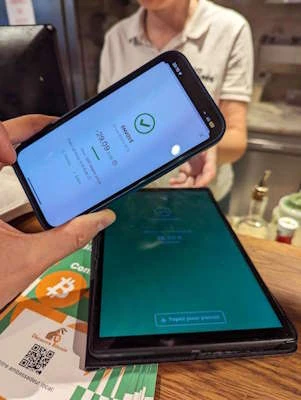

####
Enquanto o Bitcoin ainda está em sua infância, esta observação - com a qual você certamente já está familiarizado - nos leva a refletir sobre duas coisas.
Por um lado, como podemos incentivar os Bitcoiners a avançarem mais em seus aprendizados e em seus projetos, a fim de **explorar todo o potencial do Bitcoin**?
Por outro lado, como poderíamos incentivar novas pessoas que chegam pelo atrativo do lucro no "ecossistema de criptomoedas" a não perderem seu dinheiro na última memecoin da moda, mas a **se educarem sobre os fundamentos do Bitcoin**?
####
Para esses dois problemas, a melhor solução é estar no campo e educar.

## Por que criar uma comunidade ou encontro sobre Bitcoin?
<chapterId>893ea248-7d5a-5b8e-948c-7031497b1031</chapterId>

### Qual é a diferença entre uma comunidade e um encontro?

Embora, no ecossistema Bitcoin, não haja uma definição específica para esses dois termos, uma comunidade pode ser vista como a reunião de várias pessoas compartilhando uma (ou mais) paixão(ões) comum(ns), e comunicando-se juntas mais ou menos regularmente.
Em paralelo, um encontro é um evento organizado por (e para) esta comunidade, com um objetivo específico em mente. Portanto, geralmente é realizado uma vez que a comunidade associada tenha sido criada.
Neste sentido, ao longo deste curso, consideraremos que para lançar um encontro sobre Bitcoin, será necessário antes ter trocado com outras pessoas interessadas na realização deste tipo de evento; e, portanto, que **uma comunidade Bitcoin deve ter sido criada anteriormente**.
### Por que criar uma comunidade?

Como mencionado no capítulo anterior, criar uma comunidade pode ter vários objetivos.

Por um lado, quando é composta por bitcoiners, uma comunidade pode permitir que seus membros troquem e compartilhem informações entre si. A ajuda mútua está então geralmente no centro disso, permitindo que todos acelerem seu aprendizado.
Isso faz particularmente sentido no caso do Bitcoin, dada sua complexidade.

Em paralelo, uma comunidade de bitcoiners também pode permitir a construção entre pares. É assim que várias iniciativas e projetos significativos nascem, são construídos e desenvolvidos.
####
Por outro lado, uma comunidade Bitcoin também pode ter objetivos mais abertos; especialmente com o objetivo de educar o máximo possível a população sobre:
1. o que é Bitcoin;
2. como funciona;
3. o que traz para nossa sociedade;
4. as bobagens infundadas e/ou enganosas que algumas personalidades e mídias procuram espalhar;
5. suas diferenças fundamentais em relação a outras criptomoedas.

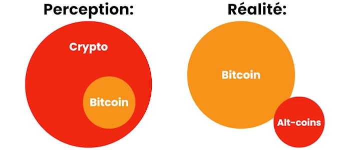

Construindo gradualmente as primeiras cidadelas do mundo de amanhã, **as comunidades Bitcoin ao redor do mundo se posicionam como um baluarte particularmente relevante contra tentativas de desinformação e/ou censura em alguns países**. Em paralelo, **elas criam um terreno fértil para aprender os fundamentos do Bitcoin**; permitindo que qualquer pessoa que ainda não tenha entendido, tenha, quando estiver pronta, os contatos e recursos para vislumbrar um novo mundo.

Além disso, **já que o Bitcoin é inclusivo, parece ser o papel de uma comunidade capacitar e educar todos os futuros bitcoiners sobre os fundamentos do Bitcoin**; incluindo os mais relutantes.
####
Embora falaremos mais sobre isso mais tarde no curso, ainda é relevante afirmar agora que **uma comunidade pode existir inteiramente de forma digital**. Assim, um grupo do Telegram "Bitcoin London", um grupo do Facebook "Bitcoin Berlin", um servidor do Discord "Bitcoin Madrid" ou uma lista de e-mails "Bitcoin France" constituem, inteiramente de forma digital, comunidades. Isso significa que **uma comunidade não precisa, tecnicamente, de encontros físicos para existir, progredir e desenvolver seus projetos. Seu objetivo permanece, contudo, compartilhar, construir e educar**.

### Por que criar um encontro?

Como dito anteriormente, **a criação de um encontro segue a criação de uma comunidade, pois é complementar a ela**.
De fato, ao longo da jornada de um entusiasta do Bitcoin, um número muito significativo de pessoas destaca o desejo (e a necessidade) de **encontrar e trocar fisicamente com outros** dentro do mesmo ecossistema. Isso geralmente é explicado pela emergência de um sentimento de solidão, presente entre muitos deles.
Organizar esses encontros pode, assim, permitir encontros físicos muito mais conviviais do que através de chamadas de áudio ou vídeo. Eles podem acontecer **durante uma bebida ou uma refeição**, e permitem trocas mais precisas e diretas, com um número maior de pessoas.

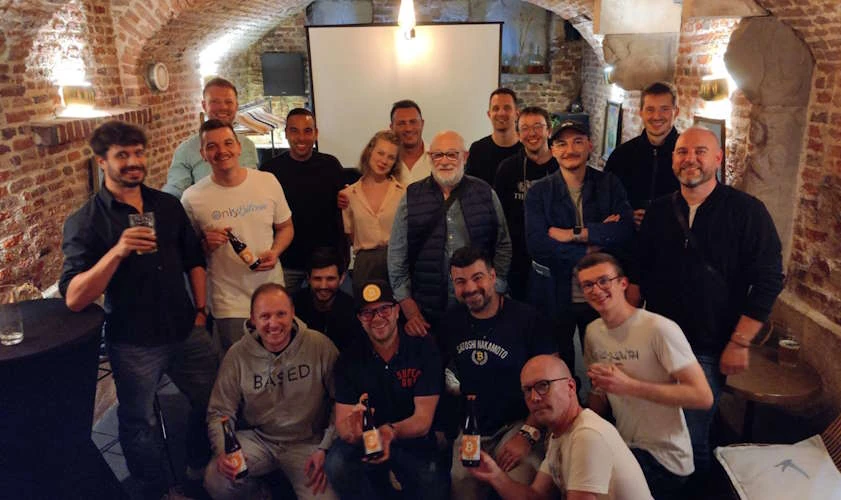

Para os entusiastas do Bitcoin, os encontros podem então ser um momento **propício para discussões sobre assuntos técnicos ou projetos** que estão desenvolvendo; e para os "aspirantes a Bitcoiners", para **descobrir o mundo do Bitcoin e se imergir gradualmente nele**.

Além disso, esses eventos também podem facilitar o anúncio de projetos relacionados ao Bitcoin, o empréstimo de equipamentos ou livros, a pré-estreia de um documentário; mas também, a realização de uma conferência ou um workshop sobre um determinado tópico. Falaremos sobre isso com mais detalhes na parte 6/8 deste curso, intitulada "[Exemplos de projetos e iniciativas](LINK).

Embora seja de responsabilidade de cada comunidade formar suas próprias opiniões, lançar seus próprios projetos e conduzir seus próprios experimentos, **os encontros parecem ser essenciais para o desenvolvimento do Bitcoin e suas comunidades**; e isso, em todos os territórios.

**Sua organização, no entanto, requer algum planejamento e tempo**; e é por isso que, neste curso, nos esforçaremos para compartilhar a experiência resumida das [sessenta comunidades francesas e belgas do Bitcoin](https://btcmap.org/communities/map#2/5.24949/0.20000); **para que você possa criar e desenvolver sua comunidade e seu encontro da forma mais simples possível**.

## Onde criar sua comunidade e seu encontro?
<chapterId>72da5285-5395-592d-ab62-303a0aef3d6d</chapterId>

Uma vez que você decidiu estabelecer uma comunidade Bitcoin, a primeira pergunta que você deve se fazer é: onde criá-la? E essa pergunta é essencial.

De fato, embora a criação de uma comunidade inicialmente dependa apenas de ferramentas de comunicação e redes sociais digitais, **a localização geográfica precisa ser considerada por várias razões**.

Inicialmente, ao procurar trocar e encontrar outros entusiastas do Bitcoin, é comum começar fazendo algumas pesquisas na internet. Isso rapidamente leva a descobrir e se voltar para servidores do Discord ou canais do Telegram como os de [Decouvre Bitcoin](https://decouvrebitcoin.fr/), ou até mesmo fóruns de discussão como [bitcointalk.org](https://bitcointalk.org).
Após alguns meses interagindo através de telas, muitas vezes surge o desejo de ir além. Esse desejo então cristaliza-se na necessidade de encontrar outros entusiastas do Bitcoin, com quem se sente "próximo" fisicamente. Em outras palavras: entusiastas do Bitcoin da própria cidade ou até mesmo do próprio departamento.
Infelizmente, **é totalmente possível que não exista uma comunidade Bitcoin perto de você naquele momento. Este é certamente o momento para você assumir o papel de embaixador de uma nova comunidade**.

Antes de começar, no entanto, é essencial antecipar o próximo passo: um encontro potencial. Um meet-up, em outras palavras!
No entanto, é claro que se os membros da sua comunidade tiverem que dirigir duas horas para chegar ao seu evento, poucos deles farão a viagem.
É por isso que **a geolocalização da sua comunidade (e, portanto, dos seus futuros meet-ups) tem um impacto considerável no seu desenvolvimento**.

####
Aqui estão alguns pensamentos que podem guiá-lo:
1) **Crie e desenvolva sua comunidade em uma cidade média ou grande**. Isso permitirá que você:
    * **encontre um local** muito mais facilmente para o seu meet-up e/ou seus projetos (apresentações, workshops, aceitar Bitcoin como meio de pagamento, etc.);
    * **aumente o sentimento de envolvimento e pertencimento** de um número maior de pessoas em relação à sua comunidade e seus eventos;
    * **facilite a adesão aos seus eventos** (transporte público, estacionamento para carros, etc.). **Portanto, escolher um local para a organização de um meet-up físico, próximo ao transporte público e estacionamento, é claramente aconselhável**.

2) **Escolha um nome para sua comunidade/meet-up que faça referência a esta cidade**, facilitando a identificação das pessoas com ela. Por exemplo: "Bitcoin Paris", "Einundzwanzig Berlin", "Satoshi Spritz Milano", etc.
####
Outro ponto mais do que relevante a se informar é: **já existe um meet-up perto de mim?**
Para fazer isso, você deve saber que o site [btcmap.org](https://btcmap.org/communities/map#0/0/0/) lista quase todas as comunidades e meet-ups globais.

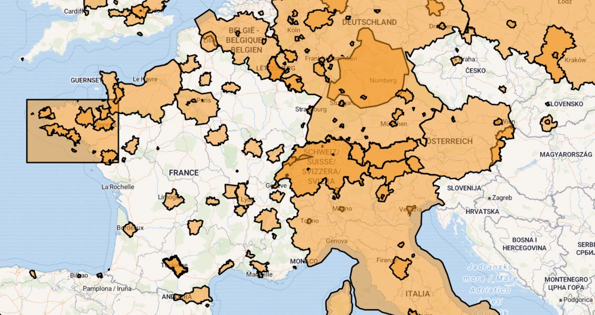
Após algumas pesquisas, se você decidir criar um meet-up ou uma comunidade na mesma cidade (ou na vizinha) que um meet-up ativo que está funcionando há vários meses/anos, você deve saber que isso pode criar uma forma de competição; mesmo que seja involuntária. Claro, dado que o Bitcoin é descentralizado, todos são livres para fazer o que desejarem. No entanto, está claro que **é mais relevante unir forças tanto quanto possível em vez de multiplicar comunidades próximas; assim, diminuindo a capacidade de impacto de cada uma**.
Nesse sentido, a seguinte "convenção" pode ajudá-lo a decidir sobre o assunto: se não existir uma comunidade Bitcoin ativa dentro de 45 minutos do seu local (vamos dizer de carro, por exemplo), então pode parecer relevante criar uma nova.
Mas, claro, você é totalmente livre para fazer como quiser.

Se, no entanto, uma comunidade Bitcoin existir mas não estiver ativa, pode ser mais relevante assumi-la e reacender sua chama; entrando em contato, por exemplo, com seus criadores anteriores com o objetivo de obter acesso aos canais de comunicação e redes sociais anteriormente utilizados.

Ao contrário, no caso em que uma comunidade Bitcoin antiga tenha - digamos - "evoluído", não compartilhe mais seus valores, e você não tenha a motivação ou tempo para convencê-los novamente, criar um fork é sempre possível.

## Quais objetivos devem ser estabelecidos?
<chapterId>0aae1aa8-93ec-544a-ad88-22d32c619595</chapterId>
Agora que você encontrou a cidade (ou localização geográfica) à qual você vai vincular sua comunidade, é essencial **pensar nos objetivos que você gostaria de alcançar**.
Esta questão pode ser respondida sozinho, no lançamento da sua comunidade/encontro, como pode ser uma vez que vários membros tenham se juntado a você e sua comunidade esteja ativa.

Para ajudá-lo, listamos algumas reflexões abaixo que podem ser úteis.
####
1. **Por que, como um bitcoiner, eu criei esta comunidade?** É para compartilhar meu conhecimento? Para educar? Para aprender com outros? Para conhecer outras pessoas que compartilham a mesma visão? Para se envolver no ecossistema? Para conhecer profissionais? Para simplesmente beber cervejas e fazer novos amigos?

Obviamente, dependendo de suas respostas, seu posicionamento e motivações não serão os mesmos.
Por exemplo, se seu objetivo é **compartilhar seu conhecimento com o objetivo de educar sobre o Bitcoin**, é claro que a **criação de conteúdo educacional** (artigos, podcasts, vídeos, apresentações, panfletos, etc.) é relevante. Você então poupará aos outros dezenas de horas de pesquisa e trabalho. Isso pode até ser levado adiante, através notavelmente da **organização de workshops, apresentações e conferências**.
Paralelamente, se seu objetivo é "simplesmente" conhecer outros bitcoiners para compartilhar seu dia a dia, isso pode ser feito de maneira muito mais relaxada; por exemplo, durante uma bebida.
No entanto, você está sem dúvida ciente de que brindar ajuda a facilitar as interações sociais, especialmente quando envolve álcool. Ainda assim, mesmo que ainda seja comum hoje se sentir sozinho e incompreendido por todos quando se está profundamente convencido do que o Bitcoin traz para nossa sociedade, é importante não esquecer que **beber cervejas permite discussões sobre o mundo, mas não para mudá-lo** :smirk:

Nesse sentido, **definir objetivos concretos e projetos parece necessário**.
####
2. É relevante **dar uma dimensão física à minha comunidade**? Se sim, que tipos de eventos poderiam ser realizados?

No caso de você desejar dar uma dimensão física à sua comunidade, seu primeiro evento certamente será um encontro. Seu objetivo será então, obviamente, conhecer gradualmente os bitcoiners que vivem perto de você.

No entanto, como veremos mais tarde na seção [Exemplos de projetos e iniciativas](LINK), **um encontro pode ser construído de diferentes maneiras, com objetivos variados e diversos**.
De fato, ele pode permitir **combinar a descoberta de novas pessoas e apresentação educacional sobre uma noção específica associada ao Bitcoin, apresentação profissional de soluções ou empresas Bitcoin, estratégia de orange-pilling de comerciantes, etc**. Cabe a cada organizador de encontro se posicionar de acordo com seus objetivos.

Às vezes, dependendo dos assuntos abordados (como para apresentações técnicas ou workshops manuais), pode ser relevante realizar um **evento além do encontro**, em um lugar diferente e em um horário diferente.

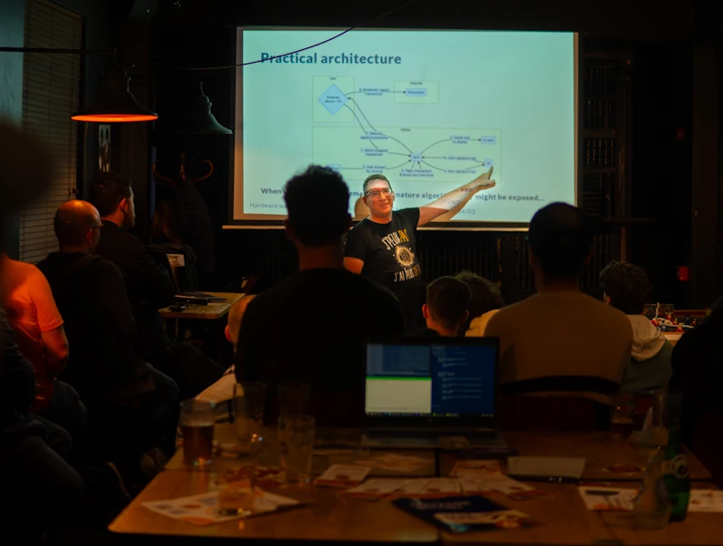

####
3. Que envolvimento eu gostaria que minha comunidade tivesse no ecossistema Bitcoin?

Esta questão, muito mais avançada, pode ser considerada desde a criação da sua comunidade.
De fato, se você aspira a **desenvolver uma comunidade unida, envolvida e cheia de bitcoiners motivados** que desejam educar e orange-pill o máximo de pessoas ao seu redor possível, então você precisará:
* por um lado, **aproximando você das comunidades desenvolvidas já existentes**, com o objetivo de acessar um painel mais substancial de informações, tendo acesso a uma multitude de links e recursos de código aberto que podem ser reutilizados, mas também para receber uma mão amiga quando precisar;* por outro lado, **organizando-se - e assim distribuindo tarefas - dentro da sua comunidade, a fim de ir mais longe juntos**.
####
Claro, definir objetivos não é uma tarefa fácil. No entanto, **objetivos de curto, médio e longo prazo** podem ser definidos em vários pontos na evolução da sua comunidade.
**Por exemplo, na criação da sua comunidade, você pode escolher focar a curto prazo no desenvolvimento de suas redes sociais e canais de comunicação. A médio prazo, o desenvolvimento de recursos educacionais (artigos, panfletos, etc.) parece acessível e relevante. Finalmente, a longo prazo, por exemplo em 6 meses, lançar um encontro presencial é geralmente concebível**.

Alguns meses depois, **quando seus encontros se tornarem regulares, você poderia então definir a curto prazo a implementação de apresentações ou workshops sobre temas específicos; a médio prazo, a realização de uma campanha de conscientização/educação sobre Bitcoin; e a longo prazo, a criação de uma associação ou a busca por um bar que aceite Bitcoin como meio de pagamento**.
####
No entanto, tenha em mente que criar uma comunidade não acontece da noite para o dia: **requer tempo, motivação e um pouco de organização**.
Às vezes, isso pode até ser desanimador; especialmente quando ninguém aparece em um dos seus encontros e você se sente sozinho carregando essa causa nos ombros.

Esta é a razão pela qual **este curso foi construído com o objetivo de compartilhar todos os recursos e dicas possíveis para que sua comunidade possa crescer e se tornar autônoma**.

# Criando uma identidade única para sua comunidade Bitcoin
<partId>da6673ad-bf49-5979-80a6-3f69cfb28046</partId>

## Por que e como criar sua própria identidade?
<chapterId>b48a18cc-afdf-5216-802c-32647b5cd8a3</chapterId>

Na continuação deste curso, vamos considerar que:
* você deseja criar uma comunidade (ou, eventualmente, um encontro) em uma cidade ou localização geográfica que já definiu;
* você definiu objetivos em diferentes horizontes de tempo, esses obviamente não sendo imutáveis.

**O segundo passo na criação de uma comunidade é obviamente o de sua identidade**. Isso envolve escolher seu nome, mas também **sua identidade visual**.
É por isso que nos esforçaremos, nesta parte 2/8, para oferecer tutoriais e soluções de software que permitam projetar a identidade visual da sua comunidade; e isso, sem necessariamente ter as habilidades de um designer.####
É evidente que quando um ser humano se identifica com um grupo, ele se sente mais envolvido. Nesse sentido, ter uma identidade única para sua comunidade é essencial.

Isso começa, antes de tudo, com a escolha do nome. De fato, dependendo do país, diferentes iniciativas e/ou comunidades nacionais existem.
Por exemplo, **na França, as cinquenta comunidades que se desenvolveram lá são nomeadas "Bitcoin [CIDADE]" ou "[CIDADE] Bitcoin"; levando assim seu grupo do Telegram a ser nomeado "Bitcoin [CIDADE] meet-up" ou "[CIDADE] Bitcoin meet-up"**.
Na Alemanha, a iniciativa "Einundzwanzig" (que significa "21") levou quase todas as comunidades de língua alemã a serem chamadas de "Einundzwanzig [CIDADE]"; enquanto na Itália, a iniciativa "Satoshi Spritz" - que é o instigador da maioria das atuais comunidades italianas - nomeia suas comunidades "Satoshi Spritz [CIDADE]". **Cada comunidade, assim, tem sua própria identidade, relativa à sua cidade de origem; mas também, à identidade global de seu país**.

Portanto, embora seja perfeitamente possível criar uma nova comunidade francesa com o nome que desejar, **parece mais relevante em nosso país chamá-la de "Bitcoin [CIDADE]" ou "[CIDADE] Bitcoin"**.

####
Paralelamente, **a identidade visual da sua comunidade e do seu encontro desempenha um papel essencial no seu desenvolvimento**, porque é em parte graças a ela que sua iniciativa será lembrada.
É por isso que, **ao criar suas redes sociais e seus canais de comunicação, um logo e um banner devem ter sido projetados**. No entanto, isso não precisa ser feito por um designer profissional, e existem ferramentas simples e gratuitas disponíveis.

Para criar sua identidade visual, a melhor abordagem é começar com um elemento ou lugar significativo da sua cidade. Isso poderia ser, por exemplo, a Torre Eiffel em Paris, o campanário ou a cidadela em Lille, a rocha Monégasque em Mônaco, o porto antigo em Marselha, etc.
Partindo deste elemento, é então possível projetar um logo que seja mais ou menos elaborado, dependendo da complexidade desejada.

Para dar algumas ideias, aqui estão alguns exemplos de logos de comunidades francesas:
- Em Marselha, o logo representa a basílica de Notre-Dame-de-la-Garde, que domina a cidade:

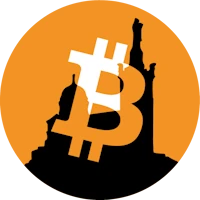

- Em Mônaco, refere-se à rocha Monégasque:

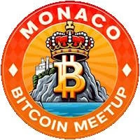
- Em Lille, o logo simplificado representa a cidadela de Vauban e seu parque, localizado a apenas alguns minutos do centro da cidade:

- Em Saint-Malo, a doninha - o emblema da cidade - é destacada:

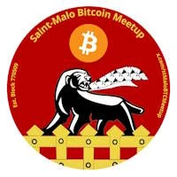

Agora cabe a você **encontrar um elemento ou lugar significativo na sua cidade e usá-lo para construir o visual para a sua comunidade Bitcoin**.

####
Além disso, se a inspiração transcender você, é até possível ir além criando um brasão, um lema ou até mesmo uma música relacionada à sua comunidade. Sua imaginação é então o seu único limite!

## Criar um Logo, um Poster e um Banner
<chapterId>3470a31f-0190-5e87-8af0-6a00e79267ef</chapterId>

### Usando o Canva

Para criar os diversos visuais para a sua comunidade, **é possível usar o [Canva](https://www.canva.com/)**.

Este site, fácil de usar e gratuito, é particularmente apreciado pela sua quantidade de modelos pré-desenhados; os quais você pode duplicar e modificar como desejar.

Ao **criar seu logo**, é então possível realizar uma busca na página inicial pelos diferentes logos pré-construídos, duplicar aquele ou aqueles que lhe interessam; e então modificá-los como desejar.
Adicionar um elemento de fundo representativo da sua cidade (importando uma foto ou procurando por "Ilustrações" ou "Imagens" no menu lateral "Elementos") pode então ser feito. Posteriormente, inserir o logo ou ₿ do Bitcoin por cima - até mesmo modificando sua cor, se desejado - é uma possibilidade.
No caso de **criar um banner ou um pôster**, você simplesmente precisa realizar uma nova pesquisa na página inicial do site para obter um pôster pré-desenhado. Após duplicá-lo, você poderá modificá-lo alterando os textos e fontes, adicionando o logo da sua comunidade e importando fotos para arrastar para um quadro (que você obterá procurando por "quadro" no menu lateral "Elementos").
Além disso, o menu lateral "Designs" permite procurar outros modelos de acordo com sua solicitação.

Finalmente, também é possível pesquisar na página inicial por uma **miniatura ou banner pré-desenhado para YouTube**, duplicá-lo e, então, modificá-lo como desejar.

Em resumo, **as possibilidades são infinitas e dependem das suas necessidades, mas também da carta gráfica que você deseja criar** para sua comunidade e seus encontros/eventos!
####
Para orientá-lo em mais detalhes, oferecemos abaixo um tutorial em vídeo não exaustivo apresentando algumas possibilidades:

####

Aqui estão também alguns arquivos pré-desenhados, duplicáveis e editáveis à sua disposição que usamos com nossa associação, Bitcoin Lille:
- **pôster de anúncio de meet-up** (para redes sociais e impresso em A4 ou A3): [link](https://www.canva.com/design/DAGBvBXFJ8A/92-j_toeLU8QbVAD0NwoAA/edit?utm_content=DAGBvBXFJ8A&utm_campaign=designshare&utm_medium=link2&utm_source=sharebutton)
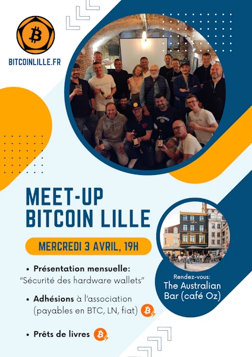

- **pôster de anúncio de evento conjunto** (para redes sociais e impresso em A4 ou A3): [link](https://www.canva.com/design/DAGBvG3rNCc/oXtNR9pduRs22AqclG4O2g/edit?utm_content=DAGBvG3rNCc&utm_campaign=designshare&utm_medium=link2&utm_source=sharebutton)

- **banner para certas redes sociais**: [link](https://www.canva.com/design/DAGBvOXyNqw/iSJG9PbIQHgGWHz5PhlXSQ/edit?utm_content=DAGBvOXyNqw&utm_campaign=designshare&utm_medium=link2&utm_source=sharebutton)

- **anúncio de um concurso**: [link](https://www.canva.com/design/DAGBvIjuA_w/YzSUXzOmbNV9oCma9mluOw/edit?utm_content=DAGBvIjuA_w&utm_campaign=designshare&utm_medium=link2&utm_source=sharebutton)

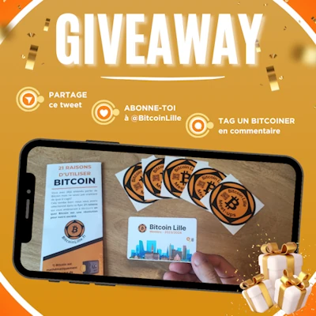

- **carta** da nossa biblioteca, exibida em A4 durante os meet-ups: [link](https://www.canva.com/design/DAGBvPqL7N4/LmUItfsysypRLSOFOzBXcQ/edit?utm_content=DAGBvPqL7N4&utm_campaign=designshare&utm_medium=link2&utm_source=sharebutton)
- **Apresentação PowerPoint** "Capítulo 2 - Entendendo as Transações com Bitcoin", por @ProfEduStream: [link](https://www.canva.com/design/DAFsEcnOro8/Mz9FYdTGhsvozZOe0Y9jtw/edit?utm_content=DAFsEcnOro8&utm_campaign=designshare&utm_medium=link2&utm_source=sharebutton)
- **Panfleto** "21 Razões para Usar Bitcoin", escrito por @ProfEduStream: [link](https://www.canva.com/design/DAFtAR1NauQ/ZDwl2CchIJ9Gpb36N6-7iw/edit?utm_content=DAFtAR1NauQ&utm_campaign=designshare&utm_medium=link2&utm_source=sharebutton)

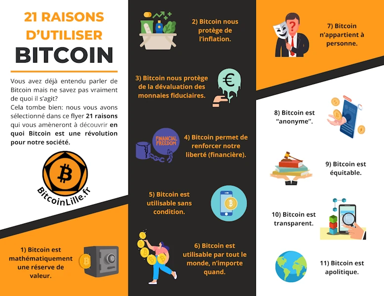
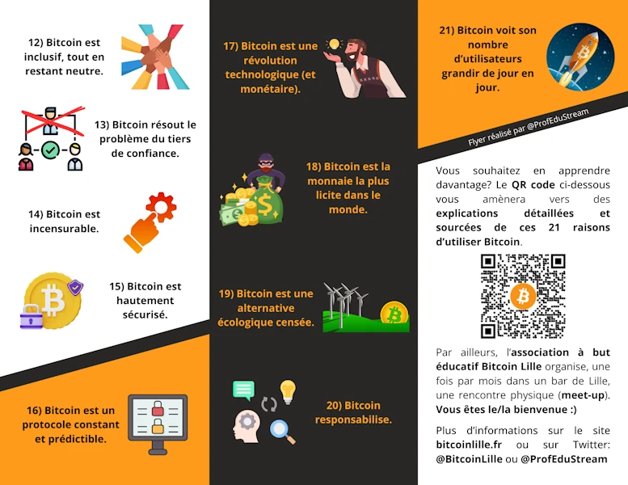
####
Como você pode observar, as possibilidades são infinitas e obviamente dependem das suas necessidades. **Não hesite em criar novos modelos você mesmo, depois reserve alguns minutos para compartilhá-los com outros ao seu redor para que possa economizar várias horas de trabalho para outras comunidades em seu país**. De fato, não esqueça que **toda comunidade, em algum momento, enfrentará as mesmas questões e necessidades que você. Ao compartilhar seus recursos de maneira open-source, você está, assim, acelerando indiretamente o desenvolvimento de todas as outras comunidades Bitcoin**.

No entanto, ao criar seus visuais, certifique-se de prestar atenção às dimensões esperadas pelas redes sociais e aplicativos de comunicação que você planeja usar.
Aqui estão algumas proporções e padrões que podem ser úteis para você:

| Rede / Plataforma | Logo      | Banner     | Pôster / Imagem |
| ----------------- | --------- | ---------- | --------------- |
| Telegram          | 512 x 512 | N/A        | N/A             |
| Signal            | N/A       | N/A        | N/A             |
| Twitter           | 400 x 400 | 1500 x 500 | 1200 x 628      |
| Meet-up           | N/A       | N/A        | N/A             |
| Discord           | 512 x 512 | 960 x 540  | N/A             |
| Facebook          | 512 x 512 | 851 x 315  | 960 x 720       |

Nesse sentido, para a criação de um **logo**, o tamanho adequado é **512 pixels por 512 pixels**.
Para um **banner**, **depende especificamente da aplicação ou site** que você está usando.
Quanto a **pôsteres e outras imagens**, o formato clássico **A4** geralmente é relevante.

### Usando Inteligência Artificial

Embora o Canva permita que você faça inúmeras coisas (logos, pôsteres, banners, panfletos, etc.), obviamente não é o único site ou software que permite realizar esse conjunto de tarefas.
Nesse sentido, se você se sentir mais confortável usando outro pacote de software (notavelmente Photoshop ou Illustrator), faça o que for mais prático para você.

No entanto, seja na criação de um logo para sua comunidade ou na adição de visuais atraentes a pôsteres, apresentações ou panfletos, **pode ser relevante usar inteligência artificial para aprimorar seus materiais**.

Para fazer isso, existem várias IAs. Notavelmente:
- [midjourney](https://docs.midjourney.com/docs/quick-start) (pago);
- [leonardo](https://leonardo.ai/) (grátis, limitado por conta);
- [copilot](https://copilot.microsoft.com/) (grátis, limitado por conta);
- [DALL-E](https://www.dall-efree.com/) (pago). Obviamente, muitas outras inteligências artificiais surgiram nos últimos meses no campo da criação de conteúdo visual. Portanto, esta lista não é exaustiva.
####
Caso alguém queira criar, por exemplo, uma imagem ou logotipo futurista para o encontro "Bitcoin London", pode então pedir ao "copiloto" de IA:
- [ ] *Crie um logotipo do Bitcoin com a Ponte de Londres e o Big Ben ao fundo. Futurista* - [Link](https://copilot.microsoft.com/images/create/un-logo-bitcoin-futuriste-avec-en-arric3a8re-plan-le-/1-6612ba1758df4384bc33c4bca00ab45b?FORM=SYDBIC)

Se as quatro propostas do copiloto não forem realistas o suficiente para o seu gosto, é possível adicionar à conversa:
- [ ] *Torne a 4ª muito mais realista* - [Link](https://copilot.microsoft.com/images/create/un-logo-bitcoin-futuriste-avec-en-arric3a8re-plan-le-/1-6612ba64b72d4cea9830ab7eb844f785?FORM=SYDBIC)

A última renderização é bastante agradável, aliás!
####
No entanto, se desejar um logotipo muito mais simplificado, por exemplo, para um adesivo, pode então entrar no "copiloto":
- [ ] *Crie o logotipo para o "Encontro Bitcoin de Londres" com um estilo britânico e simplificado* - [Link](https://copilot.microsoft.com/images/create/logo-for-27londres-bitcoin-meetup27-with-a-british-a/1-6612bb9451924859a6c34b350b3a6ebc?FORM=SYDBIC)
      
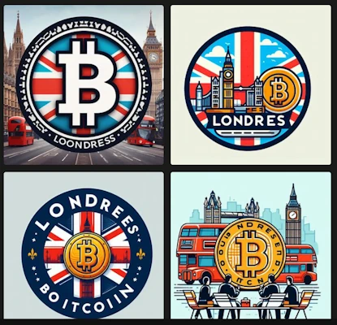

A segunda renderização é típica e poderia fazer o trabalho perfeitamente!
####
No entanto, embora permita a criação de renderizações visuais muito interessantes em tempo recorde, **infelizmente, a inteligência artificial não será capaz de alcançar exatamente o que você gostaria de fazer em detalhes**.
Portanto, seja paciente, tente ditar instruções (ou "prompts") o mais precisamente possível; e **se não estiver satisfeito com as renderizações obtidas, nada impede que você se aproxime de um bitcoiner mais conhecedor no assunto**. Por alguns sats (ou gratuitamente), é certo que eles criarão um logotipo ou visual de qualidade para você.

# Criando canais de comunicação para sua comunidade Bitcoin
<partId>fc588298-6876-554c-bd57-55d182464878</partId>

## Quais canais de comunicação priorizar?
<chapterId>b4f4eef6-1035-5290-848a-2b7f9391c77a</chapterId>
Como mencionado anteriormente, dependendo das motivações e hábitos individuais, os canais de comunicação de uma comunidade podem ser diferentes. Por exemplo, **na França, Alemanha e Itália, Telegram e Twitter são os principais canais de comunicação**. Com o tempo, eles se tornaram "padrões de comunicação" para as comunidades Bitcoin nesses países. No entanto, algumas comunidades também usam outros canais para propósitos específicos. Em contraste, na República Tcheca, as numerosas comunidades que se desenvolveram lá usam **Matrix**, um protocolo de mensagens instantâneas criptografadas. Em seu país, o Telegram é assim raramente usado.
Neste sentido, **para escolher canais de comunicação, a abordagem mais relevante é começar tomando exemplos de comunidades vizinhas no próprio país**. Para fazer isso, acessar o mapa em [btcmap.org](https://btcmap.org/communities/map#0/0/0/) lhe dará uma ideia muito precisa dos canais de comunicação mais usados no seu país. Na Suíça, por exemplo, as informações são principalmente transmitidas através do Telegram, Twitter e do site da comunidade.
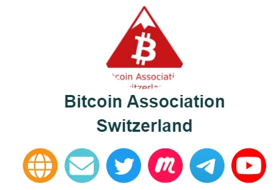
####
**No caso da França (e do mundo francófono em geral), o principal canal de comunicação é o Telegram**. Mais de 90% dos encontros franceses têm um: é um "indispensável". Seguindo isso, **a principal rede social usada pelas comunidades é o Twitter** (70% dos encontros franceses); uma rede social na qual a maioria dos bitcoiners está presente. Além disso, quase 30% dos encontros franceses (assim como todos os encontros canadenses) têm uma conta paga no aplicativo **Meetup**. De fato, isso pode ser uma excelente maneira de dar visibilidade a eventos fora do ecossistema Bitcoin. Finalmente, 30% dos encontros franceses também têm um **site**; e 10%, um servidor **Discord** e uma conta **NOSTR**.
####
Claro, outros canais de comunicação e redes sociais são às vezes usados: Matrix, Keet, Signal, Facebook, Instagram, LinkedIn, etc. **Cada comunidade é de fato livre para desenvolver os canais que desejar**. No entanto, é óbvio que, **quanto mais canais de comunicação e redes sociais são multiplicados, mais tempo é exigido do(s) organizador(es) para gerenciá-los**, para postar informações importantes regularmente e para moderar, se necessário.
####
**Para quem deseja iniciar uma comunidade na França, é aconselhado começar apenas com:**
- **um grupo no Telegram**;
- **uma conta no Twitter**.

Dependendo do seu tempo e desejos, você pode desenvolver outros redes mais tarde; até mesmo **atribuindo a moderação a futuros membros da sua comunidade**.

## Criando e Configurando um Canal, Grupo ou Super-Grupo no Telegram
<chapterId>d13714ce-8f08-53e9-bedd-b6a3aaac5dad</chapterId>
Como mencionado anteriormente, o Telegram é um "indispensável" em muitos países. No entanto, ao criar um canal de comunicação para sua comunidade nesta aplicação de mensagens instantâneas, é importante entender as diferenças entre:
- um canal no Telegram;
- um grupo no Telegram;
- um super-grupo no Telegram.

Veremos mais adiante, mas **é altamente recomendado escolher "grupo no Telegram" ao criar** (ou, dependendo dos seus objetivos, "super-grupo no Telegram").
####
Para os tutoriais que seguirão, usaremos a aplicação APK "Telegram+"; uma aplicação que permite uma configuração mais avançada do seu Telegram. No entanto, isso não é necessário, pois criar um grupo ou super-grupo no Telegram agora pode ser feito muito facilmente em um telefone:

### Criando um Canal no Telegram

Se você quer criar um lugar onde seus membros possam trocar diretamente entre si, responder uns aos outros, etc., então um canal no Telegram definitivamente não é o que você deve escolher!
Então, vá diretamente para a próxima seção, intitulada [Criando um Grupo no Telegram](LINK).

De fato, **um canal no Telegram é apenas uma vitrine de informações postadas pelos administradores, na qual os membros não podem fazer muito mais do que adicionar emojis**.

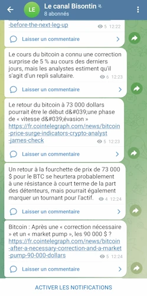
No entanto, é possível adicionar a capacidade para os membros do canal comentarem em cada postagem do administrador, mas isso será feito em discussões separadas; dividindo significativamente as trocas. **Portanto, criar um canal no Telegram geralmente não é recomendado para uma comunidade**.
####
Tutorial para criar um canal no Telegram:

### Criando um Grupo no Telegram

Ao contrário, **criar um grupo no Telegram é bastante relevante**.
De fato, para tomar exemplos bem conhecidos como grupos no Messenger ou WhatsApp, todos que se juntarem a este **grupo no Telegram poderão trocar mensagens entre si, responder uns aos outros; e isso, tudo dentro da mesma discussão**.

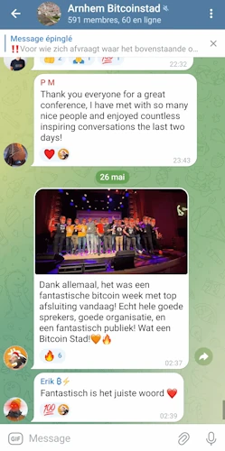

Os administradores deste canal poderão então:
- postar mensagens eles mesmos;
- **fixar** as mais importantes;
- postar **enquetes** (muito útil para escolher a data do próximo encontro quando ainda não é regular, ou seja, quando a comunidade ainda está em desenvolvimento);
- criar um **link de convite personalizado** (desde que o grupo seja "público" e não "privado", o que deve ser definido nas configurações. Também é muito prático ter seu link de convite do Telegram estilizado como: t.me/Bitcoin[CIDADE]);
- **adicionar ou remover permissões, administradores e membros**;
- **Adicionar uma "foto de perfil"** ao grupo do Telegram (ou seja, o logo da sua comunidade), **e mudar seu nome**.
####
Tutorial para criar um grupo no Telegram:

Uma nota rápida: como mencionado antes, o tutorial acima foi feito em um computador com o APK "Telegram+". No entanto, agora é muito fácil criar um grupo no Telegram em um telefone.
Portanto, não é mais necessário baixar o "Telegram+" para realizar essa tarefa; a menos que você queira se aprofundar nas configurações de privacidade do seu grupo.

### Criando um supergrupo no Telegram

A desvantagem de um grupo no Telegram é que, quando começa a ter várias centenas de membros, discussões paralelas no mesmo canal de comunicação começam a se tornar confusas. Isso então leva a um efeito indesejável: alguns membros não seguem mais o grupo do Telegram diariamente, às vezes fazendo com que percam informações importantes; como a data do próximo encontro.

Para remediar isso, várias soluções podem ser aplicadas:
1. **Fixar mensagens importantes como administrador**, para que todos sejam notificados (pressione uma vez na mensagem em questão com o dedo, depois selecione "Fixar");
2. sugerir à sua comunidade para **usar um servidor no Discord** com vários canais de comunicação variados, que cada um pode silenciar se desejar;
3. **criar um "supergupo" no Telegram**.
####
Mas o que é um supergrupo no Telegram?

É simplesmente **um grupo no Telegram no qual vários "tópicos" são integrados**. Assim, um tópico **"Informações Importantes"** pode ser criado, no qual apenas informações importantes e informações associadas a eventos/encontros futuros serão postadas.
Um tópico **"Geral"** também pode ser configurado, no qual todos os membros poderiam discutir.
Finalmente, **tópicos específicos** (mineração, desenvolvimento de um projeto, próxima conferência, etc.) podem ser adicionados.

Cabe a você modificar isso de acordo com seus desejos; semelhante, por exemplo, ao supergrupo do Meet-up de Bitcoin de Abidjan.

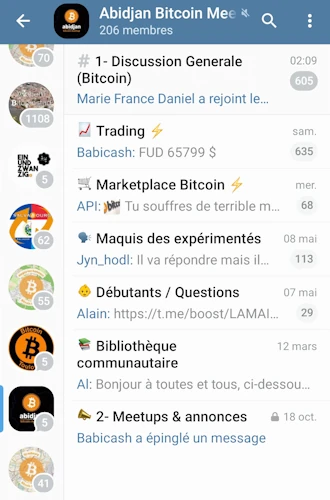
####
No entanto, deve-se notar que **um supergrupo do Telegram pode ser mais difícil de usar para alguns membros**. De fato, às vezes, alguns não conseguem entender **como acessar os outros tópicos deste supergrupo** (para isso, basta clicar no logo do grupo; e isso abre a lista de tópicos criados). Ajudá-los enviando um curto vídeo tutorial em uma captura de tela pode então ser uma boa ideia.####

Em geral, não há um número específico de membros no qual se torna relevante usar um supergrupo do Telegram em vez de um grupo do Telegram. Portanto, a escolha é sua, com base nas necessidades e solicitações de seus membros; enquanto sabe que um grupo do Telegram pode ser facilmente convertido em um supergrupo do Telegram (e vice-versa). Para fazer isso, você simplesmente precisa criar um tópico (ou deletar todos eles).

Tutorial para criar um supergrupo do Telegram:

Nota: como mencionado antes, o tutorial acima foi feito em um computador com o APK "Telegram+". No entanto, agora é muito fácil criar um supergrupo do Telegram em um telefone.
Para fazer isso, simplesmente crie um grupo do Telegram; então, nas suas configurações, clique no botão "Tópicos" para adicionar alguns. Uma vez que a mudança seja validada, uma lista de tópicos aparecerá; e você pode modificá-la como desejar.
Não é mais necessário baixar o "Telegram+" para realizar essas tarefas; a menos que você deseje se aprofundar nas configurações de privacidade do seu supergrupo.

## Configurando seu grupo ou supergrupo do Telegram
<chapterId>35e674b3-5924-50b0-98f1-83a56c9a186d</chapterId>

Agora que você criou seu grupo (ou supergrupo) do Telegram, é hora de **pensar nas suas permissões e moderação**. E, obviamente, cada comunidade é livre para fazer como quiser!

No entanto, **pela experiência, é preferível remover dos membros as permissões para**:
- **enviar uma enquete**;
- **enviar arquivos** (em caso de vírus);
- **enviar mensagens de voz**;
- **adicionar usuários** (em caso de entrada de um bot);
- **fixar mensagens**;
- **modificar as informações de troca**.

Também é **altamente recomendado escrever uma descrição do seu encontro ao criar o grupo ou supergrupo no Telegram**, pois será visto por qualquer pessoa que deseje entrar. Isso poderia ser, por exemplo:

> Bem-vindo ao Telegram do @Bitcoin[CIDADE] 🔥
> 
> Organizamos um encontro todo primeiro quarta-feira do mês, no bar [NOME_DO_BAR] em [CIDADE] 🍻
> 
> Para acessar nossas outras redes sociais: [LINK_DESEJADO] 🌐

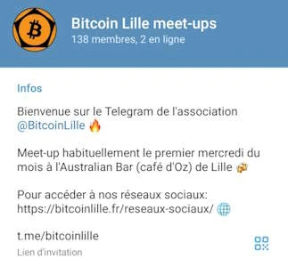

Também é observado, na imagem acima, que o link de convite foi personalizado pelos administradores do grupo do Telegram Bitcoin Lille, pois é público.

Posteriormente, em "Configurações do Grupo", pode ser relevante **ativar "Aprovar novos membros"**.
De fato, pela experiência, houve uma instância onde o grupo do Telegram de uma comunidade Bitcoin foi atacado por várias milhares de contas falsas querendo entrar no grupo com o objetivo de spammar e destruí-lo. Além de permitir a remoção de contas pornográficas falsas querendo acessar seu grupo, **ativar a aprovação de membros certamente o salvará de um ataque do tipo spam**.
Finalmente, na seção "Administradores", é possível adicionar um recurso de "Anti-spam Agressivo", que automaticamente deleta mensagens consideradas como tal. No entanto, isso pode não ser necessariamente necessário.
## Inserindo um Bot Multifuncional em um Canal do Telegram
<chapterId>c61f69cc-15ec-53f1-8c02-1cea55def09e</chapterId>

**Outra possibilidade para configurar e proteger seu grupo ou supergrupo do Telegram é adicionar um bot multifuncional**. Isso de fato permite uma configuração muito mais avançada.

Entre as múltiplas opções disponíveis com **o bot [@GroupHelpBot](https://telegram.me/grouphelpbot)**, destacamos entre outras:
- **adicionar um conjunto de regras** (comando /rules);
- configurar um **mecanismo anti-spam**;
- adicionar uma **mensagem de boas-vindas automática e personalizável para novos membros que é deletada após alguns minutos**;
- configurar o **mecanismo anti-flood**;
- adicionar um comando de @administrador;
- adicionar blocos;
- adicionar um comando para obter o link do grupo (/link);
- configurar permissões de comando;
- deletar automaticamente certos tipos de mensagens;
- etc.

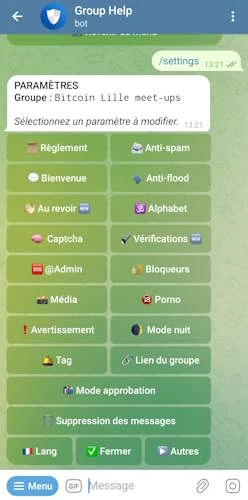

Três outras ideias simples são:
- **criar um comando "/link"** para enviar o link de acesso ao grupo do Telegram;
- o mesmo para obter redes sociais ("/socials") ou suas possíveis regras em caso de moderação ("/rules");
- **bloquear a entrada de bots** e "entradas/saídas".

Inúmeras opções adicionais também estão disponíveis para você. No entanto, um conselho: **não tente restringir demais as trocas**.
####
Tutorial para adicionar um bot multifuncional a um grupo ou supergrupo no Telegram:

Pequena nota: como mencionado antes, todo esse procedimento agora pode ser feito em um telefone.

## Criando um Servidor no Discord
<chapterId>eef2a965-4c24-5f3a-8013-72cc7d315314</chapterId>

À medida que o número de membros no seu grupo do Telegram aumenta, transformá-lo em um supergrupo no Telegram pode ser a solução.
No entanto, como mencionado anteriormente, **as potenciais "dificuldades de usabilidade" e o aumento no número de tópicos e mensagens em um supergrupo do Telegram podem levar à perda de interesse entre alguns membros ativos**.
**O Discord então se apresenta como uma alternativa** para criar um supergrupo no Telegram, pois permite **a criação de canais de texto e voz específicos**; e, o mais importante, seus usuários podem silenciar quaisquer canais que não lhes interessem.

Obviamente, além do Telegram e Twitter, isso ainda requer um pouco mais de tempo para gerenciar; especialmente durante sua configuração e lançamento.

Para facilitar as coisas para você, **estamos compartilhando um [servidor do Discord pré-fabricado, duplicável e modificável](https://discord.com/template/bDY4eXXJk2C8) para você personalizar como desejar**:

####
Assim, quando bem construído, um servidor do Discord pode ser um verdadeiro ativo para sua comunidade. De fato, muitos Bitcoiners já usam o Discord diariamente (e não o Telegram), e **permitir que eles sigam as conversas do grupo do Telegram diretamente dentro do servidor do Discord é uma economia de tempo significativa**. E vice-versa.
É por isso que um bot de código aberto chamado [TediCross](https://github.com/TediCross/TediCross) foi desenvolvido. Seu objetivo é simples: transferir automaticamente mensagens de um canal de texto do Discord para um grupo do Telegram (ou um tópico em um supergrupo do Telegram); e vice-versa. Isso pode, portanto, ser muito interessante para configurar.####
No entanto, vale ressaltar que sua instalação não é muito simples, que **é necessário manter um prompt de comando (CMD) em execução contínua em um computador para que este bot funcione**; mas também, que às vezes ocorrem erros de bugs. Felizmente, nesta situação, basta reiniciá-lo; e então tudo volta ao normal.

Com o objetivo de economizar seu tempo novamente, aqui está um tutorial sobre como adicionar um bot multifuncional a um grupo ou supergrupo do Telegram:

## Considere outros canais de comunicação, privados e mais seguros
<chapterId>29d0aad6-0612-5dd0-bcef-7337eaf4fefc</chapterId>

Como mencionado anteriormente nesta seção, Twitter e Telegram são os dois principais canais de comunicação usados na Europa (e possivelmente no mundo).
No entanto, você provavelmente está ciente de que **o Telegram não é o serviço de mensagens mais seguro e confidencial e que o Twitter não é a empresa mais livre para se mover no mundo**.
Nesse sentido, **é totalmente relevante - quando você tem tempo para alocar - começar a pensar em alternativas**.
Esta é de fato a razão pela qual, nos próximos meses, tutoriais sobre o uso de protocolos de comunicação mais confidenciais e seguros serão oferecidos [dentro deste próprio curso, em planb.network](LINK).
####
Mas por que considerar essas alternativas?

Simplesmente porque, como a rede social NOSTR e aplicativos de comunicação como Matrix, Signal ou Element, eles são descentralizados e/ou criptografados. Além do **ganho em confidencialidade** nas trocas feitas entre diferentes membros da sua comunidade, isso também permite que você **proteja contra um desligamento (censura?) do seu grupo ou supergrupo no Telegram**.
O que poderia ser melhor, assim como o protocolo Bitcoin, do que **ser incensurável e imutável**?

# Lançando suas redes sociais
<partId>8ebf8cd7-9248-543f-bc27-4ec4cc03f9cf</partId>

## A importância da visibilidade para o desenvolvimento da sua comunidade Bitcoin
<chapterId>b20f12e4-c5de-5f02-80c7-b7fc6cadd3ac</chapterId>

Aí está, sua comunidade está lançada, e você agora tem um ou mais canais de comunicação (Telegram e/ou Matrix, por exemplo)!
No entanto, por enquanto... você está sozinho. Então, você terá que **fazer - um pouco - de comunicação**.

É de fato óbvio que, se ninguém pode acessar seus canais de comunicação, nos quais você postará regularmente informações (data do próximo encontro, projetos, etc.), você estará trabalhando em vão. É por isso que **as redes sociais - e certas plataformas específicas, que discutiremos mais tarde - desempenharão um papel predominante no desenvolvimento da sua comunidade**.

Entre essas redes sociais, **o Twitter se posiciona como quase essencial no mundo do Bitcoin**. Nesse sentido, parece importante **ter um perfil nesta plataforma**; mesmo que sua centralização e desenvolvimento estejam longe de serem corretos.
É por isso que um **perfil NOSTR específico para a sua comunidade** também pode ser criado, com a ideia de antecipar possíveis restrições e/ou censura no Twitter. Afinal: é melhor prevenir do que remediar.
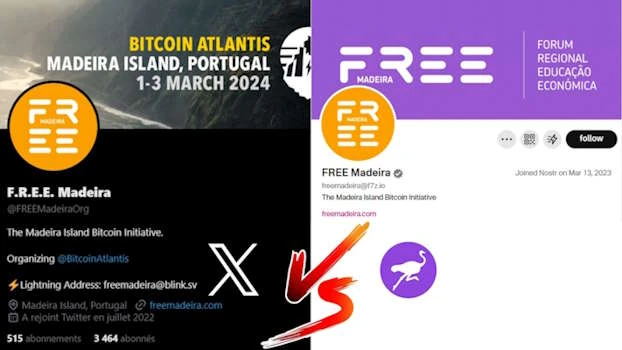

Outras redes sociais obviamente podem ser utilizadas. Esse é o caso do Facebook (no caso de um grupo ou página do Facebook) ou até mesmo do LinkedIn.
No entanto, é importante lembrar que **quanto mais canais de comunicação e redes sociais forem criados - e, portanto, para manter - mais tempo consome. É melhor focar nos mais relevantes; e o Twitter (e NOSTR) parecem ser bons candidatos**.
Na parte seguinte deste curso, explicaremos em detalhes como criar uma conta no Twitter e como usá-la efetivamente para ganhar máxima visibilidade. Explicações e tutoriais semelhantes sobre o NOSTR serão adicionados a esta seção [Lançando suas redes sociais](LINK), em algumas semanas.

## Criando um Perfil no Twitter
<chapterId>c8d73097-8eba-5530-918c-221002954110</chapterId>

O Twitter é muito amigável ao usuário, requerendo o ajuste de algumas configurações para melhorar a privacidade.

**Ao criar uma nova conta no Twitter, quatro informações essenciais devem ser fornecidas**:
1. **o @ Twitter**, que definirá sua identidade e tornará você facilmente pesquisável. Se sua comunidade é chamada "Bitcoin [CIDADE]", é, portanto, bastante relevante escolher "@Bitcoin[CIDADE]";
2. **o logo e banner** que você criou para sua comunidade ou seu encontro (veja a seção [Criando um logo, um pôster e um banner](LINK));
3. **a descrição**, que permitirá que você dê informações importantes sobre sua comunidade em cerca de uma centena de caracteres. Isso poderia ser, por exemplo:
> Conta oficial da comunidade Bitcoin [CIDADE] #BTC | Meet-ups toda 1ª quarta-feira do mês no [NOME_DO_BAR] em [CIDADE] 🍻 | Junte-se a nós no Telegram 🔽
4. Abaixo desta descrição, também é possível **inserir um link**. Isso pode levar os usuários a acessar uma página de "redes sociais" disponível no site da sua comunidade, ou pode direcioná-los ao seu canal de comunicação no Telegram.

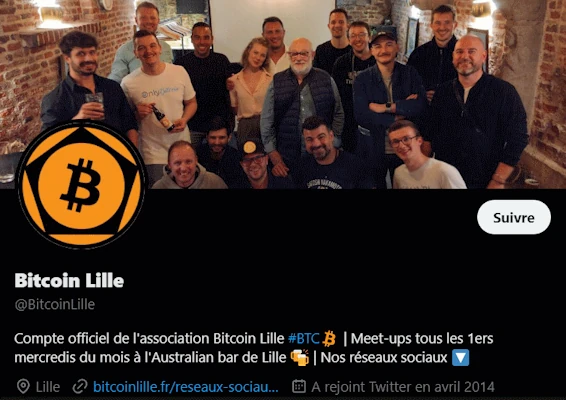

Além disso, **algumas configurações de privacidade parecem relevantes para mudar**; sendo as mais pertinentes obviamente:
* a escolha de **deixar sua conta do Twitter em modo "público"** (postagens visíveis para qualquer pessoa);
* ser **identificável por todos** (cuidado com golpes);
* **desabilitar o rastreamento de localização e compartilhamento de dados com outras entidades** (uma questão de privacidade).
####
Com o tempo, você passará a postar no Twitter. Esses tweets então anunciarão seu próximo evento, uma informação importante no ecossistema, ou até mesmo um anúncio de outra comunidade que você segue.
No entanto, como na vasta maioria das redes sociais, **a visibilidade é a chave para o sucesso**.
Para poupar-lhe uma quantidade significativa de tempo, tomamos o tempo para estudar o [código-fonte aberto do algoritmo de classificação do Twitter](https://github.com/twitter). Aqui estão **os pontos chave para prestar atenção a fim de aumentar sua visibilidade**:
* Geral:
    - **tweete no idioma que você definiu** na sua conta do Twitter, ou em inglês (caso contrário, a penalidade é severa);
    - **tweete apenas informações relacionadas ao domínio de expertise da sua conta** (caso contrário, há uma forte penalidade);
    - tweete 1 a 2 vezes por dia (consistência é importante);
- **tweetar durante os horários de alta visibilidade** (sendo os mais interessantes quinta ou sexta-feira entre 8h e 10h; consulte o "Twitter Analytics" da sua conta).
* Ao escrever um tweet:
    - **adicionar uma foto** (ou um vídeo);
    - **adicionar apenas uma hashtag ao seu tweet** (#Bitcoin geralmente é a mais relevante. Se fizer sentido, e desde que esteja relacionado ao domínio de especialização da sua conta, adicione uma hashtag que esteja em alta);
    - **encorajar sua comunidade a curtir** (peso de 0,5), **a retweetar** (peso de 1) **mas especialmente a responder** (peso de 27!);
    - **responder às pessoas que respondem aos seus tweets** (peso de 75!);
    - **não adicionar um link no seu tweet inicial** (isso pode ser feito no primeiro comentário, por exemplo);
    - escrever as palavras por inteiro, sem usar abreviações.

* Outros pontos a observar:
    - tweetar de acordo com as tendências, desde que estejam dentro do domínio de especialização da sua conta;
    - **repostar / retweetar os tweets mais visualizados**;
    - **realizar enquetes ocasionalmente**;
    - **escrever threads se possível**;
    - encorajar sua comunidade a visitar e seguir seu perfil.
####
Além disso, **é possível fixar um tweet no seu perfil do Twitter ao qual você deseja dar uma visibilidade significativa**.

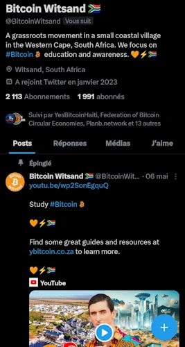

Note também que é possível, tanto no telefone quanto no computador, estar logado em duas contas do Twitter ao mesmo tempo. Isso pode ser muito conveniente para não ter que fazer login / logout entre sua conta pessoal e sua conta da comunidade; assim como pode ser um problema se você postar acidentalmente uma foto sua fantasiado com sua conta da comunidade... Cuidado, portanto!

Finalmente, embora seu nome de usuário "@Bitcoin[CIDADE]" seja único e agora pertença a você, pode ser prudente criar preventivamente contas "@Bitcoin_[CIDADE]", "@[CIDADE]Bitcoin", ou "@[CIDADE]_Bitcoin" para **garantir que ninguém tente duplicar sua identidade**. É de fato melhor antecipar!

Tutorial para criar uma conta no Twitter:

## Conectando-se com meet-ups vizinhos
<chapterId>12a21c3b-235a-5292-8209-67bf60f61e49</chapterId>

Agora que seus canais de comunicação e redes sociais foram criados, configurados e polvilhados com a identidade visual da sua cidade/comunidade/meet-up, é hora de começar a seguir as "pessoas certas" nessas plataformas.

No Twitter, isso pode começar por **seguir certas contas que trabalham no desenvolvimento do Bitcoin internacionalmente**, como @Bitcoin, @bitcoincoreorg, @planb_network, @FBCEglobal, e retweetando o famoso "Running bitcoin" de 11 de janeiro de 2009, por @halfin; mas também - e mais importante - **seguindo as contas das comunidades e meet-ups de Bitcoin no seu país**.
De fato, **isso permitirá o seguimento mútuo, marcações e, assim, ganhar visibilidade coletivamente**.
Isso acontece entre as cerca de cinquenta comunidades francesas de Bitcoin; e o mesmo vale para a maioria das iniciativas "Satoshi Spritz" na Itália e "Einundzwanzig" na Alemanha.
Embora possa parecer desnecessário para alguns, **seguir as contas de comunidades locais e iniciativas no seu país pode levar indiretamente à realização de projetos conjuntos**, ou até mesmo "parcerias". Foi assim que as comunidades Bitcoin Liège e Bitcoin Lille entraram em contato (o mesmo vale para Bitcoin Aix e Bitcoin Marseille); agora levando-os a realizar pelo menos um encontro conjunto por ano. Os jantares do **Cercle du Coin** são outro exemplo.

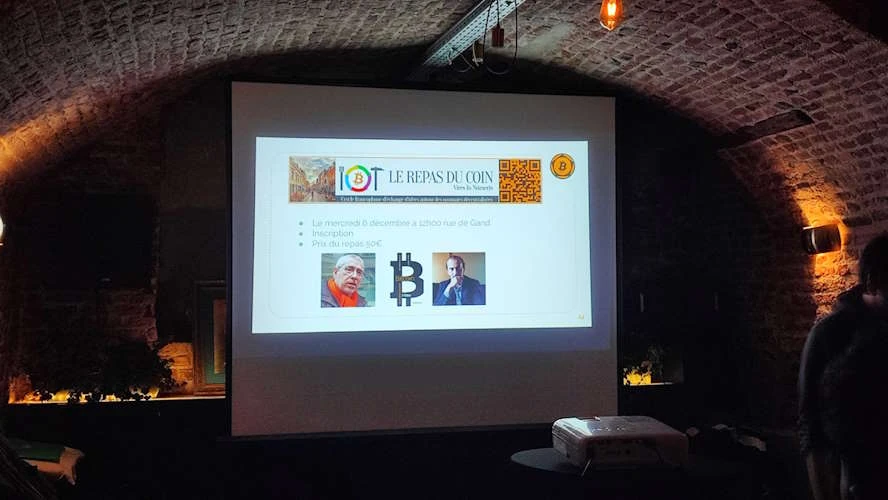

Além disso, na França, também pode ser relevante **seguir iniciativas @KonsensusFR, @bitcoinpointfr, @DecouvreBitcoin e @btcmap**. Estas são apenas sugestões, e cada comunidade obviamente é livre para fazer como quiser, em total descentralização e autonomia.
O interesse em se seguir mutuamente é bastante simples: proporcionar visibilidade um ao outro. De fato, quanto mais presente você estiver nas redes, mais as pessoas falarão sobre você; e quanto mais as pessoas falarem sobre você, mais provável é que as pessoas venham aos seus eventos. Curtir/retuitar postagens de outras comunidades nas redes sociais também pode ser interessante.
####
Paralelamente, também é possível **oferecer aos organizadores de encontros e àqueles que criaram uma comunidade a oportunidade de se encontrar em um horário pré-definido durante eventos físicos**. Isso pode permitir uma discussão sobre os sentimentos de todos, falar sobre a evolução das comunidades presentes, compartilhar ideias para projetos que tiveram sucesso; mas também, oferecer soluções uns aos outros quando necessário. Um relatório escrito pode então ser compartilhado após este "encontro" com os organizadores de comunidades no seu país que não estavam presentes, se desejado.

## BTC Map
<chapterId>365f43d4-7b2c-5961-a184-157b8c1a0116</chapterId>

Neste estágio, sua comunidade já está lançada. Resta apenas esperar pela chegada de novos bitcoiners e interessados, com o objetivo de desenvolvê-la.

No entanto, você não pode ir mais longe sem saber que **existem plataformas que permitem que bitcoiners interessados encontrem comunidades e encontros próximos a eles**.
É por isso que **é crucial que você reserve alguns minutos para solicitar que sua comunidade seja listada nesses sites/plataformas**.
####
Entre estes, encontramos notavelmente:
* **[Btcmap.org](https://btcmap.org/)**, um site que inclui dois mapas atualizados diariamente: **[o mapa mundial de empresas que aceitam Bitcoin](https://btcmap.org/map)**, e **[o mapa de comunidades globais](https://btcmap.org/communities)**. Muitos bitcoiners, durante suas férias ou mesmo no dia a dia, verificam regularmente esses mapas para fazer novos encontros ou compras. **Btcmap é claramente A referência global. E para sua visibilidade, sua comunidade deve estar listada lá.**
* **[BitcoinerEvents](https://www.bitcoinerevents.com/)** é um site criado por bitcoiners, para bitcoiners. Assim, é possível **postar eventos futuros de sua comunidade** lá. Infelizmente, na França, esta plataforma é relativamente pouco utilizada.
* dependendo do país, também existem iniciativas únicas. Isso é notavelmente o caso **na França, com o site [bitcoin.fr](https://bitcoin.fr/events/categories/evenements/), que lista as dezenas de eventos Bitcoin na França a cada mês**. Se você ainda não os seguiu no Twitter ou entrou em contato com eles para dar informações sobre sua comunidade e/ou eventos, agora é a hora! **Além disso, com o objetivo de ajudá-los a manter este calendário de eventos francês atualizado, seria apreciado se todas as comunidades Bitcoin francesas adotassem o hábito de:**    * **mencionar @bitcoinpointfr no Twitter a cada novo anúncio de evento de sua comunidade**;
* **fixar o anúncio do referido evento no grupo do Telegram de sua comunidade**.
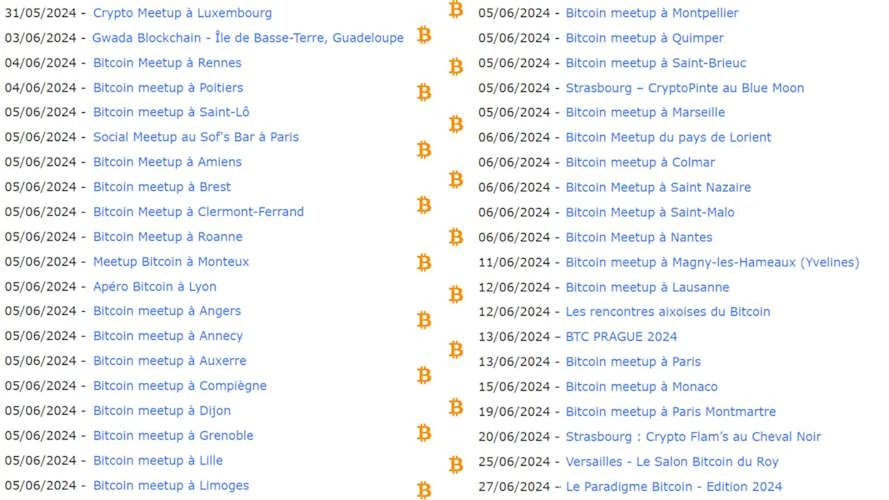
####
Vale ressaltar que outras plataformas e aplicativos também permitem aumentar a visibilidade. **[Meetup](https://www.meetup.com/)** é um deles. De fato, é um site (e um aplicativo para telefone) que permite a criação de um evento; mas também a busca por aqueles ao seu redor.
Infelizmente, para poder criar meet-ups, é preciso gastar cerca de 8€ por mês (o que dá cerca de 90€ por ano), o que é caro para uma comunidade que ainda não é estruturada nem madura. No entanto, o Meetup é muito popular em certos países, especialmente no Canadá e nos Estados Unidos; sua principal vantagem é que permite a gestão integrada das inscrições para os encontros.

Paralelamente, **[Orangepillapp](https://www.orangepillapp.com/)** é um aplicativo pago para telefone que permite aos bitcoiners se encontrarem. No entanto, também é pago (50.000 sats/ano, ou 200.000 sats para a vida).
####
Embora permitam o desenvolvimento da visibilidade para sua comunidade e seus eventos, esses dois aplicativos, no entanto, não são recomendados no lançamento de sua comunidade, simplesmente porque são pagos.
**Começar com uma listagem em [btcmap.org](https://btcmap.org/), em [BitcoinerEvents](https://www.bitcoinerevents.com/); e para comunidades francesas, em [bitcoin.fr](https://bitcoin.fr) é, portanto, claramente suficiente**.
#### 
Parabéns! Sua **comunidade está criada**, seus **visuais estão prontos**, seus **objetivos estão definidos**, seus **canais de comunicação estão estabelecidos**, suas **redes sociais estão lançadas**, e sua **estratégia de visibilidade está estabelecida**.
Uma vez que um pequeno grupo de bitcoiners se juntou a você, o próximo passo é embarcar na emocionante aventura de um encontro Bitcoin!

# Organizando um Encontro Bitcoin
<partId>c009d2a6-40ce-583b-bd24-fdfd1fea262e</partId>

## Por que iniciar um encontro regular com sua comunidade?
<chapterId>ed8e471c-3b99-57e2-a042-2d4e8a40b137</chapterId>

Agora que as redes sociais e os canais de comunicação da sua comunidade foram lançados, tudo o que resta é fazer sua presença conhecida nessas plataformas e os novos membros devem se apresentar, gradualmente se envolvendo nas discussões.
Isso pode, portanto, permitir que você libere algum tempo com o objetivo de pensar em criar um evento do tipo "meet-up", no formato que desejar. Isso é particularmente relevante se você começar a sentir uma certa fervura dentro de sua comunidade.
Como mencionado anteriormente, **um encontro sobre Bitcoin pode ser visto como o "próximo nível" de uma comunidade**. Ele permite, por um lado, **que seus membros bitcoiners se encontrem**; e por outro lado, **educar novas pessoas interessadas neste ecossistema**. Um evento do tipo "meet-up" permitirá, assim, - na sua escala - **criar entusiasmo em torno do Bitcoin na sua cidade**; o que pode se expandir ao longo do tempo, dependendo dos projetos que sua comunidade empreender.

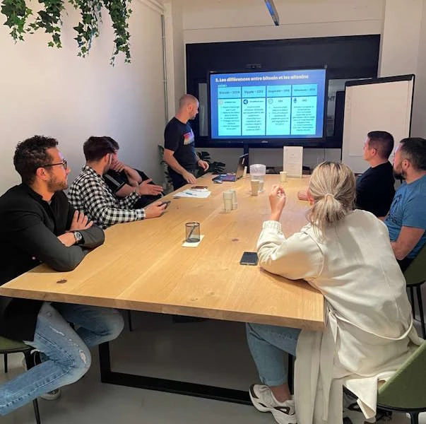

Naturalmente, quanto mais significativos forem os objetivos que você definir para o desenvolvimento da sua comunidade, mais necessário será - para você e seus membros - dedicar tempo a isso.
Portanto, é importante **começar definindo metas alcançáveis para a organização deste meet-up**.

## O primeiro meet-up: quando e por quê?
<chapterId>f3f8a614-cfb4-5994-a2e8-d56e6f8e3347</chapterId>

É totalmente possível, apenas algumas semanas após criar uma comunidade, lançar um evento do tipo meet-up.
No entanto, nesta situação, sua comunidade certamente não terá se desenvolvido muito. Isso significa que é concebível que poucas pessoas possam aparecer. Ou nenhuma.
Portanto, parece relevante **propor a organização de um meet-up a partir do momento em que houver algumas pessoas envolvidas nos canais de comunicação** da sua comunidade; digamos, por exemplo, **um pequeno grupo de cerca de dez membros**. Isso pode, portanto, ser bastante rápido.

Uma vez que você sinta essa pequena faísca, então é totalmente possível para você propor a ideia de um encontro presencial. Se essa ideia despertar interesse em outros, você simplesmente precisa **definir a data para o seu primeiro meet-up**.
Para fazer isso, certamente é preferível não definir uma data fixa desde o início, mas sim **propor - cerca de dez dias antes - uma pesquisa contendo diferentes dias e horários**. Assim, dependendo dos votos de todos, isso permitirá **maximizar a presença dos membros**, criar mais entusiasmo; mas também, **"otimizar" melhor o seu tempo**.

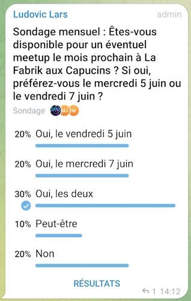

É então importante não ter uma ideia fixa, antecipadamente, de como esse meet-up vai se desenrolar, quantos de vocês haverá, os temas de discussão, etc. Você corre o risco de se decepcionar; e os participantes, potencialmente se sentindo "oprimidos".
Nesse sentido, parece preferível deixar as coisas acontecerem naturalmente, talvez ao redor de uma bebida. As conversas devem então ser fáceis; mesmo que isso signifique trazer à tona o Bitcoin se você se encontrar um a um com uma ovelha perdida.####
Se você deseja **antecipar certos momentos de calmaria, você pode planejar diferentes "atividades" ou opções de reserva**. Estas podem incluir:
- um computador ou smartphone com o **[mempool](https://mempool.space/)**;
- trazer um livro;
- trazer um **Nerdminer**, Bitaxe, FPGA, ou até mesmo um ASIC;
- ter um **folheto sobre Bitcoin** à mão;
- brainstorming em torno de um visual/logo Bitcoin mais desenvolvido para sua comunidade;
- um **[jogo de cartas Bitcoin](https://www.maximalist.ovh/accueil/20-game-le-coin-de-table.html)**;
- o **[mapa btcmap.org](https://btcmap.org/)** de comunidades e negócios;
- um casual: "Ei, por falar nisso, **você já enviou Bitcoin pelo Lightning?**"
No entanto, deve-se notar que, quando o encontro está apenas começando, pode não ser relevante fazer uma apresentação formal. Quando há apenas alguns de vocês, parece preferível envolver-se em discussões de uma maneira mais aberta e amigável.
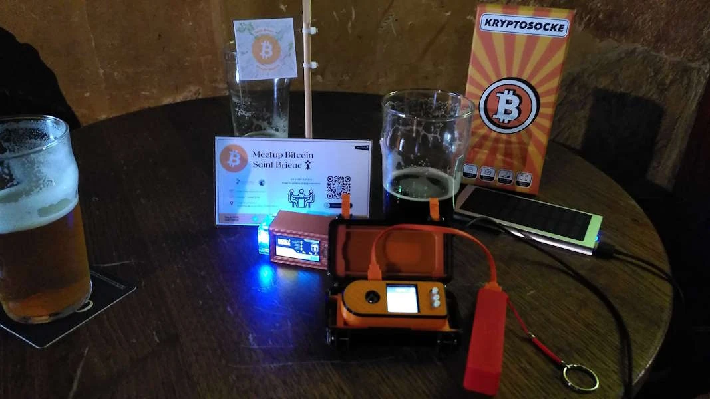
####
Uma vez que seu encontro tenha ocorrido, provavelmente você vai querer organizar outro. **Enquanto sua comunidade ainda for pequena, parece preferível continuar propondo a data por meio de uma pesquisa; por exemplo, uma vez por mês (ou a cada dois meses)**. Cabe a você discutir isso com sua comunidade.

No entanto, no caso em que **um grupo regular de Bitcoiners e interessados se desenvolve**, parece pertinente **planejar este evento de forma mais regular**; por várias razões:
1) permite que os membros planejem sua participação com mais facilidade;
2) também ajuda a **estabelecer um "hábito"**. Assim, alguém que não segue mais os canais de comunicação ou redes do encontro diariamente (por falta de tempo) e sabe o dia usual do seu encontro no mês pode então passar por lá, "como de costume".
####
Este segundo ponto é muito importante. É uma das razões pelas quais, **na França, a maioria dos encontros acontece na primeira quarta-feira de cada mês**; seguindo a iniciativa dos "embaixadores", lançada por [DecouvreBitcoin](https://decouvrebitcoin.fr/).
Na Alemanha, não há um dia definido nacionalmente; o mesmo acontece com a Itália.
No entanto, é importante destacar que **ter todos os encontros nacionais no mesmo dia cria um problema de centralização**. Além das preocupações com segurança, os bitcoiners que participam do encontro em suas respectivas cidades não podem participar dos eventos Bitcoin das comunidades vizinhas. Portanto, cabe a você tomar uma posição. Para fazer isso, **interagir com o(s) encontro(s) mais próximo(s) pode levar a uma decisão relevante**.

#### 
Finalmente, quando sua comunidade cresce significativamente e seus encontros começam a lotar, é totalmente possível propor:
* **um objetivo específico para cada um dos seus encontros**;
* ou até mesmo **um segundo evento no mês**.

No primeiro caso, embora seja necessário estar atento às sensibilidades e desejos de todos, isso pode permitir que todos os participantes **deixem o evento com novos conhecimentos**, enquanto reorienta os tópicos de conversa em torno do Bitcoin (se estavam divergindo).
No segundo caso, um segundo evento no mês, por exemplo, permite **abordar um tema específico, como a realização de sessões para "iniciantes" e/ou workshops** (mineração, lightning, instalação de nós, etc.).

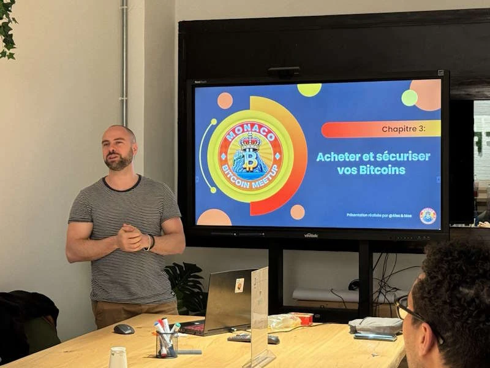

No entanto, tenha em mente que **isso requer mais organização; e, portanto, levará mais tempo** (embora muitos recursos de código aberto estarão disponíveis na parte 6/8, intitulada "[Exemplos de projetos e iniciativas](LINK).

De qualquer forma, tudo isso dependerá do plano de ação de curto, médio e longo prazo que você (ou sua comunidade) estabeleceu.

## Encontrando um Local
<chapterId>405d389e-6a32-5777-af8d-293380d2e8fd</chapterId>

Procurar um local para organizar seus eventos não é necessariamente simples. No entanto, parece essencial **que este lugar esteja localizado na cidade da sua comunidade**.
Ao mesmo tempo, muitos critérios precisam ser considerados. Entre eles:
1) a localização do local: é facilmente **acessível por transporte público? De carro?** Pode-se estacionar lá sem dificuldade?
2) o local é **agradável e não muito barulhento?** Você está procurando um lugar formal (espaço de coworking, sala de reuniões) ou um informal (bar ou até mesmo restaurante)? 3) o local tem **capacidade suficiente para acomodar vocês?** E isso, mesmo na noite de um jogo de rugby ou da Liga dos Campeões? 4) o local possui um **projetor de vídeo e um espaço tranquilo para suas apresentações?** 5) finalmente, no caso de um bar (ou até mesmo um restaurante), **o cardápio permite que todos possam comer e beber?** A esses pontos, podem ser adicionadas três observações importantes:
- no caso em que você gostaria de **dividir a noite em duas partes** (primeiro, uma **apresentação em um espaço formal** para permitir que todos estejam mais focados; depois, **mudar de local para continuar a noite de maneira mais relaxada em um bar** ou restaurante), é importante estar ciente de que essa mudança de local no meio da noite levará **alguns participantes a aproveitar a oportunidade para sair. Portanto, esse tipo de arranjo não é recomendado**;
- durante seus primeiros encontros, poucas pessoas provavelmente aparecerão, e assim, você provavelmente não fará uma apresentação. Nesse sentido, não parece necessário se apresentar ao proprietário e apresentar seus objetivos, etc. No entanto, **uma vez que seus encontros se tornem regulares e bem frequentados, parece relevante se apresentar, mostrar sua seriedade e seu desejo de vir regularmente**. Isso pode levar a muitas discussões (reservas mensais automáticas, bebidas gratuitas e/ou pratos, descontos, discussão sobre Bitcoin, aceitação do Bitcoin como método de pagamento, etc.) Obviamente, no caso em que você está especificamente procurando um local com um projetor de vídeo para apresentações, parece essencial solicitar uma reunião (pessoalmente, ou mesmo por telefone) com o proprietário e/ou gerente com antecedência para apresentar seu projeto e seus objetivos;

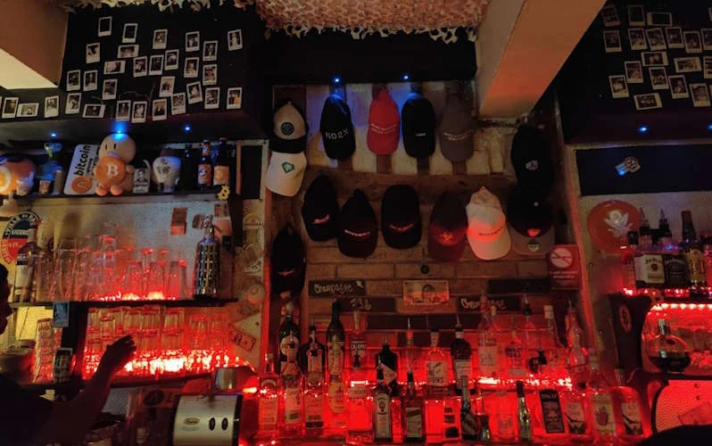

- finalmente, algumas comunidades podem desejar **realizar seus eventos apenas em locais que aceitam Bitcoin como método de pagamento**; e isso é bastante compreensível. Nessa perspectiva, parece relevante **começar procurando por empresas em sua cidade que aceitam Bitcoin (em [btcmap.org](https://btcmap.org/map/) por exemplo)** e contatá-las para encontrar um local que atenda aos seus critérios. No caso em que, infelizmente, nada for adequado, você então tem a opção de "embarcar" novos comerciantes. No entanto, espere enfrentar muitas rejeições, o que pode ser desanimador. É por isso que **pode ser sensato não estabelecer isso como um objetivo desde o início, mas chegar a isso uma vez que sua comunidade tenha se desenvolvido bem** e você tenha suficiente "influência".

Além disso, não hesite em **mudar de locais por alguns meses no lançamento de seu meet-up**. Isso permitirá que você potencialmente **faça contatos** com alguns gerentes, para **descobrir diferentes atmosferas**; mas também, para **reunir informações** sobre os vários lugares que poderiam potencialmente sediar seus eventos. Nada impede você, mais tarde, quando começar a ter muitos participantes, de tomar um fim de tarde para visitar várias empresas e bares para perguntar se eles têm um lugar adequado para hospedar, uma vez por mês, seus eventos e meet-ups!

## Antes do meet-up
<chapterId>c5218943-580d-5efc-89ed-6b5d728816d6</chapterId>

Você decidiu organizar um meet-up e informou sua comunidade sobre a data? Vários passos importantes agora seguem:
1) **entre em contato com o local** onde você realizará seu evento, para **confirmar uma reserva** para um determinado número de pessoas; 2) **anuncie nas redes sociais e canais de comunicação o seu evento, declarando claramente a data, hora, local**, e adicionando o link de inscrição se necessário. Para essa comunicação, um visual específico pode ser criado (por exemplo, um pôster no Canva, veja parte 2/8 "[Designing a unique identity for your Bitcoin community](LINK)"). Além disso, para garantir a máxima visibilidade deste anúncio, ele pode ser **fixado no Telegram e no Twitter**, e também pode incluir um **"@everyone" no Discord**. Parece também mais do que relevante **postar esses anúncios de 1 semana a dez dias antes da data do evento, permitindo que todos possam planejar sua participação**;

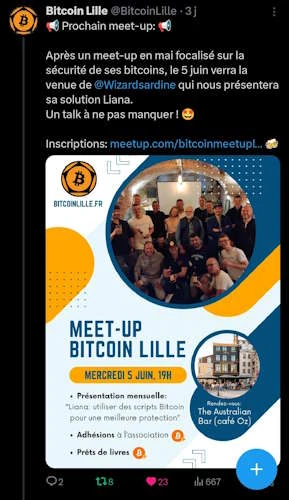

4) **dois a três dias antes do evento, esses anúncios podem ser retweetados e compartilhados novamente**, trazendo mais visibilidade; 5) finalmente, dependendo do número de respostas e/ou inscrições recebidas no dia anterior ou antes disso, é totalmente possível para você recontatar o proprietário do local para confirmar o número de participantes esperados.
####
A esses quatro passos, também podem ser adicionados:
- **imprimir flyers e/ou pôsteres**;
- **criar uma apresentação** sobre um tópico pré-definido;
- **preparar uma atividade ou um workshop**;
- etc.

## No dia do encontro
<chapterId>cf60067b-591f-5fdf-9b9e-d442aad0e8f9</chapterId>

O grande dia chegou! Uma hora ou duas antes do início do evento, você pode enviar uma mensagem simples nos canais de comunicação da sua comunidade (não há necessidade de sobrecarregar as redes sociais) para anunciar o horário a partir do qual você estará lá, mas também para informar os futuros participantes que você será reconhecível porque estará vestindo (por exemplo) uma camiseta e boné do Bitcoin.
####
À medida que seu encontro cresce e você recebe mais de 20 pessoas por evento, **preparar o local/ambiente se tornará um elemento importante**.
Para isso, será necessário:
1) **chegar um pouco mais cedo** para preparar;
2) **arranjar o quarto ou espaço de acordo com as possibilidades e suas necessidades**. No caso de vocês serem cerca de meia dúzia, realmente não há muito o que fazer. Mas assim que você chegar a 10 a 20 pessoas por evento, você rapidamente perceberá que ter todos sentados não é uma boa ideia, pois cria menos trocas, e você não será capaz de falar com todos durante a noite. Nesse sentido, **favorecer uma configuração em pé, com, por exemplo, mesas altas bem espaçadas** (quando possível) parece relevante assim que você chegar a cerca de quinze pessoas. No entanto, pense em **ainda ter cadeiras disponíveis** (altas, por exemplo). No caso de uma apresentação ser feita, é preferível manter a configuração em pé durante toda a noite, mesmo que signifique trazer algumas cadeiras (altas) alguns minutos antes da apresentação;
3) além do arranjo do quarto, outras pequenas "personalizações" podem ser empreendidas:
    - exibindo, com Patafix, um **pôster na frente do local do seu encontro, especificando em qual sala você estará** (obviamente pense em pedir permissão com antecedência);
    - exibindo, com Patafix, **pôsteres específicos** na sala onde você está realizando seu evento (**Bitcoin white paper, carta da sua comunidade, projetos em andamento**, etc.).
- configurando em uma ou mais mesas **adesivos, panfletos ou até mesmo material que possa levar a discussão** (Nerdminer, placa de aço, carteira de hardware, computador ligado com o mempool, ASIC, placa de metal para proteger sua chave privada, etc.)
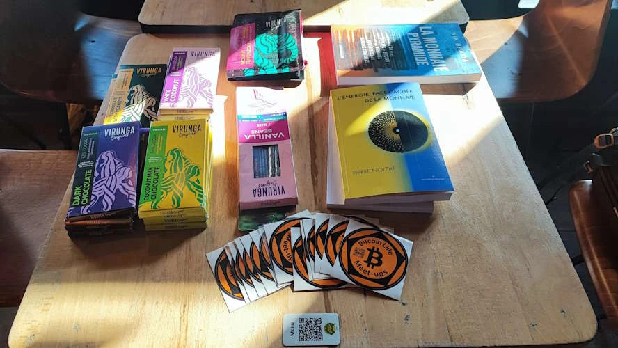
####
Obviamente, se você espera apenas alguns participantes e não informou os gerentes sobre o seu encontro porque está apenas iniciando, não comece trazendo e exibindo todo o seu material.
No entanto, **uma vez que a confiança seja estabelecida com os gerentes, você terá muito mais liberdade para organizar o espaço como achar melhor**.

Tudo o que resta é pegar uma bebida e esperar pacientemente pelos possíveis participantes. No entanto, como mencionado anteriormente: **não fique decepcionado se ninguém aparecer na primeira vez**. Portanto, planeje ter um livro ou um vídeo para assistir, caso isso aconteça.

## Após o encontro
<chapterId>3e881af9-9c09-5721-81ee-c5cda3b109c5</chapterId>
Quando o encontro terminar, é hora dos gerentes do local **arrumarem**. Então, antes de sair (e geralmente, você estará entre os últimos a sair, pelo menos inicialmente), considere oferecer sua ajuda aos garçons e/ou gerentes. Isso pode ser tão simples quanto **juntar copos em uma mesa**; ou, se você estiver perto do bar, **levá-los de volta antes de sair**.

Uma vez que você esteja de volta em casa, é muito provável que você fique com **bitcoins nos olhos** por alguns dias. Esse será um momento oportuno para avaliar o feedback, por exemplo, por meio de:
- enviar uma mensagem nos seus canais de comunicação para **agradecer aos participantes**, e/ou compartilhar links ou sites discutidos;
- sugerir àqueles que participaram do encontro para **propor melhorias** para o próximo;
- e também, para **preparar o próximo evento!**

Um longo período de algumas semanas se apresentará a você; perfeito para desenvolver outros designs e/ou projetos para o seu encontro.

## A Importância de Engajar e Reter Participantes
<chapterId>f5355e35-4b07-527c-88a3-8535cba7592c</chapterId>

Roma não foi construída em um dia; e o mesmo vale para a sua comunidade. Isso significa que **é organizando encontros e eventos regularmente que você conseguirá criar uma dinâmica em torno do Bitcoin**.
Para fazer isso, um ponto é essencial: **você deve reter os participantes dos seus eventos**.

Isso pode começar com um pequeno grupo de bitcoiners fervorosos, cujo objetivo é se reunir regularmente para falar sobre Bitcoin. Ao longo das semanas, e dependendo do tempo e sensibilidade de cada um deles, você pode **distribuir algumas tarefas organizacionais** da sua comunidade; ou até mesmo **propor a esses bitcoiners a realização de um projeto específico**. Esse projeto poderia ser específico para a sua comunidade, seus encontros, ou até mesmo a sua cidade; como também poderia se inspirar em uma das muitas iniciativas propostas na [parte 6/8 deste curso](LINK). **Isso envolveria o núcleo da sua comunidade, e, portanto, ajudaria a fazê-la florescer**.
**Novos rostos se juntarão a você, ao longo dos encontros**. Estes podem ser pessoas que compraram BTC e/ou alt/shitcoins durante ciclos anteriores, no-coiners querendo aprofundar seu entendimento sobre o Bitcoin e seu ecossistema; mas também novatos, reunindo suas primeiras informações sobre este novo sistema de pagamento eletrônico incensurável, descentralizado, transparente, justo, sem condições e sem necessidade de confiança. Para garantir que **todos se sintam incluídos nos eventos**, duas principais áreas de reflexão podem ser trabalhadas.
Por um lado, de uma perspectiva social, é crucial para o desenvolvimento de uma comunidade que todos os participantes de um evento se sintam incluídos. Isso significa: **fazer um esforço para se aproximar desses novos participantes, interessar-se pelo motivo de estarem lá, recebê-los calorosamente**, etc. Ao se sentirem incluídos e bem-vindos, esses indivíduos vão querer retornar; e até mesmo, no futuro, dependendo do seu perfil, se envolver na organização desses eventos.
Obviamente, **isso requer tempo e motivação**. No caso de você receber um shitcoiner (ou pior: um maximalista de XRP), pode ser bastante difícil deixar de lado a preferência temporal e aceitar "perder tempo" em discussões unilaterais. No entanto, é ao tomar tempo para conversar com essas pessoas que podemos ajudá-las a entender seus mal-entendidos e erros de raciocínio. Uma vez que aceitem isso, estarão então prontas para entender o Bitcoin.

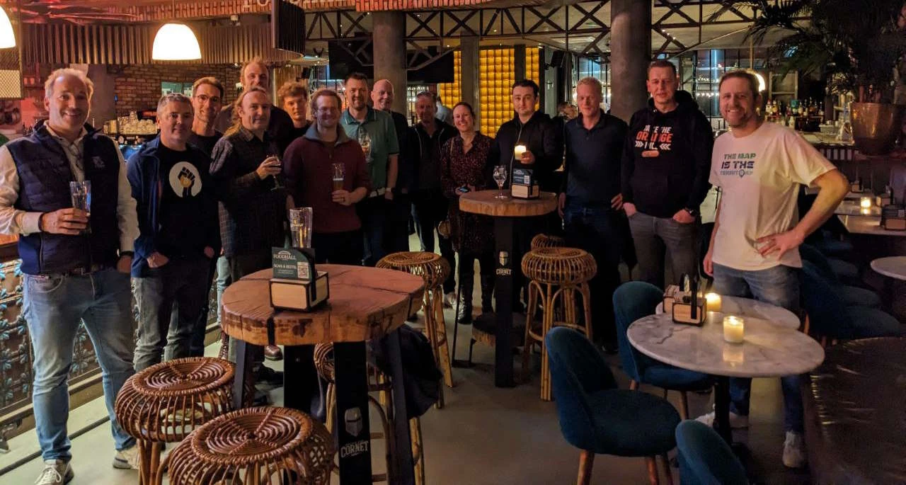

Por outro lado, do ponto de vista técnico, várias questões podem surgir:
- o local onde **o encontro ocorreu foi agradável?**
- foi **fácil de acessar?**
- por que alguns participantes acabaram não vindo?
- quais discussões foram levantadas? Foram **demasiadamente técnicas, não permitindo que novatos fossem incluídos?**
- o álcool estava fluindo livremente demais?

Obviamente, cada participante tem sua própria personalidade, sensibilidade, objetivos e interesses. Portanto, cada um vai experienciar o encontro de maneira diferente.
Mas **quando o local é bem escolhido, as pessoas presentes (especialmente os organizadores) são de mente aberta, e seu objetivo é nobre, não há razão para o encontro não ser um sucesso**.
####
**Criar um encontro, portanto, requer tempo; mas acima de tudo, organização.
É um projeto humano, e é por isso que só pode funcionar e se desenvolver a longo prazo se for pensado, aberto e inclusivo**.
Claro, **cabe a cada um definir seu limite** sobre o que significa ser "aberto e inclusivo". Mas não vamos esquecer: um shitcoiner é um bitcoiner em formação (que ainda não foi rekt).

# Exemplos de projetos e iniciativas
<partId>45b3bc40-1c31-583e-8411-2662e6efd765</partId>

## Por que ir além de apenas beber cervejas?
<chapterId>3213d87a-1998-5972-ab93-97a5769ba279</chapterId>
À medida que os blocos progridem, sua comunidade vai crescer. Novos rostos se juntarão, e outros desaparecerão.
Para **avançar o ecossistema do Bitcoin e construir laços ainda mais fortes dentro da sua comunidade**, numerosos projetos e iniciativas podem ser realizados.

Abaixo, **oferecemos uma série de ideias não exaustivas que podem ser implementadas dentro de uma comunidade ou durante um encontro**.
Você é livre para escolher as que gostar, mas também para adicionar outras fazendo um "Pull Request" no GitHub.
####
Mas antes de começar, parece interessante aprofundar mais em um ponto já listado nas partes anteriores deste curso.
Quando você organiza um encontro sobre Bitcoin, conhece novas pessoas. As interações sociais são, portanto, importantes, e a cerveja (o álcool em geral) torna esses tipos de eventos festivos. Mas CUIDADO:
- por um lado, **o álcool inibe certas habilidades cognitivas** (pensar, entender, etc.). Portanto, **fica mais difícil para os participantes acompanharem discussões sérias** - ou uma apresentação - após tomar uma bebida alcoólica doce;
- por outro lado, **o álcool pode ser reconfortante**: todo mês, você tem o seu "momento Bitcoin", com seus novos amigos. Você compartilha uma paixão comum, e isso é muito positivo! **Mas será que beber cervejas é realmente o principal objetivo do seu encontro?** Você não preferiria trocar informações sobre suas novas descobertas/pesquisas, aprender com as experiências dos outros; ou até mesmo democratizar o Bitcoin para os recém-chegados, para iniciá-los?

Cada um tem seus próprios desejos, suas próprias crenças, sua própria personalidade. Portanto, não há julgamento aqui sobre o funcionamento de um encontro ou de outro. Afinal, **é em torno de uma cerveja que nós refazemos o mundo, mas não é assim que o transformamos profundamente**.

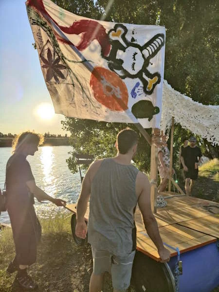

## Organize encontros temáticos, seguindo uma progressão anual definida
<chapterId>46afdbcc-a775-5c16-b20a-34956690d58f</chapterId>

Uma vez que seus encontros se tornem regulares e um grupo central de cerca de dez pessoas tenha sido estabelecido, você agora será capaz de **conduzir uma apresentação em cada um dos seus encontros**. Estes podem então ser **temáticos**, com um tema anunciado com antecedência; como eles podem ser não relacionados entre si.
No contexto de configurar apresentações e/ou workshops, pode ser muito relevante **construir uma progressão pensada com antecedência**. O objetivo dessa progressão seria, portanto, **cobrir todos os conceitos importantes relacionados ao Bitcoin**; permitindo que todos presentes nos encontros entendam o Bitcoin como um todo.####
Na França, durante o verão de 2023, os organizadores de encontros trabalharam em **uma progressão anual**, que vários deles seguem. Além de ter uma **forte dimensão educacional, isso também permite que os encontros troquem documentos e PowerPoints de código aberto**, a fim de construir um banco de dados de recursos sobre o mesmo tema.
Esta iniciativa é particularmente apreciada nos encontros e visa se desenvolver nos próximos anos.
####
A progressão seguida em 2023/2024 pelos encontros franceses está disponível abaixo. Inclui **o tema de cada encontro, bem como um vídeo e uma apresentação de código aberto que podem dar ideias sobre os conceitos que podem ser abordados**.
Se você deseja acessar outros recursos editáveis, considere verificar o [Bitcoin Educational Toolkit](https://planb.network/fr/resources/bet)!

Também deve ser notado que os capítulos 2 e 7 podem ser divididos em duas apresentações, com o objetivo de não sobrecarregar os participantes com informações; como eles podem ser conduzidos de uma só vez. Nesta segunda opção, permite mais liberdade, possibilitando que dois encontros conduzam workshops ou eventos específicos (encontro conjunto de encontro ou quiz, por exemplo).

| Mês                | Tema                                                  | Vídeo                                             | Recurso Editável                                                              |
| ------------------ | ----------------------------------------------------- | ------------------------------------------------- | ----------------------------------------------------------------------------- |
| Setembro           | Capítulo 1: O que é Bitcoin?                          | [YT](https://www.youtube.com/watch?v=CSjuBqrl4t8) | [canva](https://www.canva.com/design/DAFu0d5Jd7M/9gAWDAOSS6LDkWENuZjYgw/edit) |
| Outubro & Novembro | Capítulo 2: Entendendo as transações de Bitcoin       | [YT](https://www.youtube.com/watch?v=inFnR-3NsdM) | [canva](https://www.canva.com/design/DAFsEcnOro8/Mz9FYdTGhsvozZOe0Y9jtw/edit) |
| Dezembro           | Capítulo 3: Entendendo a Lightning Network            | [YT](https://www.youtube.com/watch?v=hHz-ALx8D9w) | [canva](https://www.canva.com/design/DAF4YPSNnR8/HKp4Vmcno8eMtVWnZmFtcw/edit) |
| Janeiro            | Capítulo 4: O que é Mineração?                        | [YT](https://www.youtube.com/watch?v=QyHZ3CVI_OI) | [canva](https://www.canva.com/design/DAF5DE6iBEM/tsy8E3oBebUnsR0kj53vvQ/edit) |
| Fevereiro          | Capítulo 5: Configurando um Nó de Bitcoin e Lightning | [YT](https://www.youtube.com/watch?v=RRYK-usg-OY) | [canva](https://www.canva.com/design/DAF55FU6HI0/sQ0lacRJblqrhn_9Xk1yDg/edit) |
| Março              | Capítulo 6: Usando a Lightning Network no Dia a Dia   | [YT](https://www.youtube.com/watch?v=o2BS4xjei8M) | [canva](https://www.canva.com/design/DAGAcJMw7lw/-haMNnHnwj5vpDAy8MDowA/edit) |
| Abril & Maio       | Capítulo 7: Protegendo Seus Bitcoins                  | [YT](https://www.youtube.com/watch?v=fHExPbhM0Hg) | [canva](https://www.canva.com/design/DAGDz3Nq4e0/D3uG-4w9FN6OhUq-VXzhfg/edit) |
| Junho              | Em Breve                                              | Em Breve                                          | Em Breve                                                                      |
| Julho              | Em Breve                                              | Em Breve                                          | Em Breve                                                                      |
| Agosto             | Em Breve                                              | Em Breve                                          | Em Breve                                                                      |
####
Claro que haverá momentos em que algumas pessoas não poderão estar presentes em um encontro. Quando possível, **gravar a apresentação para postar em uma plataforma de streaming e/ou no seu site pode ser relevante**. Isso pode, de fato, permitir que aqueles que estiveram ausentes possam se atualizar sobre as apresentações anteriores; ou até mesmo, assisti-las novamente em replay para se educarem melhor.

**Sinta-se livre para pegar esses recursos, modificá-los e compartilhá-los como desejar**. Apenas lembre-se de **citar suas fontes** se reutilizar uma apresentação modificável.
####
Paralelamente, outros meet-ups temáticos podem ser organizados. Entre eles, contamos:
- um **quiz de conhecimentos** (com, por exemplo, uma carteira física como prêmio);
- um **desafio de "onboarding"** enviando satoshis gratuitamente para no-coiners;
- **organizar a chegada de um especialista em um campo específico, ou uma empresa** oferecendo um produto relevante relacionado ao Bitcoin;
- uma **noite de "bar e comércio"** aceitando Bitcoin como método de pagamento;
- etc.

Os únicos limites a definir são os da sua imaginação!

## Criando Eventos Paralelos e Workshops
<chapterId>9dbd651a-8712-5630-90b3-b9525dcc1385</chapterId>
Ao longo do ano, outros eventos podem ser organizados. Isso pode incluir:
- **uma noite de restaurante para o Dia da Pizza**, em 22 de maio;
- **uma noite ou um fim de semana para "celebrar" o próximo halving**;
- **um evento de "jogo em família" em torno do Bitcoin** e como ele funciona. Jogos como ["Le Coin de Table"](https://www.maximalist.ovh/) ou ["SHAmory"](https://shamory.com/) podem ser trazidos;

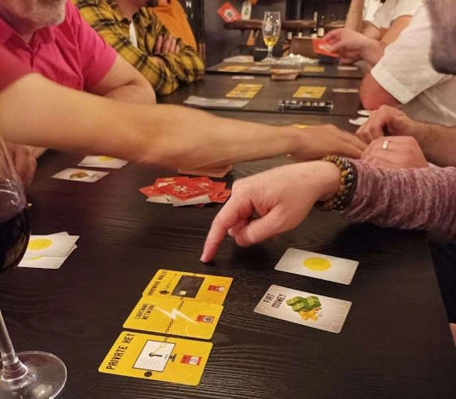

- **um workshop de mineração**, com a descoberta de diversos hardwares (processador, placa gráfica, FPGA, ASIC, nerdminer, bitaxe);
- **uma tarde ou noite especialmente para iniciantes, com workshops temáticos**;
- ou até mesmo, **um meet-up conjunto com um (ou vários) meet-up(s) vizinho(s)**.
####
No entanto, esteja atento **para não organizar muitos eventos em um mês, pois quanto mais eventos, mais tempo eles exigem** tanto dos organizadores quanto dos participantes; e isso pode levar alguns a pensar duas vezes sobre sua participação.

## Criando Adesivos
<chapterId>d605f3b3-130e-513d-85e6-06bc5ea13e99</chapterId>

Como símbolos da identidade da sua comunidade, pode ser interessante projetar e depois encomendar adesivos.
Antes de fazer seu pedido, pode ser relevante considerar os seguintes pontos:
- se você deseja que esses adesivos possam ser colados ao ar livre, você precisa de **adesivos resistentes à água** ("à prova d'água" ou impermeáveis);
- **certifique-se de que seu logotipo seja menor do que a área anunciada durante o pedido**. Isso realmente ajudará a evitar erros de precisão dos cortadores a laser, que cortariam parte do seu logotipo. Isso geralmente é explicado quando um pedido é feito;
- considere **usar um arquivo vetorial** em vez de um arquivo de imagem. Isso melhorará a qualidade da impressão;
- **pense bem sobre o tamanho desejado**. Por exemplo, um adesivo circular com diâmetro de 8 cm é aproximadamente do tamanho da palma da mão de um adulto. Você está procurando esse tamanho, que é bastante significativo para visibilidade, ou está procurando algo mais discreto (4 cm de diâmetro, por exemplo)?
- finalmente - e isso é um pouco técnico - se você deseja uma impressão preta rica (um "preto de quatro cores"), as propriedades disso devem ser: 30% ciano, 30% magenta, 30% amarelo e 100% preto. Nos casos em que apenas 100% preto é usado, o resultado será um preto meio acinzentado. Felizmente, as impressoras geralmente prestam atenção a esse detalhe. Então, você não deve se preocupar demais com isso.
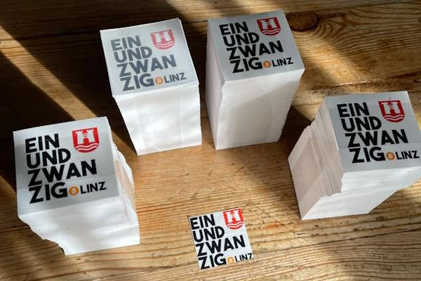
#### 
Dependendo da sua solicitação e do fornecedor que escolher, espere pagar **entre 100 e 250 euros por 1000 adesivos**. Você também pode entrar em contato com [@Mill3sim3 no Twitter](https://x.com/Mill3sim3), um bitcoiner francês especializado em marketing que pode ajudá-lo a obter preços quase 30% mais baratos do que os sites online usuais. Não hesite em contatá-lo para isso.

No entanto, vale ressaltar que 1000 adesivos é uma quantidade significativa. Portanto, é claramente **preferível, para começar, optar pela compra de uma centena de adesivos**; para ter certeza de vender esse estoque.
Além disso, uma pequena nota: **se você decidir colar um desses adesivos na rua, dependendo do país em que você está, isso pode ser proibido por lei**. No caso da França, por exemplo, é proibido colar adesivos na rua, exceto em murais públicos presentes em cada cidade. Isso significa que se um dos seus adesivos for colado de forma descuidada (ou melhor: em qualquer lugar, como no meio de uma placa de parada), ele será removido rapidamente; e se ele tiver informações que possam ser rastreadas até sua identidade ou a do seu encontro, não está fora de questão que você possa receber uma multa. Então, tenha cuidado e informe seus membros.

####
Paralelamente, se você gosta de concertos, bares ou estádios, **considere verificar se já existem adesivos colados antes de colocar o seu. Caso contrário, considere perguntar a um funcionário se isso é aceito**.
De fato, seria uma pena se um comerciante ouvisse falar da sua comunidade / encontro / associação / Bitcoin pela primeira vez porque você sabotou a decoração do banheiro dele!

## Criando uma Biblioteca
<chapterId>acc94093-f8b3-51b8-9359-348e9e075d38</chapterId>

Outro projeto que pode ser facilmente implementado é **o estabelecimento de uma biblioteca dentro dos seus encontros**.
Para fazer isso, você pode pedir a todas as pessoas interessadas para compartilhar suas leituras, trazendo um livro relacionado ao Bitcoin e, durante o encontro, se alguém mais estiver interessado em pegá-lo emprestado, **um empréstimo pode, por exemplo, ser feito ao seu proprietário, em troca de um depósito de 21.000 satoshis em Lightning**.
Isso permite, para o proprietário, cobrir os custos em caso de esquecimento ou roubo; e, para o emprestador, retornar a um futuro encontro para recuperar seus 21.000 satoshis!
####
Se você administra **uma associação e deseja investir parte do seu tesouro em recursos educacionais e pedagógicos**, você pode encomendar vários livros e oferecê-los na sua **biblioteca Bitcoin** em cada encontro.
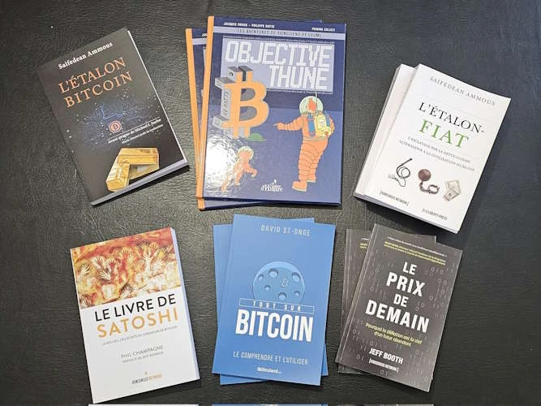
####
A este respeito, e com o objetivo de desenvolver o ecossistema, **[a editora Konsensus.Network](https://konsensus.network/) oferece a encontros e comunidades Bitcoin internacionais um desconto que varia de 15% a 35% em todos os seus livros; a partir de três comprados**.

Se você não tem um tesouro, ainda é possível para os membros da sua comunidade se beneficiarem deste desconto.
De fato, um dos organizadores da sua comunidade pode, por exemplo, centralizar o pedido de vários membros e colocá-lo com a Konsensus por um custo menor, com o objetivo de redistribuir as cópias recebidas no próximo encontro. Esta redistribuição poderia então, por exemplo, ser realizada em Lightning.

Para aproveitar este desconto, basta **entrar em contato com [a editora Konsensus](https://twitter.com/KonsensusFR) no Twitter**.
####
Além disso, uma carta de empréstimo de livros pode ser escrita e exibida durante os encontros, explicando brevemente as regras de empréstimo.

Aqui está um exemplo de código aberto, que você pode pegar e modificar como desejar:
[Carta de Empréstimo de Livros](https://www.canva.com/design/DAF7u1b5kRM/r2gEAlibe_jTIXIX-O9PMA/edit)

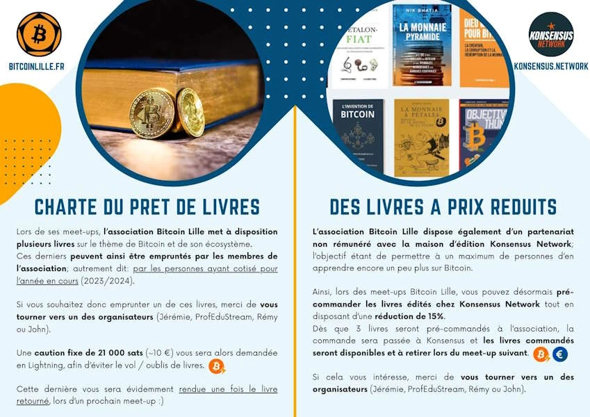
#### 
Paralelamente, ainda com a ideia de promover a leitura sobre Bitcoin, outra ação significativa pode ser **visitar as bibliotecas municipais da cidade e verificar se elas têm diversos livros sobre Bitcoin**.
Se sim, pode ser possível perguntar aos bibliotecários se **mesas redondas** sobre este tópico serão realizadas nos próximos meses, fornecendo até mesmo o contato do encontro da cidade. Se não, **propor a compra de vários livros que você selecionou antecipadamente** pode ser uma opção. O site da [Konsensus publisher's](https://konsensus.network/) pode ser uma fonte de inspiração para isso.

## Crie panfletos personalizados e distribua-os
<chapterId>62ad5430-c698-51b3-89ac-090f31c88953</chapterId>

Criar panfletos é uma etapa que consome tempo. No entanto, permite **ter um suporte de papel durante discussões sobre Bitcoin**, o que é bastante apreciável.

Esses panfletos podem ser destinados a:
- **comerciantes**, caso você deseje propor a eles a aceitação do Bitcoin como método de pagamento;
- **pessoas que participam dos seus eventos**, com um panfeto explicando especificamente como usar e pagar em Bitcoin / Lightning; - e **novatos**, encontrados na rua, no seu local de trabalho, ou em uma refeição em família, com um panfleto resumindo os principais benefícios do Bitcoin.

Também é totalmente possível preparar **um panfleto específico para a sua comunidade ou encontros, mostrando suas ações, seus objetivos, suas redes e canais de comunicação; mas também, as datas e locais dos seus eventos já planejados**.
####
Vários panfletos já estão **disponíveis em código aberto**, e outros serão criados nos próximos meses. Você pode encontrá-los especialmente **no [Bitcoin Educational Toolkit por planB.network](https://planb.network/fr/resources/bet)**.

Entre eles, você encontrará um [panfleto completo e com fontes](https://profedustream.substack.com/p/21-raisons-dutiliser-bitcoin) listando 21 razões para usar Bitcoin. Seu design também está [disponível em código aberto](https://www.canva.com/design/DAFtAR1NauQ/ZDwl2CchIJ9Gpb36N6-7iw/edit?utm_content=DAFtAR1NauQ&utm_campaign=designshare&utm_medium=link2&utm_source=sharebutton).

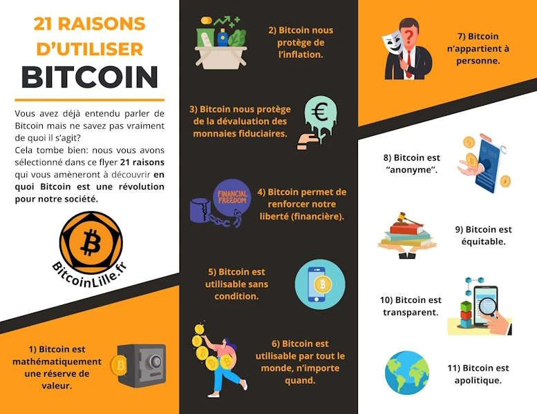

Modifique-o, adapte-o e depois compartilhe como quiser. No entanto, lembre-se de citar suas fontes.
#### 
Como mencionado antes, **esses panfletos podem ser colocados praticamente em qualquer lugar**: em uma mesa compartilhada no seu local de trabalho, em uma mesa durante uma refeição em família, em uma biblioteca municipal, etc.

Na França e em alguns outros países, também existem **"caixas de livros"**.
Geralmente feitas de madeira, essas caixas acolhem livremente livros para doação. Portanto, uma possibilidade seria **deixar lá um panfleto; ou ainda melhor: um livro!**

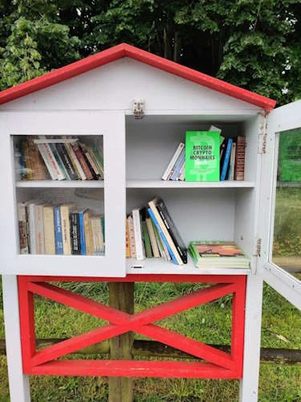

Nesse sentido, em 2023, foi lançada **a iniciativa "Um White Paper do Bitcoin nas Caixas de Livros da França"**.
Para realizar este projeto com sucesso com todos os interessados, foi primeiro necessário **obter a geolocalização de todas as caixas de livros existentes no país**. Para fazer isso, existem diferentes bancos de dados:
- [boite.a.livres.zonelivre.fr](https://boite.a.livres.zonelivre.fr/);
- [boites-a-livres.fr](https://www.boites-a-livres.fr/carte-de-france);
- [delivrez.fr](https://delivrez.fr/maps/fr_FR/);- bem como alguns artigos na imprensa local.
Claro, colocar o white paper do Bitcoin nestas trocas de livros tem um significado simbólico. No entanto, para um novato, é complexo demais para entender. A ideia foi, portanto, **escrever um pequeno folheto, incluindo**:
- **uma introdução simplificada e fundamentada ao Bitcoin, seu uso e os problemas que resolve**;
- e **o white paper do Bitcoin**, traduzido para o francês.

Aqui está o folheto que foi compartilhado entre os bitcoiners franceses [o folheto que foi compartilhado entre os bitcoiners franceses](https://profedustream.substack.com/p/bitcoin-la-naissance-dune-nouvelle) e que terminou sua jornada em várias dezenas de trocas de livros pelo país. Seu design também está [disponível em código aberto](https://www.canva.com/design/DAFs18FSoVM/Sy0QsfUkycTgXveeGgutBg/edit?utm_content=DAFs18FSoVM&utm_campaign=designshare&utm_medium=link2&utm_source=sharebutton).

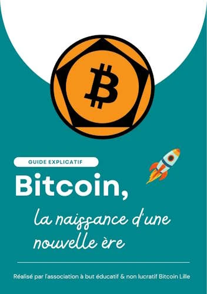
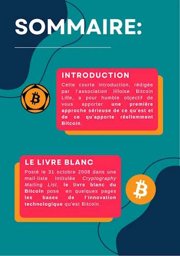

## Organizando uma Exibição de Vídeo
<chapterId>892b248a-b837-5df6-aac9-4b3261ff0390</chapterId>

Todo bitcoiner certamente já viu a mini-série muito interessante "O Mistério Satoshi, nas Origens do Bitcoin" por [Rémi Forte](https:/https://twitter.com/forteremi).
Lançada em 2021, foi vista [várias milhões de vezes no YouTube](https://www.youtube.com/watch?v=0ETcLj5jBy4), pois é um primeiro passo estimulante para entender de onde vem o Bitcoin.
Nesse sentido, é totalmente possível **propor uma exibição dessa mini-série para sua comunidade**; até mesmo criando um evento especial, por exemplo.

No entanto, há um pequeno problema: na França, entramos em contato com a ARTE para verificar se isso era legalmente possível. Infelizmente, devido aos **direitos de exibição**, o custo por exibição era quase de 250€; com um possível desconto de 120€ por exibição se 5 meet-ups fizessem um dentro do ano.
Consequentemente, para a grande maioria das comunidades, essa taxa é proibitiva. Ainda assim, o documentário está disponível gratuitamente na ARTE...
####
Paralelamente, outras exibições podem ser organizadas.
Na França, por exemplo, **a diretora do documentário "Stranded", [Alana Mediavilla](https://twitter.com/AlanaMediavilla), concordou em deixar os meet-ups do país exibir seu documentário em pré-estreia**; algumas das cenas vêm das sequências do [filme "Dirty Coin"](https://www.dirtycointhemovie.com/) que será lançado em 2024.
A comunidade Bitcoiner francesa então tomou a iniciativa de **traduzir completamente o documentário "Stranded"**, integrar legendas em francês e compartilhá-lo com todos os meet-ups pelo país. Durante a semana de 4 de março de 2024, **uma exibição conjunta foi organizada em cerca de dez meet-ups pelo país**.
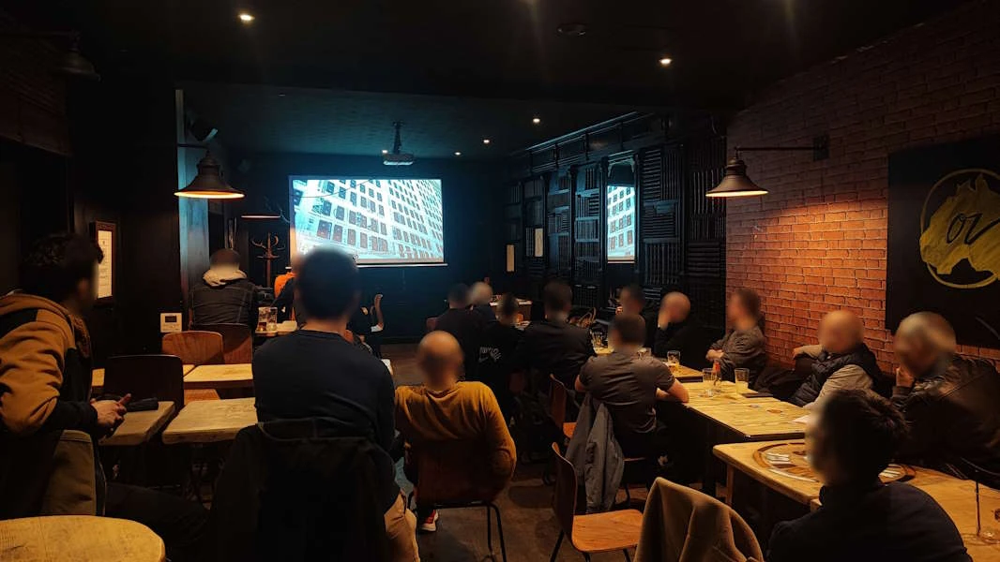

Esta transmissão levou a numerosas discussões sobre a mineração de Bitcoin, seu consumo de eletricidade e seu impacto na ecologia de forma mais ampla.

## Colocando Cartazes na Sua Cidade
<chapterId>6565e8a0-d535-5be0-9764-273584c675bd</chapterId>
Em diversos países europeus (Alemanha, Espanha, França, etc.), **alguns entusiastas do Bitcoin tomaram a iniciativa de colocar cartazes relacionados ao Bitcoin**. Alguns desses cartazes apresentam obras de Banksy, enquanto outros incorporam o logo do Bitcoin de diferentes maneiras.
Isso é notavelmente o caso de [StreetCyberArt](https://twitter.com/streetcyber_art), um Bitcoiner alemão, que tem criado colagens e arte de rua há vários anos.

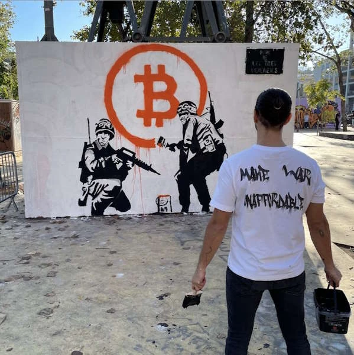
####
Claro, se você quiser entrar na postagem de rua, será necessário **estar ciente das leis em seu país**. Na França, por exemplo, é permitido apenas **colocar cartazes em murais públicos**. Em outros lugares, isso é proibido e pode resultar em multa.
Obviamente: **o que os olhos não veem, o coração não sente**. Então, neste caso, talvez seja prudente não incluir nos cartazes qualquer elemento que possa ser rastreado até você (nome do encontro, @ Twitter, etc.)

Se você planeja **imprimir esse tipo de cartazes com uma impressora pessoal, esteja ciente de que isso geralmente faz com que o papel borre muito, mas também se deteriore rapidamente com o tempo**. Nesse sentido, **a melhor coisa a fazer é certamente entrar em contato com uma gráfica profissional para produzir esses cartazes em papel autoadesivo específico, especialmente projetado para uso externo**. Assim, a qualidade será assegurada.

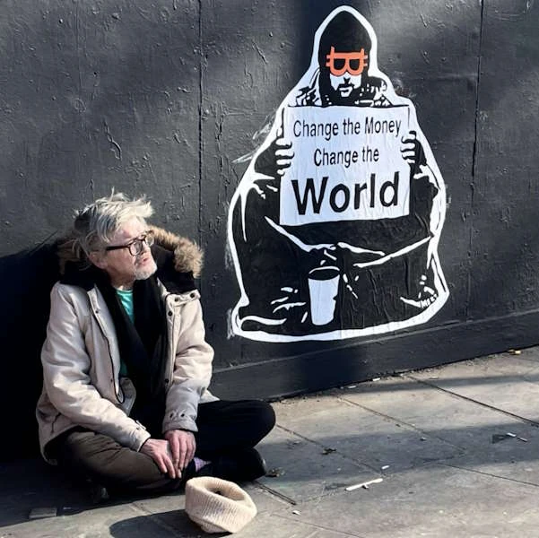
####
No entanto, não se pode negar que **esta iniciativa tem um custo significativo: mais de 0,40€ por cartaz (ou seja, 40€ por cem cartazes)**; e isso, quando você tem bons contatos. Online, os preços podem de fato variar de o dobro a cinco vezes mais.

Como mencionado anteriormente, o Bitcoiner francês [@Mill3sim3](https://twitter.com/Mill3sim3) possui o equipamento profissional adequado. Portanto, você pode contatá-lo no Twitter para informações.

## Tendo um Cartão NFC Personalizado
<chapterId>8ad65d4e-a68a-59c2-a812-85f4907ed9f3</chapterId>
Outro projeto único é a **criação de cartões NFC personalizados para pagamentos usando Lightning**, aderindo ao padrão BoltCard. Para este propósito, **Swiss Bitcoin Pay** é um parceiro de qualidade.

Atualmente, em seu site em [https://swiss-bitcoin-pay.ch/cards](https://swiss-bitcoin-pay.ch/cards), há quatro designs básicos oferecidos pela Swiss Bitcoin Pay.
No entanto, se você deseja encomendar **mais de 50 cartões NFC, pode contatar a empresa em seu site oficial (ou no [Twitter](https://twitter.com/SwissBitcoinPay)) e propor um design personalizado** que você criou para a frente do cartão. O verso, no entanto, é padronizado.

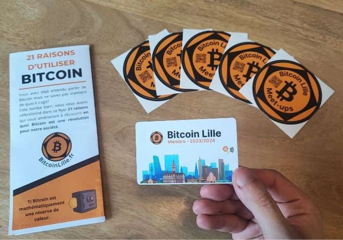

A [associação francesa Bitcoin Lille](https://twitter.com/BitcoinLille), por exemplo, encomendou cem cartões NFC com um design personalizado em 2023, a **um preço de cerca de 2,50€ a 5€ por cartão** (a taxa muda regularmente e é progressiva).
Assim, **cada novo membro da associação recebe um cartão NFC personalizado em seu pacote de boas-vindas**.

Esta ideia obviamente pode ser adotada e aprimorada conforme você desejar.

## Criando um Site
<chapterId>9a2a1b9b-0633-544a-b331-c06187d23d7f</chapterId>
Com o objetivo de ter uma vitrine para sua comunidade, encontros, eventos e documentos educacionais, pode ser relevante em algum momento **ter um site**. No entanto, **levará muito tempo para projetar** (várias dezenas de horas).

Para simplificar essa tarefa de criação, o tutorial abaixo mostra em meia hora os passos para criar um **site gratuito na plataforma WordPress**. Este site permitirá que você **tenha uma página inicial personalizável, crie categorias, publique artigos, integre mídias (vídeos do YouTube, imagens, PDFs)**, etc.
Mais tarde, você poderá comprar seu próprio nome de domínio e até hospedá-lo em seu servidor pessoal, se desejar.

####
Outros CMS ou plataformas também permitem a criação de sites. Embora alguns sejam mais simples devido à sua interface amigável, os sites resultantes também são muito menos personalizáveis.
**O WordPress parece ser a escolha mais relevante para começar**. Além disso, permite a **integração de plug-ins**, alguns dos quais são pagos, mas de alta qualidade, possibilitando um desenvolvimento muito mais amplo de um site; e isso, sem precisar codificar.
O [plugin Uncode](https://undsgn.com/uncode/), que é pago, é um deles.
## Criando um Canal de Vídeo (YouTube ou Odyssee)
<chapterId>076286db-1627-57ec-a410-c44b1666e1cd</chapterId>

Entre os membros da sua comunidade, alguns podem estar interessados em **criar conteúdo multimídia**. Isso poderia, por exemplo, assumir a forma de produzir vídeos tutoriais (usando uma carteira de software, tutorial para comprar BTC sem KYC, etc.)
Paralelamente, pode chegar o dia em que apresentações sejam feitas em seus encontros. Ou até mesmo, quando sua comunidade conduz conferências em escolas de ensino médio e universidades.

Nesse sentido, **quando a necessidade surgir, pode ser relevante ter um canal de vídeo que permita postar online todos os vídeos, apresentações e conferências feitas como parte de suas ações e projetos**.
####
Entre as plataformas de vídeo mais conhecidas, encontramos notavelmente:
- [**YouTube**](https://www.youtube.com/), que tem a falha de **não ser resistente à censura**;
- [**Odyssee**](https://odysee.com/), que é relativamente pouco usado, mas é **descentralizado** através de sua operação peer-to-peer;
- [**peertube**](https://joinpeertube.org/fr_FR), permitindo que você crie sua própria plataforma de vídeo. Isso provavelmente é um passo acima em termos de configuração.

Dependendo do que você decidir implementar, você obviamente precisará **criar visuais específicos para esta plataforma**, com o objetivo de tornar seu canal de vídeo visualmente atraente. O ponto positivo é que com o **Canva**, que discutimos na [parte 2/8 deste curso](LINK), existe uma categoria "Miniatura do YouTube" com visuais já projetados e facilmente modificáveis.

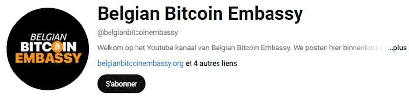
####
No caso de você desejar **gravar em seu computador, softwares como o ["Streamlabs"](https://streamlabs.com/fr-fr) funcionam muito bem**. Ele permite ajustar muitas configurações, é gratuito e também possibilita transições de cena.

Quanto à **edição de vídeo** (se houver), você precisará ter um software adequado.
Se você ainda não tem um, o software ["Wondershare Filmora"](https://filmora.wondershare.fr/) é particularmente eficaz e muito fácil de usar; permitindo que você faça edições sérias. Infelizmente, é pago (€45 por ano). Finalmente, para a **introdução e encerramento** do seu vídeo, uma pesquisa específica no **Canva** permitirá que você encontre o que está procurando, modifique os resultados como desejar, baixe-os; e então tudo o que você terá que fazer é integrá-los ao seu software de edição.
Nota: no caso de, um dia, o Bitcoin ser proibido ou censurado, pode ser relevante sempre **manter uma cópia local em um disco rígido dos vídeos** que você postar.

## Criar um podcast de áudio
<chapterId>12e96b45-1c33-5687-a753-80d0114d487a</chapterId>

Criar um podcast de áudio também pode ser uma iniciativa interessante. No entanto, assim como ao criar um canal de vídeo, não espere obter milhares de visualizações rapidamente.

Entre as plataformas de podcast mais conhecidas, encontramos:
- [**Fountain**](https://www.fountain.fm/), que é particularmente interessante porque permite doações diretas em Lightning;
- [**Soundcloud**](https://soundcloud.com/);
- [**Deezer**](https://www.deezer.com/fr/);
- [**Spotify**](https://open.spotify.com/);
- [**Google podcast**](https://podcasts.google.com/).

O problema, no entanto, é que **cada uma dessas plataformas tem um público muito específico**. Assim, para alcançar o maior número de pessoas possível, você precisará estar presente em praticamente todas elas.

Felizmente, a plataforma **["Spotify para podcasters"](https://podcasters.spotify.com/) permite que você importe seu arquivo de podcast uma vez e, em seguida, gere um feed RSS que pode ser copiado e colado em qualquer uma das plataformas mencionadas anteriormente**.
Então, uma vez que o trabalho esteja feito no "Spotify para podcasters", tudo o que resta é a formatação nas suas outras plataformas; o que é relativamente rápido.
####
No caso de você querer **gravar no seu computador, um software gratuito como o ["Audacity"](https://www.audacityteam.org/) funciona muito bem**. Ele permite ajustar muitas configurações, realizar crescendos e até melhorar a clareza do som durante a edição. Gravar sua voz e depois editar o áudio do seu podcast deve ser, portanto, bastante fácil.

Aqui está um breve tutorial apresentando, em 10 minutos, as principais características a conhecer para fazer um podcast com o Audacity.

Nota: como mencionado antes, no caso de, um dia, o Bitcoin ser proibido ou censurado, pode ser relevante sempre **manter uma cópia local em um disco rígido dos podcasts** que você postar.

## Criar um distintivo para seus eventos
<chapterId>0cccef8d-a765-5844-8921-c40f0ce653e4</chapterId>
Durante seus meet-ups e eventos, é possível projetar um pequeno incentivo para a participação. A ideia seria então **criar um tipo de distintivo que só pode ser obtido no evento em questão**. Isso existe sob o nome de "POAP" ("Proof Of Attendance Protocol") em outras blockchains. No entanto, atualmente, não há uma maneira gratuita de configurar isso no Bitcoin.
Em princípio, esta iniciativa também poderia servir para **recompensar os membros mais envolvidos da sua comunidade, por exemplo, organizando um sorteio anual**, durante o qual um distintivo obtido corresponderia a um bilhete de sorteio. Um membro presente em todos os 12 encontros do ano teria então 12 bilhetes para este sorteio anual.####
Adicionalmente, em uma veia completamente diferente, também é possível **em cada evento pedir aos participantes para escreverem seu primeiro nome ou pseudônimo em um distintivo**. A isso, os motivos de sua presença também podem ser adicionados.
Esta estratégia, embora um pouco formal, pode permitir que alguns membros **encontrem mais facilmente pontos em comum e tópicos de conversa**, além de tornar **mais fácil para os recém-chegados identificar os organizadores** e possíveis membros da associação.

Vários modelos usados pela associação Bitcoin Lille também estão [disponíveis em código aberto no Canva](https://www.canva.com/design/DAGHAsT15MU/AIA7-L_xBjNdsuxdD4-h-Q/edit?utm_content=DAGHAsT15MU&utm_campaign=designshare&utm_medium=link2&utm_source=sharebutton).

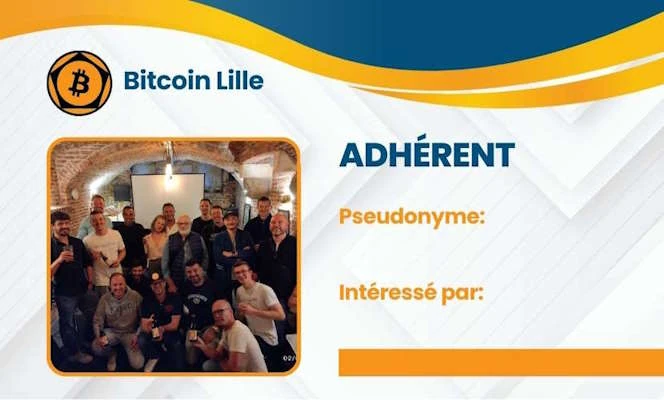

## Refletindo sobre a Transição no Evento de Morte
<chapterId>c5febf18-235c-51bc-8fbb-9467dabe4cb0</chapterId>

Outro ponto, em uma nota completamente diferente, é a posição sobre a **morte de um membro da sua comunidade Bitcoin**.
De fato, pode infelizmente chegar o dia em que a família de um dos seus ex-membros entre em contato com você para anunciar que essa pessoa faleceu. Eles então explicarão que **este indivíduo deixou instruções**, e uma delas é **entrar em contato com sua comunidade / encontro / associação**.
Esta pessoa provavelmente explicará que **precisa de ajuda para recuperar os fundos**, pois é beneficiária da herança deste ex-membro.

Em resposta a este pedido, pode ser muito relevante **já ter pensado em um tipo de procedimento a seguir**; e isso, por várias razões.
Por um lado:
- para garantir que o falecido havia pensado antecipadamente em **informar sua família para nunca divulgar ou levar a um encontro as chaves privadas e a(s) carteira(s) física(s) do falecido**;
- para que a família entenda claramente que **sua presença é sobre aprender Bitcoin**, a fim de eventualmente se tornar soberana sobre os fundos do falecido;
- para que **a família esteja ciente da lei que se aplica no país em caso de doação, herança ou conversão em moeda fiduciária**;

Além disso, pensar antecipadamente em um procedimento a seguir também garante que ninguém, seja membro do encontro ou apenas um convidado, possa usar esta situação de qualquer forma para sua vantagem (e/ou para roubar os fundos).

Com este objetivo, pode ser interessante **propor um "grupo de trabalho" sobre o procedimento a adotar em caso de morte e pedidos de ajuda vindos da família**. A associação Bitcoin Lille está realmente trabalhando neste ponto, e compartilhará seu documento de trabalho final de maneira open-source [aqui](https://docs.google.com/document/d/1TDfLZjuictC5s3PEM2Z7WmkxIDSJ8Q1E4xevm52pVgU/edit?usp=sharing) em alguns meses.

## Realizando conferências em escolas e universidades
<chapterId>65efdb44-e3d4-567c-aedf-972765753d73</chapterId>
A lista de projetos anteriormente descrita obviamente não é exaustiva. Em geral, são projetos internos à comunidade/encontros, e podem ser configurados de forma bastante fácil uma vez que sua comunidade tenha se desenvolvido. É, portanto, hora agora de abordar o caso do onboarding.

Antes de tudo, você certamente está ciente de que **uma das melhores maneiras de falar sobre Bitcoin para o maior número possível de pessoas ao mesmo tempo é, obviamente, realizar uma conferência** (ou um workshop). Isso pode ser feito **dentro de escolas pós-secundárias e universidades**; levando assim jovens (e talvez não tão jovens) a descobrir ou aprofundar seu entendimento sobre Bitcoin.

Além da importância de **saber falar em público**, hospedar uma conferência diante de várias dezenas ou até centenas de pessoas requer **saber gerenciar o estresse, a articulação e o tempo**. Também requer **preparar uma apresentação ou workshop de qualidade, fundamentado e alinhado ao nível de habilidade do público** que você enfrentará.
Além disso, **ter uma mentalidade aberta, pronta para simplificar conceitos conforme necessário**, é essencial neste tipo de exercício; especialmente durante a fase de perguntas/respostas e no caso de uma discussão em painel. Isso não significa "abandonar seus princípios"; mas simplesmente aceitar que outros possam ter um ponto de vista diferente, mesmo que isso signifique responder mais tarde ou deixar para lá para que o diálogo possa progredir. De qualquer forma, se **seu discurso e suas respostas forem baseados em argumentos relevantes e fundamentados**, o público não será enganado.
Então, se você se sente capaz: vá em frente! Nosso mundo está em tão grande necessidade de educação sobre o que é Bitcoin...
No entanto, é desnecessário dizer que para realizar essa tarefa, **você precisará de muita motivação, um grande trabalho; mas também, os contatos certos**.

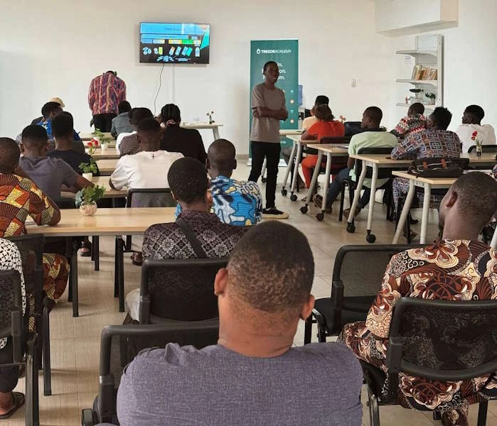
####
De fato, **organizar uma conferência ou um workshop em uma escola e/ou universidade não é uma tarefa fácil**.
Primeiramente, é necessário **obter um contato**. Isso pode ser alcançado **por meio de um conhecido, através do BDE ("Bureaux Des Étudiants" ou Escritórios dos Estudantes); ou até mesmo associações estudantis**, que geralmente organizam ciclos de conferências e encontros a cada ano. Seus **professores antigos da escola de engenharia e/ou universidade** também podem atuar como intermediários.
No caso de uma escola pós-bacharelado, também é possível **contatar diretamente a pessoa responsável pelo programa de treinamento**, com o objetivo de explicar sua proposta. Isso pode então levar a uma reunião inicial e – no melhor dos mundos, algumas semanas depois – a uma apresentação sobre o que é Bitcoin e como funciona diante dos alunos.
####
Infelizmente, em nosso mundo atual, Bitcoin ainda é muitas vezes deliberadamente demonizado pela mídia e políticos; levando muitos novatos a pensar que deveria ser banido das salas de aula e auditórios. **A probabilidade é, portanto, bastante alta de que você enfrentará muitas rejeições**; especialmente no âmbito acadêmico onde o proof of work do Bitcoin e o consumo de energia às vezes parecem tabu.
No entanto, nada impede de tentar, especialmente com o BDE e associações estudantis. **Com um pouco de sorte, mesmo que a recusa seja firme na primeira vez, não é impossível que você seja contatado novamente durante o próximo bull-run no endereço de e-mail da sua comunidade para realizar uma conferência diante de quase 280 estudantes!**

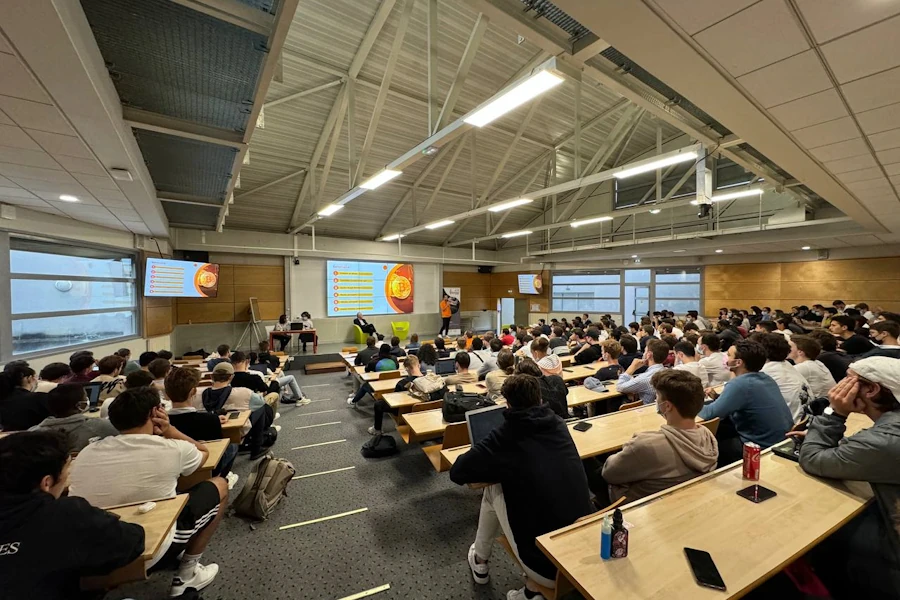

## Abordando Empresas
<chapterId>b730462b-7928-5d28-a14f-9ceaa773d3d2</chapterId>
Alcançar o objetivo de **fazer com que o Bitcoin seja aceito como método de pagamento por um comerciante** é algo como o "Santo Graal" para muitos entusiastas do Bitcoin. É como desbloquear uma conquista no seu Pokédex! No entanto, como cada comerciante é diferente, essa tarefa não é fácil; e numerosos problemas surgem:
- **um comerciante ainda precisa de moeda fiduciária para pagar seus fornecedores (por enquanto)**;
- **eles precisam de relatórios financeiros claros e explícitos** que possam ser enviados aos seus contadores;
- **seus métodos de pagamento devem funcionar sem nenhum problema técnico ou logístico**, e os funcionários devem ser capazes de receber pagamentos sem poder fugir com o caixa.

A esses problemas, adicione:
- **os preconceitos potenciais** do comerciante em relação ao Bitcoin;
- **a dificuldade de encontrar uma solução de software** que funcione perfeitamente;
- mas também, **a importância de fazê-los entender os benefícios de aceitar o Bitcoin** como método de pagamento.

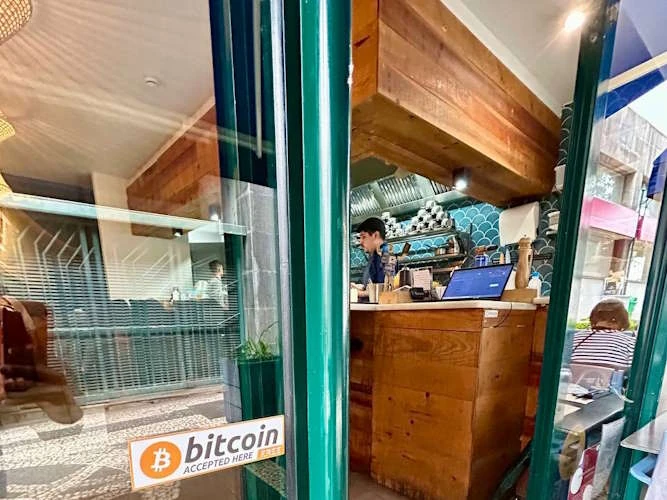
####
Desenvolver o ecossistema Bitcoin na sua cidade pode, portanto, envolver **a adesão de comerciantes**. Para fazer isso, a maneira mais simples é **proceder em etapas**:

1) assim que entrar em uma loja, **sempre pergunte se você pode pagar em Bitcoin**. Isso geralmente resultará em uma recusa e um olhar de questionamento, mas essa simples pergunta gradualmente levará os comerciantes a ver que o Bitcoin pode ser usado por "pessoas normais" e que está ganhando interesse como método de pagamento entre a população. Você pode até **alternar duas ou três pessoas na mesma loja, alguns dias de intervalo, perguntando para pagar em Bitcoin**. Em algum momento, isso chamará a atenção do comerciante;

2) uma vez que eles se tornem interessados ou perguntam o que é Bitcoin, você pode **explicá-lo de forma sucinta e em termos leigos**. Por exemplo, que o Bitcoin é uma moeda, não controlada por bancos, sem um intermediário de confiança, que é inconfiscável, não sujeita à inflação, e que as taxas são menores do que com o sistema bancário tradicional. Você pode então **dar a eles um panfleto**, por exemplo, "21 razões para usar Bitcoin" e/ou "10 razões para aceitar Bitcoin em sua loja", e então **dar a eles seu contato ou o de seu meet-up**. Assim, quando estiverem interessados em uma demonstração, eles podem entrar em contato com você.

3) uma vez que essa pessoa decidiu aceitar Bitcoin, **marcar uma reunião com eles para mostrar a solução de software que você propõe parece apropriado**. **[Swiss Bitcoin Pay](https://swiss-bitcoin-pay.ch/)** apresenta-se como uma excelente solução a este respeito, porque:
- permite que comerciantes que desejam converter seus ganhos diários em bitcoin em moeda fiduciária, possibilitando assim que paguem seus fornecedores;
- também permite, se desejado, manter uma certa porcentagem da receita em BTC;
- possibilita a exportação da contabilidade de todos os pagamentos em bitcoin para enviá-los aos contadores, facilitando assim o trabalho deles;
- tem um painel de controle amigável para o gerente;
- mas também uma interface ergonômica e fácil de usar para os funcionários, que poderão processar pagamentos sem poder fugir com o caixa;
- finalmente, seu custo de uso é mais barato do que a rede bancária tradicional de 2 a 3%.

4) **quando esse negócio aceita Bitcoin**, será então possível para você:
- **visitar regularmente** para fazer compras;
- aproveitar a oportunidade para **perguntar se está tudo indo bem**, até mesmo oferecendo seu contato novamente, se necessário;
- **propor novamente vir aos seus meet-ups e eventos**;
- para **adicionar este negócio no [mapa btcmap.org](https://btcmap.org/)**, e informar [Swiss Bitcoin Pay no Twitter](https://x.com/swissbitcoinpay) para dar visibilidade a este negócio; - mas também para **potencialmente realizar eventos neste negócio**, como meet-ups ou workshops.

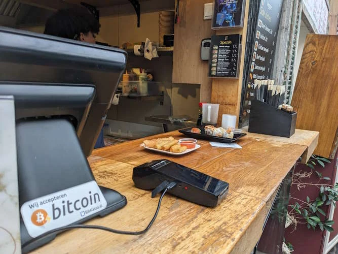

5) uma vez que vários negócios na sua cidade tenham sido integrados e tenham entendido o que o Bitcoin lhes traz, você pode então **propor a criação de um grupo especial no Telegram para comerciantes**; o objetivo sendo **permitir que eles se ajudem mutuamente** e avancem na conversão de outros negócios na cidade para o Bitcoin. Paralelamente, este grupo também pode **atuar como suporte técnico**, caso surja um problema com um cliente.
####
Claro, **esta prospecção é um trabalho de longo prazo. Requer muito tempo, motivação aumentada, mas também um pouco de estratégia**.
Sua comunidade se sente pronta para construir na sua cidade **as bases de uma economia circular Bitcoin**, similar a [Arnhem na Holanda](https://www.arnhembitcoinstad.nl/)? Se sim, vá em frente!

## Contatando a Imprensa e Rádio Locais
<chapterId>435bfbc1-22dd-59bb-b737-a32ea995b238</chapterId>

Muito frequentemente esquecido, nós, bitcoiners, geralmente pensamos que os melhores meios de comunicação são as redes sociais e a internet. Mas estamos – em parte – enganados.

Várias comunidades (este é o caso notavelmente com [Breizh Bitcoin](https://breizhbitcoin.com/), na França) têm assim o hábito de **contatar sua imprensa local** a fim de:
- **Falar com eles sobre os eventos que organizam** (meet-ups, apresentações, workshops, festas de halving, etc.);
- **Convidá-los a explorar negócios locais que aceitam Bitcoin, com o objetivo de escrever um artigo** sobre o assunto;
- mas também, simplesmente, **pedir para compartilhar a data e o local de seus próximos eventos**.

De fato, muitos jornais locais ainda têm, em sua última ou penúltima página, uma lista de eventos organizados na região.
O feedback do Breizh Bitcoin é claro: funciona bem, e novas pessoas compareceram aos seus meet-ups após descobrirem sua associação no jornal.

Embora isso possa ser específico para a localidade em que você está situado, aqui está uma lista dos principais títulos de imprensa regional francesa:
- [acpm.fr](https://www.acpm.fr/Les-chiffres/Diffusion-Presse/Presse-Payante/Presse-Quotidienne-Regionale);
- [csmp.fr](http://www.csmp.fr/layout/set/print/Menu/La-presse/Presse-quotidienne-regionale).

Paralelamente, também pode ser interessante **contatar estações de rádio locais, para propor, por exemplo, a criação de um podcast ou uma entrevista**.
No entanto, esteja ciente de que palavras na mídia podem facilmente ser usadas a seu desfavor. **Então, esta não é uma tarefa fácil, e pode ser sábio preparar-se para ela**.

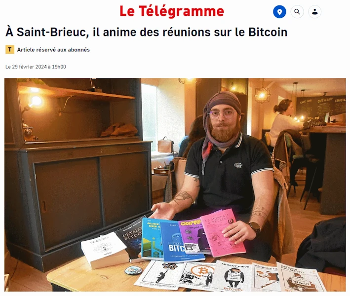
####
Obviamente, **muitos outros projetos podem ser realizados**. Em geral, tudo dependerá do seu tempo, sua motivação; mas também da dificuldade do projeto em questão.
Na realização destes, **três conselhos** podem guiá-lo:
1) **defina antecipadamente as etapas do projeto, seu(s) objetivo(s) e o que precisa ser feito**;
2) **proceda passo a passo, sem desanimar**; 3) e acima de tudo, **peça ajuda e apoio aos seus membros e outras comunidades ao seu redor**.

Tenha em mente que **cada comunidade e encontro passou pelas mesmas etapas pelas quais você está passando**. Então, não hesite em **pedir conselhos**.

# Antecipando o Futuro
<partId>6ea07445-9369-54bc-9aa0-d260db026e0b</partId>
## Planejando um Aumento nos Participantes
<chapterId>8af722d4-3a9f-548c-9001-424f2142de12</chapterId>

À medida que o mundo entrou em sua quarta época, no bloco 840.000, cada vez mais indivíduos veem o **Bitcoin como uma revolução tecnológica, financeira e social**.
Assim como a revolução da internet, esta também **levará tempo**, e isso é bom. Isso permitirá que todos **se eduquem sobre os fundamentos do Bitcoin e aprendam a usá-lo**. Mas também, dará tempo para que desenvolvedores e empresas desenvolvam protocolos e aplicações relevantes, permitindo a exploração do potencial completo do Bitcoin.
Embora seja impossível prever o futuro, **um aumento muito significativo no número de usuários do Bitcoin deve ser antecipado**, a fim de **estar preparado para todas as situações**. Incluindo as mais catastróficas, como uma possível implosão do sistema financeiro tradicional; ou até mesmo: uma proibição do Bitcoin.

Nesta oitava e última parte deste curso, vamos dedicar um tempo para detalhar alguns pontos a considerar ao desenvolver sua comunidade e seus encontros.
####
O primeiro entre eles (o mais fácil de antecipar) é obviamente **o aumento no número de pessoas ingressando em sua comunidade**. Isso impactará de duas maneiras:

1) **seus canais de comunicação (Telegram, Signal, Matrix, etc...) ficarão cheios, potencialmente tornando as conversas difíceis de seguir**. Dois pontos são então a considerar.
Por um lado, se você tem 500 trocando mensagens sobre vários tópicos no mesmo canal de discussão, a maioria dos seus membros gradativamente deixará de seguir as conversas; entre outras coisas por causa da abundância de mensagens para ler e notificações associadas. Nesse sentido, pode ser relevante **repensar seus canais de comunicação; como por exemplo supergrupos do Telegram, ou até mesmo um servidor no Discord**, que ambos permitem agrupar conversas por tema.
Por outro lado, mais pessoas nos canais de troca também significa mais bots, mais golpes, e também **mais moderação a ser feita**. Você precisará estar preparado, redigindo por exemplo um conjunto de regras nas quais você pode se basear quando moderar uma mensagem. Pela experiência, isso evita grande parte dos conflitos; especialmente quando as regras estão disponíveis para leitura em seus canais de comunicação. Nesse sentido, a associação Bitcoin Lille escreveu há alguns anos **[um conjunto de regras de código aberto](https://bitcoinlille.fr/reglement/) para seu grupo no Telegram e seu servidor no Discord**, baseado em princípios simples e universais. Seu design está [também disponível](https://www.canva.com/design/DAGHI692AD4/rjT4sqEnhajc5FiPA6GFZQ/edit?utm_content=DAGHI692AD4&utm_campaign=designshare&utm_medium=link2&utm_source=sharebutton).

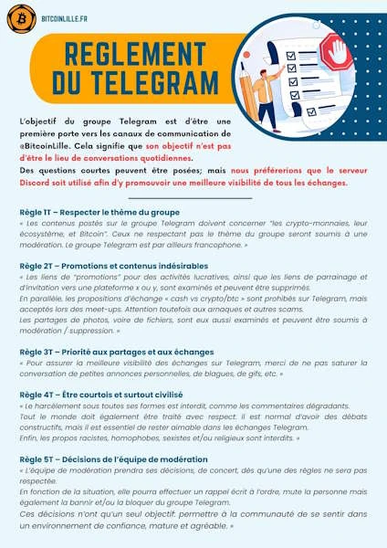

2) **seus encontros e eventos ficarão significativamente cheios, com uma abundância de novos rostos querendo trocar entre si**.
Diante dessa afluência significativa, várias abordagens podem ser discutidas e consideradas:
- Primeiramente, pode ser relevante **encontrar um lugar maior para organizar encontros e eventos**, especialmente se você só podia acomodar cerca de vinte pessoas no local anterior;
- Em segundo lugar, se você perceber que a presença humana se torna muito avassaladora, você também pode – para os próximos encontros – **exigir que os participantes se registrem** (isso pode ser feito via aplicativo Meetup, ou por meio de um formulário padrão), **ou organizar múltiplos encontros dentro do mês** (por exemplo: um encontro para iniciantes, um para intermediários e outro para especialistas);
- Além disso, é certo que muitos iniciantes no ecossistema se juntarão a você, geralmente com o objetivo de ganhar dinheiro. **Para que as conversas permaneçam focadas no Bitcoin durante esses encontros que crescem rapidamente**, é aconselhado:
    a) **realizar uma apresentação temática sobre Bitcoin durante esses encontros**, pois isso levará posteriormente uma boa parte dos participantes a discutir esse tema, e não um suposto novo projeto revolucionário;
    b) **não se limitar apenas aos bitcoiners, mas abordar os recém-chegados, mesmo que isso signifique tomar a iniciativa de ficar no fundo da sala para recebê-los**. As discussões podem então girar em torno das razões pelas quais essas pessoas vieram, o que estão procurando, os objetivos (ou fundamentos) da sua comunidade, etc.
####
Finalmente, embora seja lamentável dizer, **golpistas podem aparecer nos encontros**. Seu objetivo será então falar o máximo possível sobre seu esquema de pirâmide, seu MLM, ou seu "projeto revolucionário de blockchain". Também é totalmente plausível que pessoas com intenções maliciosas venham especificamente para lavar dinheiro ou comprar BTC com notas falsas.
Em situações complexas como essas, a abordagem mais simples é tomar a iniciativa de "gentilmente" explicar a esses indivíduos que o encontro não é o lugar onde eles terão sucesso, apresentando argumentos x ou y (como, informar sobre a presença de polícia disfarçada).
Se, infelizmente, esses indivíduos recusarem a sair ou a cumprir com as regras de decência (o que já aconteceu antes), um anúncio verbal durante o encontro informando que um ou mais indivíduos estão tentando se envolver em tais atos maliciosos pode ser feito.
**Felizmente, essas situações são raras e geralmente bastante peculiares. Mas é melhor estar preparado.**
Além disso, se isso pode tranquilizá-lo como organizador, contanto que você não esteja violando a lei ou facilitando trocas ilegais, você não precisa se preocupar. Na França, você de fato não é legalmente responsável pelas ações de outros.####
Em um mundo ideal, seria portanto melhor ter um local que possa acomodar várias dezenas de pessoas (dependendo do crescimento da sua comunidade); mas também, **construir relações sólidas entre bitcoiners e futuros bitcoiners durante o mercado de baixa**, para que você esteja pronto para **converter durante o próximo mercado de alta**.

## Descentralizando a Organização da Sua Comunidade
<chapterId>bedfc110-e099-58f4-a5b7-fb50f3b19a49</chapterId>

Você é o organizador de um encontro e, de um dia para o outro, **decide parar essa tarefa** para ir criar lhamas no Peru; apenas deixando tudo para trás?

**Considere passar adiante sua comunidade**:
1) **dando direitos administrativos (ou até de propriedade) dos canais de comunicação a indivíduos de confiança**, mesmo que isso signifique mudar de mãos mais tarde;
2) **compartilhando com pelo menos uma pessoa de confiança na sua comunidade os nomes de usuário, senhas e e-mails das contas e redes sociais** que você criou para dar visibilidade a ela.

Sem esses direitos e identificadores, será impossível para qualquer pessoa **assumir facilmente e assim continuar a iniciativa que você dedicou tanto tempo desenvolvendo**.
Começar do zero criando redes e canais "forkados" de fato leva tanto tempo e tanta energia…
**Portanto, antecipe sua possível partida** para o Peru. E se você não tiver, na França, um membro de confiança em seu encontro, você sempre pode contatar @ProfEduStream ou @gabtribe no Telegram para fazer essa transição de forma suave.####
Isso nos leva a **um ponto crucial no desenvolvimento de uma comunidade: sua descentralização**.
De fato, se você é a única pessoa envolvida nela, tendo todos os controles, o que acontecerá se você desaparecer? A resposta é simples: sua comunidade desaparecerá.

A melhor maneira de evitar isso é, portanto, **descentralizar tarefas e compartilhar direitos, papéis e acessos**. Assim, se um dos membros da equipe organizadora de sua comunidade ou encontro for preso em uma futura distopia porque possui Bitcoin não-KYC (ou simplesmente: porque não tem mais tempo para dedicar a isso porque acabou de ter um filho ou mudou de emprego), os outros podem continuar suas missões sem dificuldade.
####
Com o objetivo de descentralizar ainda mais, **usar softwares de código aberto como o conjunto framasoft** também pode constituir uma primeira "linha de defesa" contra um estado fictício que censuraria o Bitcoin. Usar ferramentas de comunicação criptografadas - até mesmo anônimas - é a segunda.
## E se o Bitcoin se tornasse o inimigo público número 1?
<chapterId>c739651f-cd13-51e0-a36e-85023749b15b</chapterId>

Em 5 de abril de 1933, Franklin Roosevelt, então o 32º presidente dos Estados Unidos da América, assinou a Ordem Executiva 6102, proibindo qualquer indivíduo de possuir moedas de ouro, barras de ouro e certificados de ouro em todo o território.

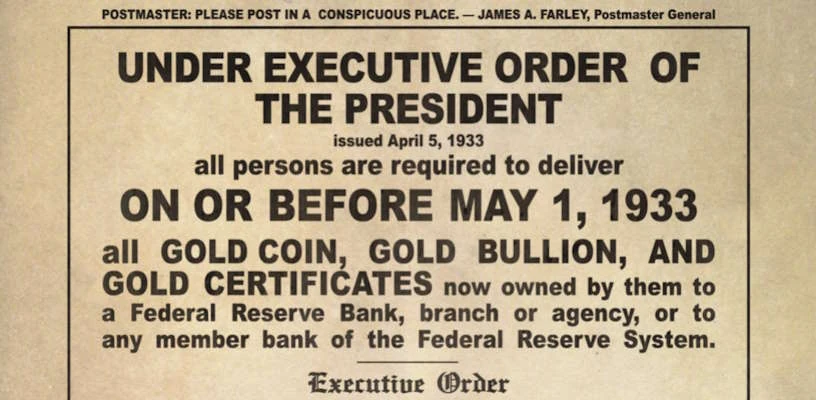

Obviamente, a Grande Depressão (o crash da bolsa de valores de 1929) não é mais relevante hoje. Mas quem pode dizer que, amanhã, outro estado não fará o mesmo e **proibirá qualquer indivíduo de possuir bitcoin?**
####
Felizmente, essa distopia orwelliana não impedirá ninguém de realmente possuir seus bitcoins, pois é impossível impedir alguém de aprender uma sequência de palavras.
Mas o que acontecerá **se os líderes do nosso mundo finalmente entenderem que o Bitcoin tem a capacidade de mudar a ordem mundial, incluindo no nível do estado?** O Bitcoin se tornará então **"o inimigo público número 1"?**
####
Claro, não devemos cair em uma forma de pensamento conspiratório. Mas **nada nos impede, desde já, de antecipar, descentralizar e educar**.

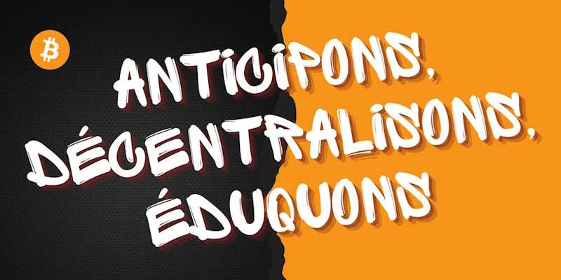

# Conclusão
<partId>62bc2138-c0be-5d39-a341-594690863257</partId>

## Um plano de ação resumido para criar sua comunidade Bitcoin
<chapterId>1f463ec2-3f64-5641-8d60-e02a47c94f27</chapterId>

Satoshi Nakamoto criou uma ferramenta revolucionária que tem a capacidade de mudar o mundo como o conhecemos. No entanto, é certo que **cabe a nós, bitcoiners, escolher a trajetória que desejamos tomar para construir o futuro**.

Paralelamente, a essência do Bitcoin o torna um vasto buraco de coelho, cruzando tantos aspectos históricos, econômicos, literários, matemáticos, de ciência da computação e criptográficos que é impossível cobrir tudo. Isso constitui parte de sua beleza.
Como seres humanos, temos apenas uma quantidade finita de tempo durante nossas vidas. **É permanecendo humildes e aprendendo com os outros** que cada um de nós será capaz de alcançar os objetivos que estabelecemos para nós mesmos em entender o Bitcoin.
**As comunidades globais de Bitcoin, portanto, desempenham um papel fundamental na construção do mundo de amanhã**; comunidades nas quais os bitcoiners podem **trocar, construir e compartilhar**. **Juntos**.
####
Como você deve ter entendido deste curso, **criar uma comunidade e um encontro sobre Bitcoin** requer organização e motivação. Claro, dependendo dos seus desejos e do tempo que você tem para dedicar a isso, você irá mais ou menos longe nos projetos.
No entanto, o objetivo permanece o mesmo: **acender a faísca para o Bitcoin crescer em sua cidade**.
####
Para resumir os muitos capítulos e subcapítulos deste curso, aqui está **um "plano de ação" resumido para criar sua comunidade Bitcoin**:
1) decida antecipadamente por que você quer criar uma comunidade Bitcoin, para quais propósitos, onde, etc.;
2) aproxime-se de comunidades já estabelecidas ao seu redor fazendo contato e/ou pedindo conselhos;
3) crie uma identidade única para sua comunidade e sua localização (logo, pôster, banner, flyer, etc.)
4) crie canais de comunicação e redes sociais como Telegram, Twitter, NOSTR, Discord. Considere também canais descentralizados e/ou impossíveis de censurar;
5) aproxime-se de encontros e comunidades vizinhas (especialmente nas redes sociais) e faça com que sua comunidade seja listada em diversos mapas e plataformas para ganhar visibilidade;

Uma vez que os canais de comunicação da sua comunidade estejam suficientemente desenvolvidos:

6) proponha um tipo de encontro através de uma pesquisa;
7) pense nos objetivos que você deseja alcançar com este evento físico;
8) procure um local bem localizado e acolhedor que atenda aos seus objetivos e reserve uma mesa;
9) uma semana antes do evento, comunique sobre ele em suas redes e canais de comunicação. Repita isso dois a três dias antes da data crucial;
10) faça com que seu evento seja listado em plataformas e sites adequados, se possível;
11) no dia do encontro, deixe as coisas acontecerem e vá ao encontro dos outros, mesmo que isso signifique direcionar gentilmente a conversa de volta, se necessário;

Dando seguimento:

12) busque reter e envolver o máximo de membros e participantes possível para que eles retornem;
13) Proponha ideias de projetos e iniciativas simples, e comece a implementar aquelas que são pessoalmente importantes para você. Se alguém quiser montar algo diferente, não hesite em dar uma mão com base na tarefa e no objetivo desejado;
Finalmente:

14) Antecipe o futuro considerando um local maior para encontros, regras para canais de comunicação, um site, etc.;
15) Comece a democratizar a aceitação do Bitcoin nos negócios da sua cidade, perguntando se eles aceitam Bitcoin, por exemplo;
16) Descentralize tarefas entre indivíduos confiáveis, bem como os direitos aos seus canais e redes;
17) Promova sua comunidade para que mais e mais pessoas se juntem e envolva indivíduos interessados;
18) Vá ainda mais longe com projetos que você gosta e se importa.

De uma maneira um pouco menos detalhada, em um vídeo de 21 minutos, parece assim:

####
De qualquer forma, **lembre-se de que você não está sozinho e que as comunidades existentes estão lá para ajudá-lo**.

## Curso BTC302
<chapterId>8bf10b77-80ee-5d50-87bc-0ef32574a675</chapterId>

Neste curso BTC302, detalhamos as etapas para criar uma comunidade, um encontro; mas também, a implementação de numerosos projetos.

Quando sua comunidade se sentir pronta para avançar para o próximo nível, **é possível criar uma associação**.
Na França, por exemplo, de cerca de cinquenta comunidades e encontros, existem quase dez associações.
####
O interesse em criar uma é duplo:
- por um lado, o status de uma associação permite **ter um status oficial, abrir uma conta bancária associativa e também obter uma forma de reconhecimento por parte da imprensa, mídia e subsídios**; - por outro lado, possibilita **uma organização mais precisa das operações da comunidade e a implementação de seus projetos**, definindo papéis específicos.
####
Com o objetivo de fazer sua comunidade prosperar ainda mais, **um curso chamado COMMU201 será lançado em [planb.network](https://planb.network/) nos próximos meses**.

Por meio dele, **também detalharemos outro ponto importante: a organização de eventos em grande escala, com cerca de uma centena de participantes**. Abordaremos questões como: Por quê? Que organização? Onde? Que orçamento? Como? Que operação?
Para alcançar isso, começaremos com a experiência de várias comunidades francesas que já organizaram seus próprios eventos, como **o BEF (Bitcoin Economic Forum, em maio, na Bretanha) e o B-only (em novembro, em Annecy)**.
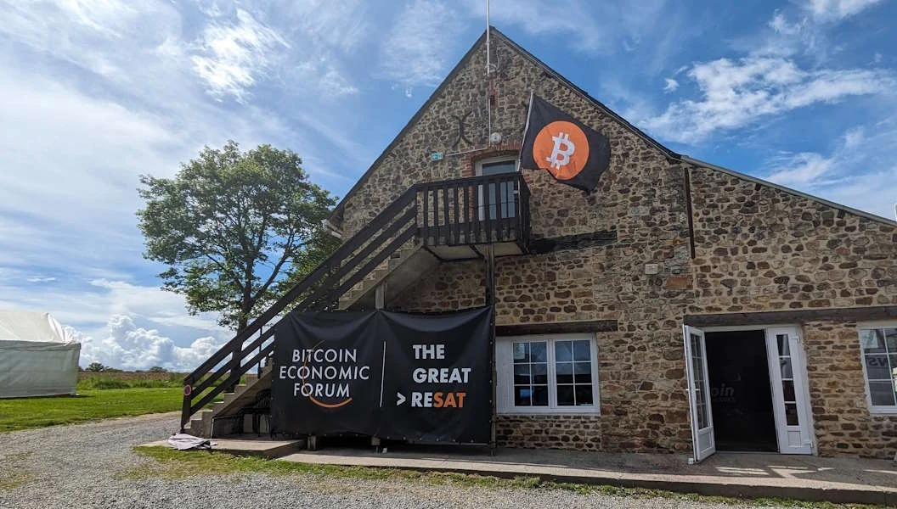
####
Claro, **em outros países, a legislação e o funcionamento das associações são diferentes**. Muitos pontos, no entanto, serão muito úteis para criar uma associação ou organizar um grande evento; e **esperamos que outros bitcoiners venham a complementar este treinamento de uma maneira específica para o seu país**.

## Avalie o curso
<chapterId>08a35d2a-204b-519a-9bb1-588665a037fa</chapterId>
<isCourseReview>true</isCourseReview>

## Cuide de Você Mesmo
<chapterId>cf1631cb-ddbe-55c7-be8c-26a5652979a0</chapterId>

Quando se cai na toca do coelho, nossa percepção de muitas coisas muda.
Isso então nos impulsiona a querer ir além, a querer descobrir aquelas outras pessoas que estão fazendo o mesmo trabalho mental que nós e que, também, entenderam.
Isso nos motiva, nos dá ainda mais desejo de **contribuir com nossa pedra para a construção** e compartilhar nossa descoberta: o Bitcoin.
Isso também nos leva a **pensar sobre o mundo de amanhã, o que desejamos construir, e as comunidades que estão em processo de construí-lo**.
####
**Neste longo corredor que é a criação de uma comunidade, você precisará mostrar motivação, estratégia, auto-sacrifício e tempo**. É às vezes uma tarefa ingrata; e nesse empreendimento, é melhor tomar as coisas pouco a pouco para não se machucar.
**Então, pense em você, em seus limites**. E embora o Bitcoin possa animá-lo noite e dia, **não tente fazer tudo sozinho; caso contrário, você se esgotará**.

Ao contrário, **peça ajuda a bitcoiners que já passaram por este mesmo corredor, que já exploraram as mesmas questões e construíram as mesmas ferramentas**. Isso economizará uma quantidade tremenda de tempo.

**Também proponha às pessoas que o seguirão nesta aventura ajudá-lo, mesmo que isso signifique delegar algumas tarefas** e que estas possam demorar mais. A longo prazo, sua comunidade emergirá unida e mais madura.

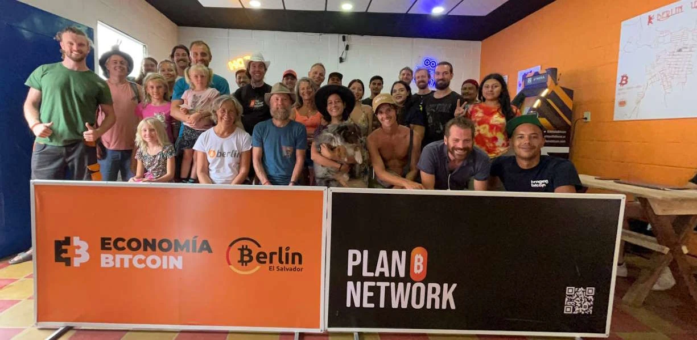

Sozinho, pode-se rapidamente explorar uma das muitas galerias da toca do coelho do Bitcoin, até alcançar seu fim. Mas há a jornada de volta a fazer. Depois, todas as outras direções a explorar.
Enquanto **criando e/ou juntando-se a uma comunidade de bitcoiners, compartilhando e trocando com eles regularmente, você explorará todas as direções da toca do coelho do Bitcoin ao mesmo tempo**.

É então que, muito mais rapidamente do que teria feito sozinho, você pode dizer: "Eu entendi o Bitcoin".
