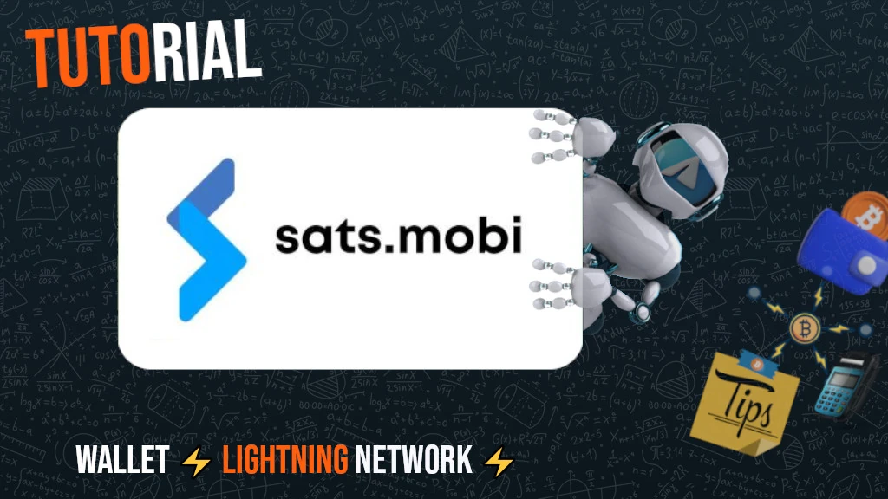

_This tutorial was written by_ [Bitcoin Campus](https://linktr.ee/bitcoincampus_)

## Sats.Mobi
SatsMobi is a wallet that operates on Telegram, featuring all the functionalities of a Lightning Network (custodial) wallet, plus a series of very entertaining features. It originated from a fork of the now-discontinued LightningTipBot, inheriting all its features while adding more current ones, thus making it more modern. Like LNTipBot, Sats.Mobi also embraces the open-source philosophy. The wallet can be configured and managed independently by cloning it from this [repository](https://github.com/massmux/SatsMobiBot).

If you prefer to use it simply, starting a chat on Telegram will reveal that it is a bot.

## Settings
From the Telegram search bar, look for "satsmobi" and the link to the [bot](@SatsMobiBot) will appear.

**Attention**: If you're not sure about searching via Telegram, access the bot securely using the following [link](https://t.me/SatsMobiBot)

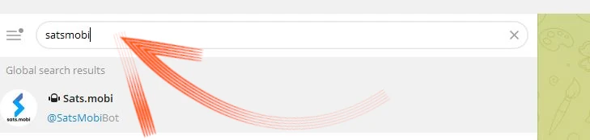

All you need to do to get started is press _START_

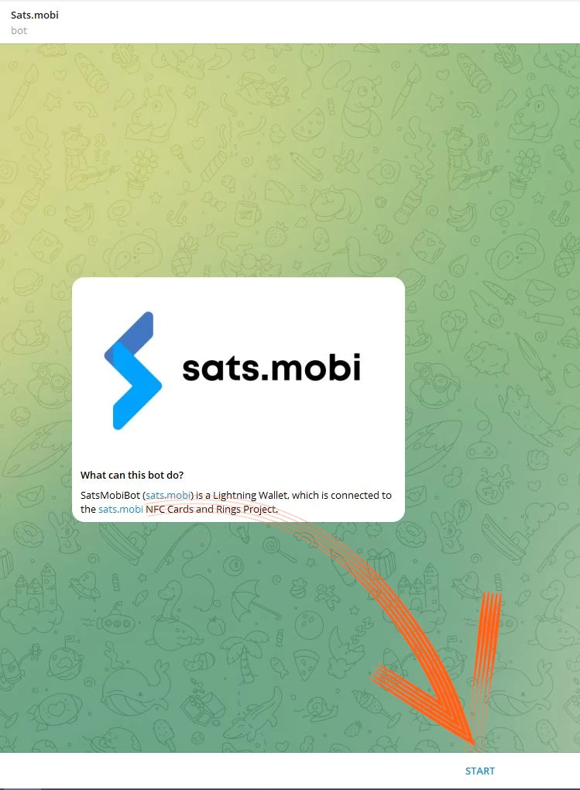

To explore the wallet, you can select _Menu_ at the bottom left.

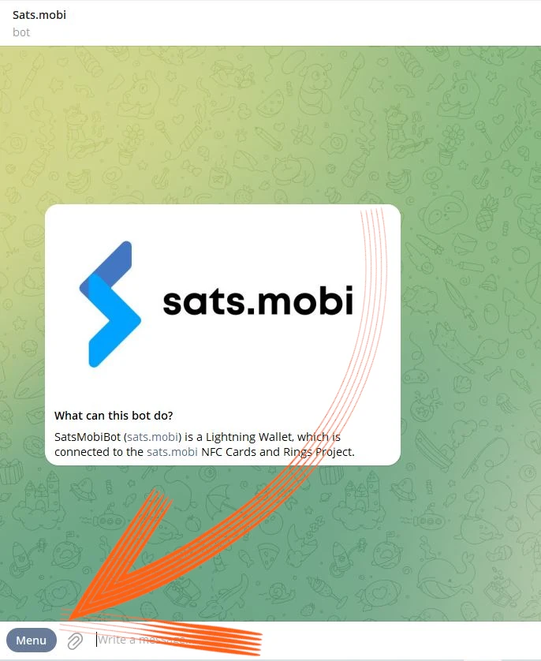

Now opt for _/help_ among the main commands.

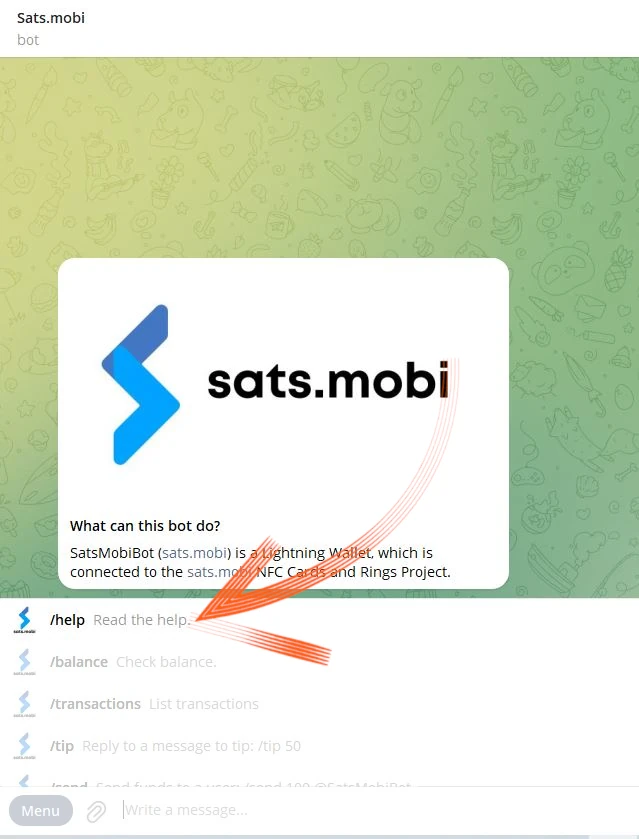

Sats.Mobi welcomes us by showing a message, listing all the main functionalities. Upon startup, the bot also created an LN Address, linked to the chosen handle on Telegram (which is unique by default). Commands for sending and receiving sats with this wallet are visible, as well as other functions we will see later. It's interesting to also take a look at the _/advanced_ menu

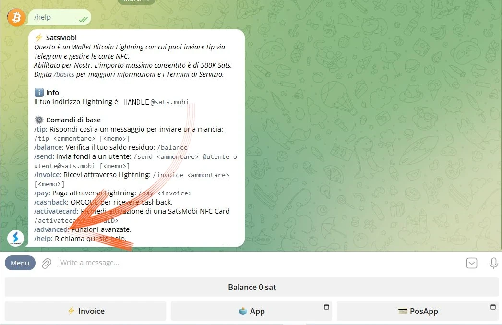

It's noticeable that Sats.Mobi also created an anonymous LN Address, to be used for gaining privacy. The bot works with commands: just click on the corresponding word, or type the slash "/" in the message bar, followed by the command you want to execute. Even if the wallet has just been created, choose for example _/transactions_

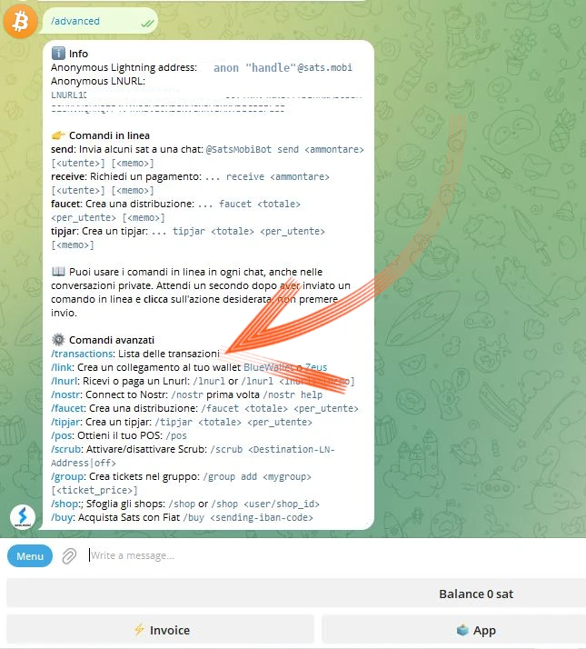

This command shows the list of the latest transactions, in this particular case equal to zero.

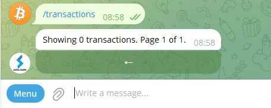

## Receiving sats
The command to create an invoice and receive sats is _/invoice_. Sats.Mobi operates exclusively in satoshi, the smallest unit of Bitcoin; therefore, to create the invoice, it is necessary to write the amount in sats in the message bar and then send it in the chat with the bot.

In the following example, the choice was made to receive an amount of 210 sats.

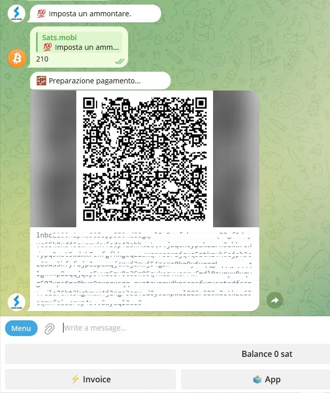

After a few moments of waiting for the invoice to be prepared, it is available as text and as a QR code. Paying the invoice, the wallet shows the balance. If for some reason the total is not updated, write _/balance_ and press the `enter` key.

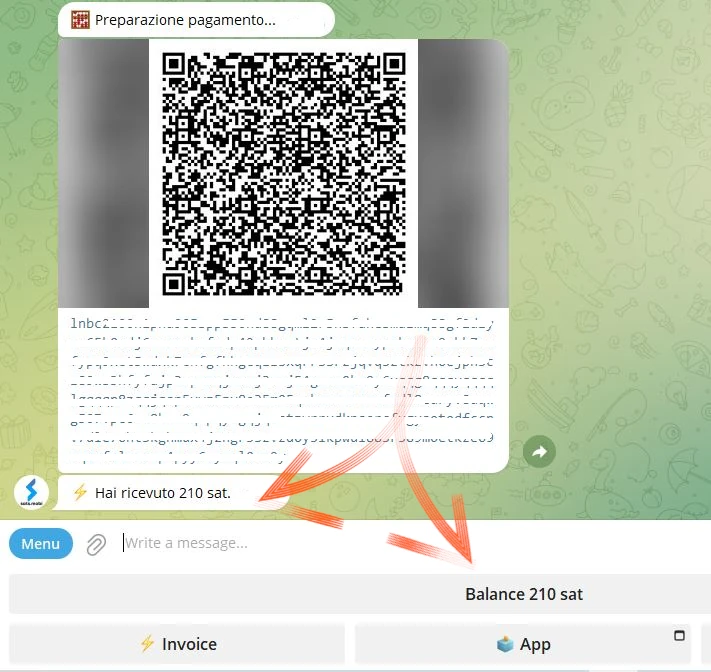

## Sending sats

Although sats are an extremely valuable asset, from which one should not part with lightly, Sats.Mobi makes this part appealing, performing some brief tests (i.e., a couple of trial transactions) will not be a problem.

### Paying an invoice

The simplest way to pay an invoice is to copy the message string `lnbc1xxxxx` and paste it into the message bar after typing the command _/pay_. **The correct syntax** requires leaving a space after the command.

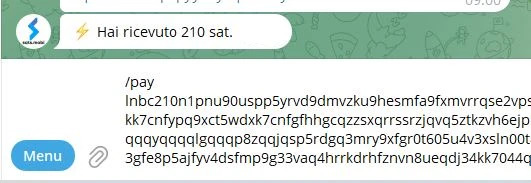

The wallet sends a message asking for confirmation. By clicking on _Pay_, the invoice is paid.

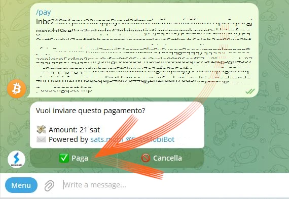

Sats.Mobi can rely on an efficient and well-connected Lightning node, rarely do payments fail because it always manages to find the correct routing.

### Paying comfortably from mobile

Browsing on Telegram, Sats.Mobi is also available on mobile. The most convenient function for paying with mobile is scanning a QR code, but this wallet lacks it by design, since it is not a standalone app but is contained in a social network. Sats.Mobi is therefore programmed to facilitate the mobile experience as much as possible: it can indeed decode an image, like a photograph taken of the QR code of the invoice you want to pay.

Suppose, for example, you want to pay an invoice of 50 sats.

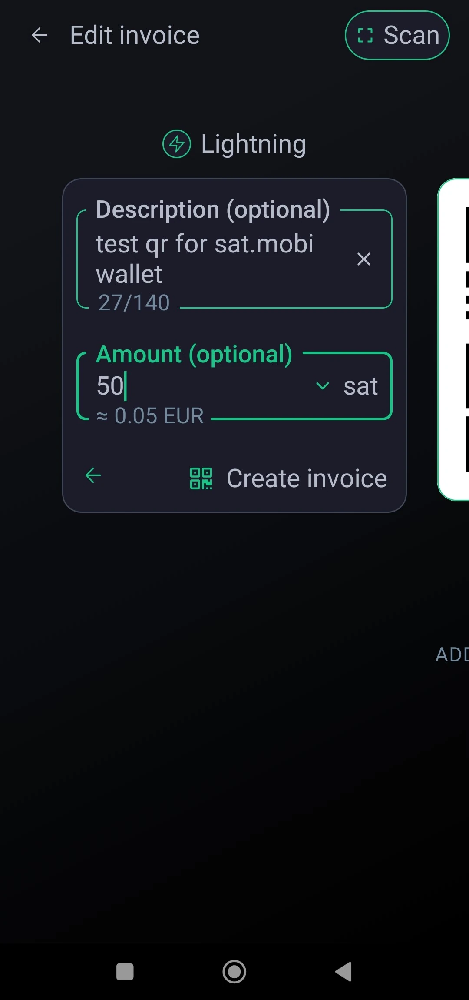

When this is shown to us, we can take a photo of the related QR code.

We then open Telegram on the mobile and, in the chat with Sats.Mobi, attach the photo just taken of the QR code

Once selected, we send it to the bot:

Sats.Mobi decodes the photo and **immediately presents the payment request**, with the correct description. The chat asks for confirmation, to proceed you must press _/pay_
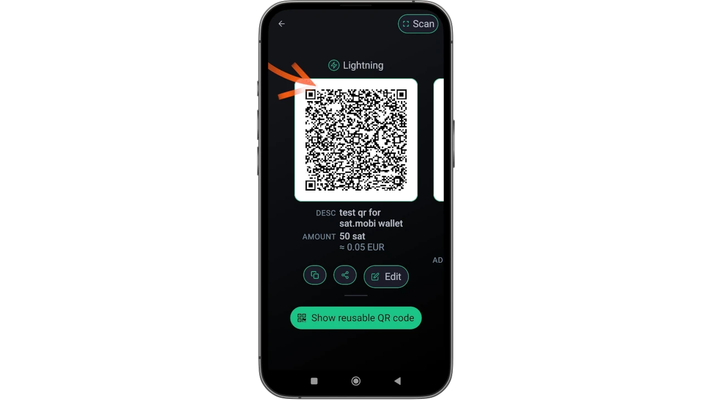

Please wait a moment to allow the payment to be processed.

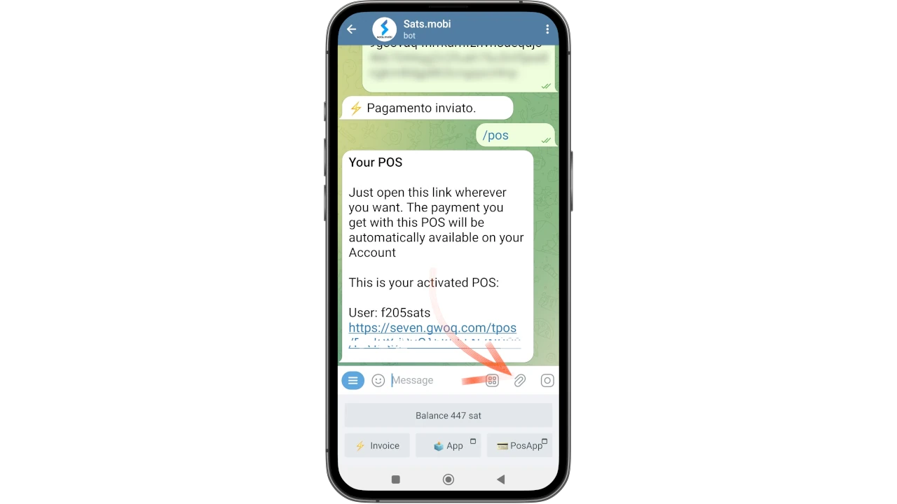

The invoice for 50 sats has been paid, a result achieved without the use of a camera and its integrated scanning function.

### Sats.Mobi in Telegram Groups

Among the features that made LNTipBot famous and that Sats.Mobi brings to Telegram, is the one that makes the experience fun and interactive for members in a group.
Owners can invite the bot to join the group chat and then nominate Sats.Mobi as admin. From that moment on, the fun begins, because members can start to reward other users for their contribution to the group.
- _/tip_ adds a tip by replying to a message;
- _/send_ sends funds specifying a LN Address or a Telegram handle as the recipient;
- _/faucet_ (in the _/advanced_ menu) allows creating a series of tips that the fastest members of the group can collect by clicking on _/collect_;
- _/tipjar_ (in the _/advanced_ menu) creates another type of distribution that can be sent to users in the group.

Each of these commands has its syntax, which is explained in the main command menu.

And if we are not the owner of a group? No problem: just ask the founder to invite Sats.Mobi, add it as admin of the group, and you're all set!

## Point of Sale (POS)

When Sats.Mobi is launched for the first time, the bot also creates another feature for the user: **the POS**. The "device" is activated by the user with the command _/pos_ or by clicking on the related button from the console at the bottom right. In fact, the POS is a web app, which opens as a pop-up on the Telegram chat

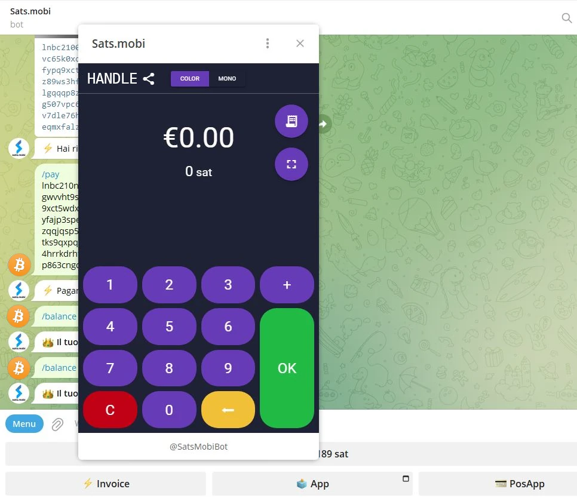

The interface displays the user's personal Telegram handle at the top left and is used simply as all POS are used: by typing the amount on the keypad. Let's suppose now we want to collect 21 euro cents for a service. Knowing that Sats.Mobi only natively manages sats, it's not easy to do the conversion in your head. On the contrary, the POS displays the euro as the unit of account, showing at the same time the equivalent in satoshi.

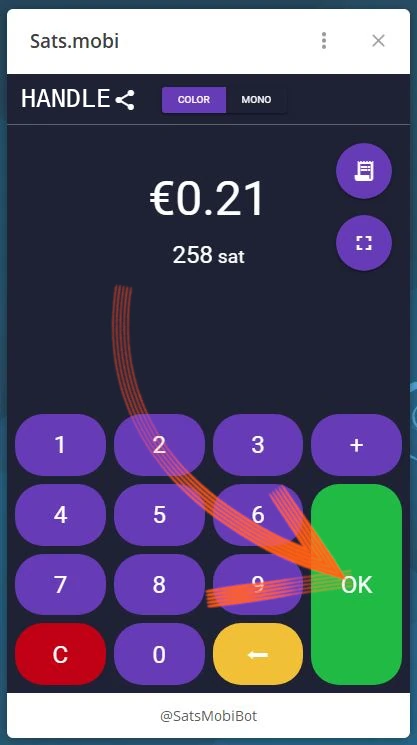
Clicking on _/OK_ displays the invoice that can be shown to the customer via a QR code, or that can be sent as a string through instant messaging, so it can be paid.
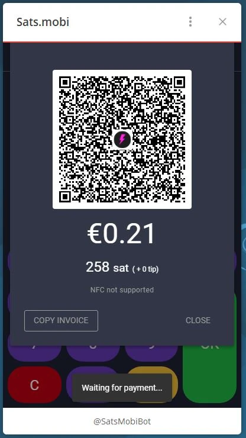
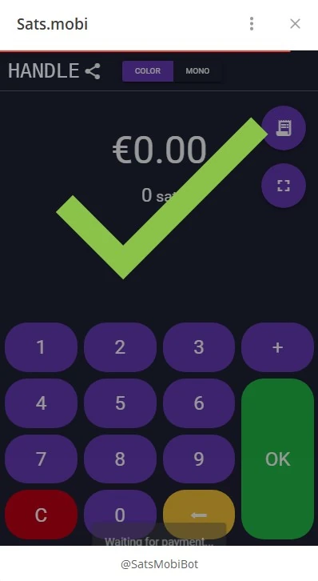

Naturally, the POS is also available on mobile phones, accessed in the same way as shown previously.

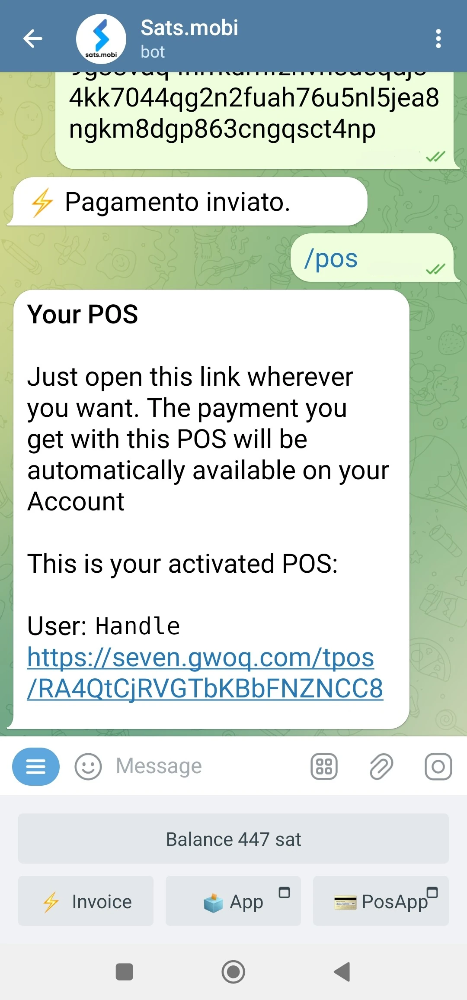

It is also well displayed on the mobile phone screen:

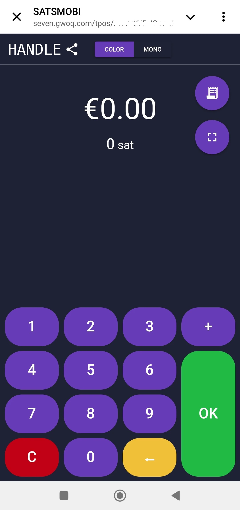

## Additional Features

There are other features that complete the offering of the Sats.Mobi wallet, which, as we have seen, expands the concept of a wallet beyond the operations of receiving and sending payments:
- _/nostr_: to connect the wallet to your own Nostr user to receive zaps;
- _/cashback_: shows a code that can be presented to a merchant to obtain cashback on a purchase;
- _/buy_: starts a guided procedure within the bot, which allows buying sats for euros;
- _/activatecard_: to request the activation of an NFC debit card, rechargeable through the Sats.Mobi wallet and for which notifications can be activated;
- _/link_: creates a link for your own Zeus or Blue Wallet, which can be used as remote controls for this wallet.

## Conclusion
Sats.Mobi is a pleasant and fun wallet to use, which brings back the experiences had with LNTipBot using the more advanced functions of LNBits. However, it is important to remember that **it is a custodial service**. Therefore, it should be used to hold very few sats, it is not a main wallet for your Lightning Network funds. There is also an intrinsic capacity limit, equal to 500,000 sats, a limit that is advised not to exceed.

If you are looking for non-custodial Lightning Network wallets, it is definitely advisable to look at other products.

---
### Documentation
- [Github](https://github.com/massmux/SatsMobiBot)
- Playlist of [videos](https://www.youtube.com/results?search_query=sats.mobi) demo